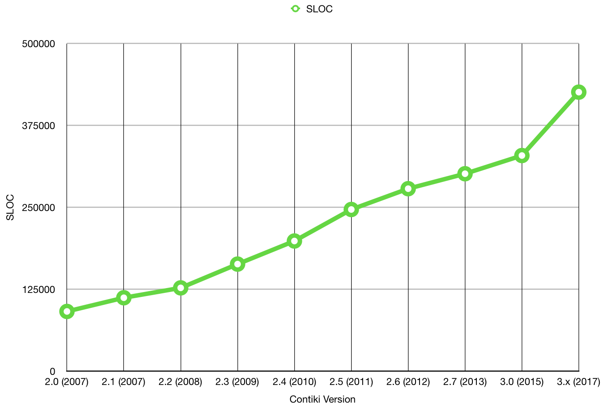

#Contiki

In this section, we list some of the key features of Contiki, and explore the core concepts related to IoT driven sensor networks. This is intended to provide an overview of the technologies featured in Contiki, some of the advantages and limitations of that technology, and how it is looking to progress in future. 

####Overview

Contiki connects low-power microcontrollers to the internet and supports standards like IPv6, 6lowpan, RPL and CoAP. Other key features include highly efficient memory allocation, full IP networking, very low power consumption, dynamic module loading and more. Supported hardware platforms include Redwire Econotags, Zolertia z1 motes, ST Microelectronics development kits and Texas Instruments chips and boards.

##Features 

Designed specifically to work with IoT 
Devices which are low power, constrained devices - microcontrollers, wireless sensors 
Highly portable, multi tasking 
New features - MicroIP (uIP) and 6LoWPAN.

####uIP (Micro IP)

* Implements a skeleton TCP/IP 
* Designed for 8 and 16 bit micro controllers 
* Stack includes TCP, UDP, ICMP protocols. 
* Size of uIP is a few Kilobytes, ram requirements are a few hundred bytes. 
* uIPv6 - the world’s smallest certified IPv6 stack - designed by CISCO for sensors and actuators. 

####6LoWPAN
 
* IPv6 - low power and wireless personal area network. 
* Enables the use of IPv6 over the MAC and PHY layer of 802.15.4 (LR-WPAN). 
* Challenges - each MAC layer has a limitation for data e.g. MTU - allowing in this case only 127 bytes. 
* Networking layer - the IPv6 MTU was 280 bytes. 

####Transition from IPv4 to IPv6 

* IPv4 is a 32 bit IP address - 2^32 = 4 billion or so available addresses, which is soon to run out. 
* IPv6 is 128 bit IP addresses - which is considerably more. 
* How does this transition? Slowly, and gradually. 
* Enabled from three popular technologies: Dual stack, tunnelling and header translation. 

####Dual Stack 

* TCP/IP protocol stack where we contain bother IPv4 and IPv6 parts of the protocol in the stack. 
* If we need to communicate with an IPv4 node, use that part of the stack. Or with IPv6 address, use that part of the stack. 
* Source queries the DNS - the DNS responds back with IPv4 or IPv6 address - based on which one, the source may respond with an IPv4 packet or an IPv6 packet which it sends to the destination node. 

####Tunnelling 

Implemented when different IP versions exist on path. 
E.G. if two IPv6 machines communicate through IPv4 routers, the IPv6 packets are placed inside IPv4 packets and then forwarded towards the destination machine.

####Header Translation 

* Necessary when most of the Internet has moved to IPv6, but some systems still use IPv4. 
* Sender uses IPv6, receiver uses IPv4. Tunnelling doesn’t work here, as destination machine only understands IPv4. 
* So the header format is changed on route. 
* It is converted from IPv6 to IPv4 on route. 
* Done by mapped address. 

####RPL 

* Routing protocol for Low power and Lossy networks (RPL) 
* A distance vector routing protocol.
* The routing is based on Destination oriented Acyclic graphs or DODAGs.

####Terminology related to RPL

* Direct acyclic graph (DAG) - a spanning tree graph when we don’t have any cycles 
* Root - destination of the nodes in the DAG.
* Up - any edge that is directed towards the root. 
* Down - any edge that is directed away from the root. 

####Destination Oriented Direct acyclic graph (DODAG) 

* Special DAG where all nodes are trying to reach a single destination. 
* Objective function - helps us determine how close we are to the root - e.g. number of intermediary nodes. 
* Rank - distance from the root. 
* RPL instance - When we have one or more DODAGs, then each DODAG is an instance. 
* DODAG ID - Each DODAG has an IPv6 ID (128 bit). This ID is given to the root only. As long as the root doesn’t change, the ID doesn’t change. 
* DODAG version - each different shape of a DODAG has a different version. E.g. if nodes sleep or turn off for a couple of weeks, the shapes will change to fill in the gaps. 
* Goal - where a DODAG wants to reach. 
* Grounded - when a DODAG reaches its goal. 
* Floating - when DODAG hasn’t reached its goal. 
* Parent - the parent node - the node to which the arrow is pointing 
* Child - the child node - the node from which the arrow is extending. 
* Sub-DODAG - any subtree of a given DODAG 
* Storing nodes - keeps the whole routing table. They know how to go from one node to the other. 
* Non storing nodes - only know about their parents. 

####RPL Control Messages 

5 control messages that form the spanning tree: 

* DODAG Information object (DIO) - Message sent by a node present in a DODAG. Multicasted from the node, message contains information about whether the node is storing/non storing, floating/grounded. 
* DODAG Information Solicitation (DIS) - Message sent by a new node when it doesn’t receive announcements - “Is there any DODAG out there”. 
* DODAG Advertisement Object (DAO) - Request made by a new node to a parent or a root to request to be a part of their DODAG. 
* DAO-ACK - an acknowledgement - yes or no, consistency check

##Contiki 3.0

This section contains several developer notes concerning the features of Contiki 3.0: the latest release of Contiki as of 2016. It also provides signposting for where particular functionalities of the operating system are kept, with regard to the project directories. 

GitHub Repository: https://github.com/contiki-os/contiki 

Contiki Website: http://contiki-os.org/

###Features

#####Memory Allocation 

>Contiki is designed for tiny systems, having only a few kilobytes of memory available. Contiki is therefore highly memory efficient and provides a set of mechanisms for memory allocation: memory block allocation memb, a managed memory allocator mmem, as well as the standard C memory allocator malloc.

Found in: contiki/core/lib/{memb,mmem}.[ch].

#####Full IP Networking 

>Contiki provides a full IP network stack, with standard IP protocols such as UDP, TCP, and HTTP, in addition to the new low-power standards like 6lowpan, RPL, and CoAP. The Contiki IPv6 stack, developed by and contributed to Contiki by Cisco, is fully certified under the IPv6 Ready Logo program.

Find the code in contiki/core/net/.

#####Power Awareness 

>Contiki is designed to operate in extremely low-power systems: systems that may need to run for years on a pair of AA batteries. To assist the development of low-power systems, Contiki provides mechanisms for estimating the system power consumption and for understanding where the power was spent.

Find the code in contiki/sys/energest.[ch].

#####6lowpan, RPL, CoAP

>Contiki supports the recently standardized IETF protocols for low-power IPv6 networking, including the 6lowpan adaptation layer, the RPL IPv6 multi-hop routing protocol, and the CoAP RESTful application-layer protocol.

Find the code in contiki/core/net/rpl/ and contiki/apps/erbium/.

#####Dynamic Module Loading

>Contiki supports dynamic loading and linking of modules at run-time. This is useful in applications in which the behavior is intended to be changed after deployment. The Contiki module loader can load, relocate, and link standard ELF files that can optionally be stripped off their debugging symbols to keep their size down.

Find the code in contiki/core/loader/.

#####Examples

>There are plenty of examples in the Contiki source code tree to help you get started with your own code. Some examples show how to program network code, others show how to interact with the platform hardware, yet others demonstrate different aspects of the Contiki system. Most have a corresponding Cooja simulation available.

Find the code in contiki/examples/.

#####The Cooja Network Simulator

>Contiki devices often make up large wireless networks. Developing and debugging software for such networks is really hard. Cooja, the Contiki network simulator, makes this tremendously easier by providing a simulation environment that allows developers to both see their applications run in large-scale networks or in extreme detail on fully emulated hardware devices.

Find the code in contiki/tools/cooja/.

#####Sleepy Routers

>In wireless networks, nodes may need to relay messages from others to reach their destination. With Contiki, even relay nodes, so-called routers, can be battery-operated thanks to the ContikiMAC radio duty cycling mechanism which allows them to sleep between each relayed message. Some call this sleeping routers, we call it sleepy routers.

Find the code in contiki/core/net/mac/.

#####Hardware Platforms

>Contiki runs on a wide range of tiny platforms, ranging from 8051-powered systems-on-a-chip through the MSP430 and the AVR to a variety of ARM devices. There are also a number of more exotic platforms thrown in there for good measure. Read more about Contiki hardware platforms:

#####Contiki hardware »

Find the code in contiki/platform/ and contiki/cpu/.

#####Protothreads

> To save memory but provide a nice control flow in the code, Contiki uses a mechanism called protothreads. Protothreads is a mixture of the event-driven and the multi-threaded programming mechanisms. With protothreads, event-handlers can be made to block, waiting for events to occur.

Find the code in contiki/core/sys/pt.h.

#####Coffee flash file system

> For devices that has an external flash memory chip, Contiki provides a lightweight flash file system, called Coffee. With Coffee, application programs can open, close, read from, write to, and append to files on the external flash, without having to worry about flash sectors needing to be erased before writing or flash wear-leveling. The performance of Coffee is within 95% of the raw throughput of the flash memory.

Find the code in contiki/core/cfs/cfs-coffee.[ch].

#####The Contiki shell

> Contiki provides an optional command-line shell with a set of commands that are useful during development and debugging of Contiki systems. With Unix-style pipelines, shell commands can be combined in powerful ways. Applications can define their own shell commands that work together with existing commands.

Find the code in contiki/apps/shell/.

#####Regression Tests

>To ensure that the Contiki code works as expected, the Contiki developers use a set of nightly regression tests that test important aspects of Contiki on a daily basis in the Cooja simulator. The regression test scripts can be used as a starting point for setting up simulations or to investigate how different Contiki mechanisms work.

Find the code in contiki/regression-tests/.

#####The Rime Stack

>In situations when bandwidth is at a premium or where the full IPv6 networking stack is overkill, Contiki provides a tailored wireless networking stack called Rime. The Rime stack supports simple operations such as sending a message to all neighbors or to a specified neighbor, as well as more complex mechanisms such as network flooding and address-free multi-hop semi-reliable scalable data collection. Everything runs with sleepy routers to save power.

Find the code in contiki/core/net/rime/.

#####Build System

>The Contiki build system makes it easy to compile applications for any of the available Contiki platforms. This makes it easy to try out applications on a range of different platforms. Don't have the hardware available? Use the Cooja simulator to emulate any of the available hardware devices!

Find the code in contiki/Makefile.include.

##Code Metrics

To get an overall understanding of the Contiki software, we first conducted an investigation into the general code metrics behind the operating system. This consisted of measuring the total number of lines of code, expressed as SLOC over the entire codebase and over each directory. In addition to this, we analysed the ratio of programming languages present in Contiki: focusing on the core language of ANSI C. When it came to measuring errors, bug density, or general security of the system, we did this purely on the basis of the code written in ANSI C, as with it being the primary language of Contiki, it gave us the most accurate representation of its general behaviour when deployed on the wild. As such, all of the bug detection and patching is also performed exclusively on C code. In the sections below, we describe the method we used for obtaining the code metrics and discuss the statistics of the Contiki codebase.

###By codebase

The first measure we took was to collect data on the SLOC of Contiki irrespective of the programming language. At later stages, we filtered specifically to focus on C based metrics, after having broken down the weighting of each language in the project overall. 

Contiki Version | SLOC (Total)
:----------------:|:-----:
2.0 (2007) | 91099
2.1 (2007) | 111983
2.2 (2008) | 127057
2.3 (2009) |	163321
2.4 (2010) | 	198561
2.5 (2011) |	246627
2.6 (2012) |	278368
2.7 (2013) |	301189
3.0 (2015) |	328945
3.x (2017) |	425652

 

This is then condensed more explicity for each version in the tables below. 

####Contiki 2.0

Programming Language | SLOC
:----------------:|:-----:
ANSI C | 69165
Java | 17840
ASM | 3242
Python | 704
Perl | 91
Shell Script | 57
<b>Total</b> | <b>91099</b>

####Contiki 2.1

Programming Language | SLOC
:----------------:|:-----:
ANSI C | 80029
Java | 22629
Python	| 4832
ASM	| 4010
Perl | 390
Shell Script	| 89
AWK	 | 4
<b>Total</b>	| <b>111983</b>

####Contiki 2.2

Programming Language | SLOC
:----------------:|:-----:
ANSI C	| 90217
Java | 26971
Python	| 4832
ASM	 | 4356
Perl | 498
Shell Script | 143
PHP	| 36
AWK	| 4
<b>Total</b> | <b>127057</b>

####Contiki 2.3

Programming Language | SLOC
:----------------:|:-----:
ANSI C	| 116648
Java | 36609
Python	| 4832
ASM	 | 4356
Perl | 563
Shell Script | 267
PHP	 | 36
Lisp | 6
AWK	 | 4
<b>Total</b> | <b>163321</b>

####Contiki 2.4

Programming Language | SLOC
:----------------:|:-----:
ANSI C	| 147042
Java | 40995
Python	| 4832
ASM	 | 4356
Perl | 1023
Shell Script | 261
PHP	 | 36
Lisp | 12
AWK	 | 4
<b>Total</b> | <b>198561</b>

####Contiki 2.5

Programming Language | SLOC
:----------------:|:-----:
ANSI C	| 191187
Java | 45258
Python | 5528
ASM	 | 2233
Perl | 2101
Shell Script | 254
PHP	 | 49
Lisp | 13
AWK	 | 4
<b>Total</b> | <b>246627</b>

####Contiki 2.6

Programming Language | SLOC
:----------------:|:-----:
ANSI C | 217308
Java | 50313
Python	| 5832
Perl | 2362
ASM	 | 2233
Shell Script | 254
PHP	 | 49
Lisp | 13
AWK	 | 4
<b>Total</b> | <b>278368</b>

####Contiki 2.7

Programming Language | SLOC
:----------------:|:-----:
ANSI C	| 235456
Java | 53228
Python	| 7662
Perl | 2434
ASM	 | 2270
Shell Script | 93
PHP	| 29
Lisp | 13
AWK	 | 4
<b>Total</b> | <b>301189</b>

####Contiki 3.0

Programming Language | SLOC
:----------------:|:-----:
ANSI C	| 260346
Java | 56033
Python	| 6971
ASM	 | 3008
Perl | 2434
Shell Script | 149
AWK	 | 4
<b>Total</b> | <b>328945</b>

####Contiki 3.x

Programming Language | SLOC
:----------------:|:-----:
ANSI C	| 355913
Java | 56497
Python	| 7185
ASM	 | 3302
Perl | 2452
Shell Script | 299
AWK	 | 4
<b>Total</b> | <b>425652</b>

 

In order to generate the code metrics, we used SLOCCOUNT (https://www.dwheeler.com/sloccount/) an open source set of tools for calculating properties of code; such as number of physical lines (SLOC). According to its documentation it is suitable for large systems such as Contiki, and has been used to perform estimations on systems as complex as the Linux kernel (https://www.dwheeler.com/sloc/redhat71-v1/redhat71sloc.html).

Contiki Release |	platform | core	| tools | apps | cpu | examples | doc |backyard | regression tests	| dev	| lib |	TOTAL
:--------:|:---------:|:----------:|:------:|:-------:|:------:|:------:|:---------:|:-----:|:--------:|:------:|:--------------------:|:------:|:-----:|:----:|
2.0| 22324 | 25520 | 1381	| 10654 | 8078 | 978 | 230 |  |  |  |  | 69165 |
2.1 | 17947 |	22627 | 1383	 | 10125 |	10828	| 1945	| 185	 | 14989 | | | |80029
2.2 | 17465 | 24695 | 2855 | 13071 | 11053 | 3243 | 185 | 17650 | | | |90217
2.3 | 23090 | 30774 | 4578	|15552 | 19715 | 4627 | 187 | 18125 | | | |116648
2.4 | 24002 | 31591	| 8562	 | 16190 | 43526 | 4859 | 187	 | 18125 | | | | 147042
2.5 | 37154 |	38233 |	12519 | 21037 |	73861 |	8196 |	187 | | | | |191187
2.6 | 40731 | 40514 |	12613 | 31959 |	76524	|14780 | 187 | | | | | |217308
2.7 | 43740 | 42597 | 12596 | 35386 | 84834 | 15699 | 152	 | | 452 | | |235456
3.0 | 36624 | 41450 | 13264 | 28583 | 116320	| 20803 |154	 | | 494 | 2654	| |	260346
3.x | 55459 | 49422	| 10154 | 31768 | 133730 | 32273 |161	 | | 1521 | 5568 |	35857 | 355913

 

All of the above data was generated using David A. Wheeler's 'SLOCCount'.

The chart above demonstrates the growth of Contiki over 10 years. There is a particular increase to the "cpu" directory, which, for the past 7 releases has contained the highest SLOC. This is mainly owed to the substantial increase in platform support that Contiki has exhibited over time, resulting in consistently large amounts of additional code to be added at each consecutive update. As of version 3.x (current version of Contiki) cpu has grown to 133,730 lines of code. In the next sections, we explore the ratio of bugs encountered in the entire codebase as well as in each directory, in order to establish a measure of which areas of the project are most stable, and those which are perhaps more error prone.

##Areas of Interest

As of our initial meeting with the Bristol team of researchers, we established a few areas of interest to consider for analysis. We also established a workflow platform for which we could git pull the latest Contiki project files, analyse the source code and identify bugs, and disclose them alongside some potential improvements to the Bristol "blue-team"; who were tasked with patching the system. To achieve this, we used Eclipse to store the Contiki project and isolate the directories we were interested in analysing. As a result of the meeting, we concluded that the following areas were of interest:

* apps/er-coap
* apps/ipso-objects
* apps/mqtt
* apps/oma-lwm2m
* apps/rest-engine
* core
* cpu/cc26xx-cc13xx
* examples/ipv6
* examples/sensniff
* platform/srf06-cc26xx
* lib
* examples
* apps

For ease of access, we configured Eclipse to display these project directories only, so that when it came to running static analysis tools via Eclipse, the tools would target only those specified areas. This was used throughout the project as the workbench for getting to grips with the Contiki code, and as a testing ground for making modifications when patching vulnerabilities.

