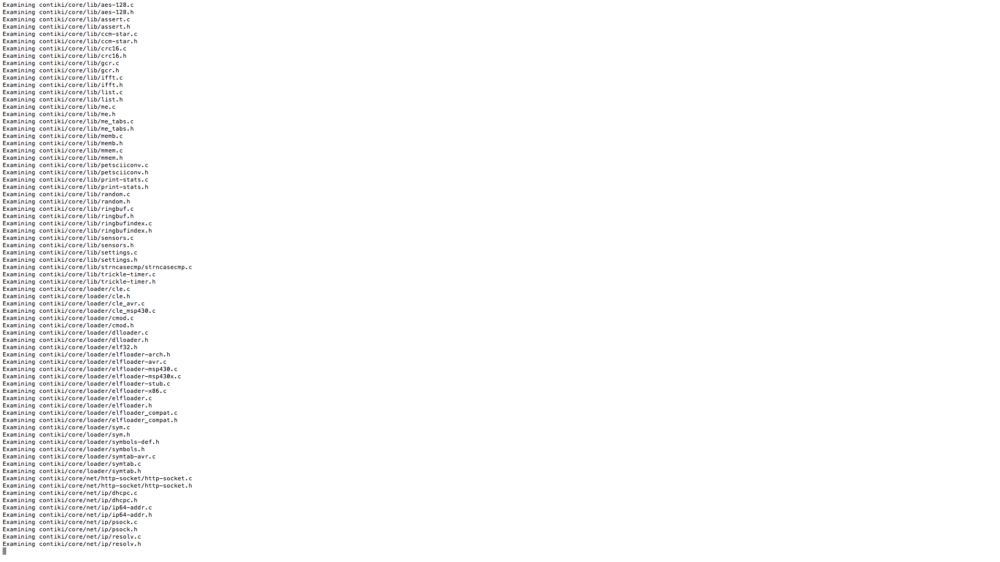
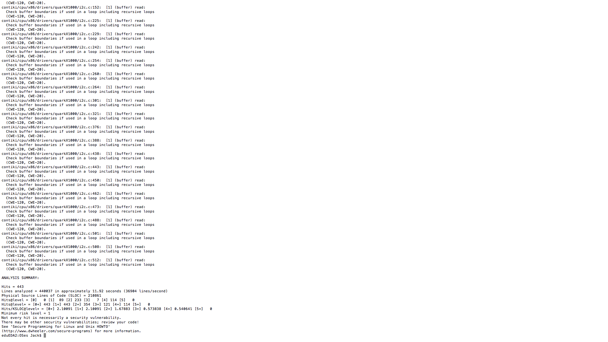

#Flawfinder

##Brief

Flawfinder is a simple static analysis tool which incorporates pattern matching of source code against a database of known vulnerabilities, in order to flag bugs in software. It was developed by David Wheeler as a tool for quickly assessing the stability of C/C++ based projects, and features a reporting system based on "risk level", allowing the user to distinguish errors based on levels of severity. As a result of its pattern matching mechanism, it is known to produce a high level of results which might otherwise be deemed harmless by the programmer. Due to this, it will likely need to be averaged against more concise tools in order to make its findings more applicable. Despite this, based on the speed and ease of use of the tool, it is incredibly trivial to apply it recursively to large codebases in short spaces of time, and as such will serve as a useful asset in pinpointing which areas of the Contiki source code, if any, are most saturated with bugs. 

To find out additional information regarding the usage of Flawfinder in this project, the directory <a href = "Static_Analysis/Open_source_tools/Flawfinder">`Static_Analysis/Open_source_tools/Flawfinder`</a> contains the complete documentation and results of the tool, including screenshots, test outputs and help files.

Additionally, consult <a href = "/Statistics/">Statistics</a> for an overview of general tool results, many of which involve reportings from Flawfinder. 

Within this report, you can also read more about Flawfinder under the [Static Analysis](#static-analysis) section.

##Features

Flawfinder incorporates a built-in database of C/C++ functions with well-known problems, such as buffer overflow risks (e.g., strcpy(), strcat(), gets(), sprintf(), and the scanf() family), format string problems ([v][f]printf(), [v]snprintf(), and syslog()), race conditions (such as access(), chown(), chgrp(), chmod(), tmpfile(), tmpnam(), tempnam(), and mktemp()), potential shell metacharacter dangers (most of the exec() family, system(), popen()), and poor random number acquisition (such as random()). 

Flawfinder then takes the source code text, and matches the source code text against those names, while ignoring text inside comments and strings (except for flawfinder directives). Flawfinder also knows about gettext (a common library for internationalized programs), and will treat constant strings passed through gettext as though they were constant strings; this reduces the number of false hits in internationalized programs.

Flawfinder produces a list of “hits” (potential security flaws), sorted by risk; by default the riskiest hits are shown first. This risk level depends not only on the function, but on the values of the parameters of the function. For example, constant strings are often less risky than fully variable strings in many contexts. In some cases, flawfinder may be able to determine that the construct isn’t risky at all, reducing false positives.

Not every hit is actually a security vulnerability, and not every security vulnerability is necessarily found. Nevertheless, flawfinder can be an aid in finding and removing security vulnerabilities. A common way to use flawfinder is to first apply flawfinder to a set of source code and examine the highest-risk items. This applies directly to our project, and will generally be the way we use the tool. The intention is to begin with a high-level approach to the entire source code, and then zero-in on specific areas.

* Flawfinder can also report on hit density: hits per thousand lines of source code.
* Released simultaneously as RATS by Secure Software Solutions.
* Flawfinder is very fast: Flawfinder version 1.31 averaged an analysis speed of 45,126 lines/second when it examined the Linux kernel version 3.16 (released 2014-08-03) on a Intel Core2 Duo CPU E8400 @ 3.00GHz (each CPU running at 2GHz) running Fedora Linux version 20.
* Based on its simple tokenisation procedure, flawfinder will necessarily produce many false positives for vulnerabilities and fail to report many vulnerabilities.
* Flawfinder utilises a system of risk levels to introduce granularity into its findings. 
* Flawfinder reports explicitly on known vulnerabilities and unsafe functions by integrating its own database.
* The risk level depends on the function as well as its given parameters. For example, constant strings are often less risky than fully variable strings in many contexts, and so receive a lower level of risk.
* Flawfinder can analyze software that you can't build.
* Flawfinder provides reccommendations for improving code security e.g. usage of safe replacement functions.

###CWEs

Flawfinder can report on the following CWEs:

* CWE-20: Improper Input Validation
* CWE-22: Improper Limitation of a Pathname to a Restricted Directory (‘‘Path Traversal’’)
* CWE-78: Improper Neutralization of Special Elements used in an OS Command (‘‘OS Command Injection’’)
* CWE-119: Improper Restriction of Operations within the Bounds of a Memory Buffer (a parent ofCWE-120: Buffer Copy without Checking Size of Input (‘‘Classic Buffer Overflow’’)
* CWE-126: Buffer Over-read
* CWE-134: Uncontrolled Format String
* CWE-190: Integer Overflow or Wraparound
* CWE-250: Execution with Unnecessary Privileges
* CWE-327: Use of a Broken or Risky Cryptographic Algorithm
* CWE-362: Concurrent Execution using Shared Resource with Improper Synchronization (‘‘Race Condition’’)
* CWE-377: Insecure Temporary File
* CWE-676: Use of Potentially Dangerous Function
* CWE-732: Incorrect Permission Assignment for Critical Resource
* CWE-785: Use of Path Manipulation Function without Maximum-sized Buffer 
* CWE-807: Reliance on Untrusted Inputs in a Security Decision
* CWE-829: Inclusion of Functionality from Untrusted Control Sphere

##Images

Flawfinder can be executed via the command line as a python program. All of the reports it generates are then printed. Some screenshots of this working in action can be seen below:

####Scanning directories for bugs

####Sample output of the "cpu" directory

##Limitations

* Flawfinder does not use or have access to information about control flow, data flow, or data types when searching for potential vulnerabilities or estimating the level of risk.
* High level of false positives can somewhat obscure the general picture of the results.
* No ability to run the program during a build execution. Instead, it is simply used on general segments of code.

##Conclusion

Flawfinder is an effective tool for scoping a codebase for high level issues that may be embedded in the source code. That is to say, as a tool, Flawfinder is incapable of contextual awareness - such as control flow or data types, but can spot verifiable bugs based on pattern matching with a known bank of vulnerabilities. It is a very fast tool with low overhead, so is suitable for gaining a quick understanding of source code stability when auditing a system. However, due to its emphasis on reporting negligible errors, a tool of this kind is most effective when used alongside others which are more concise, in order to establish a balanced overview of the vulnerabilities that are being reported.  