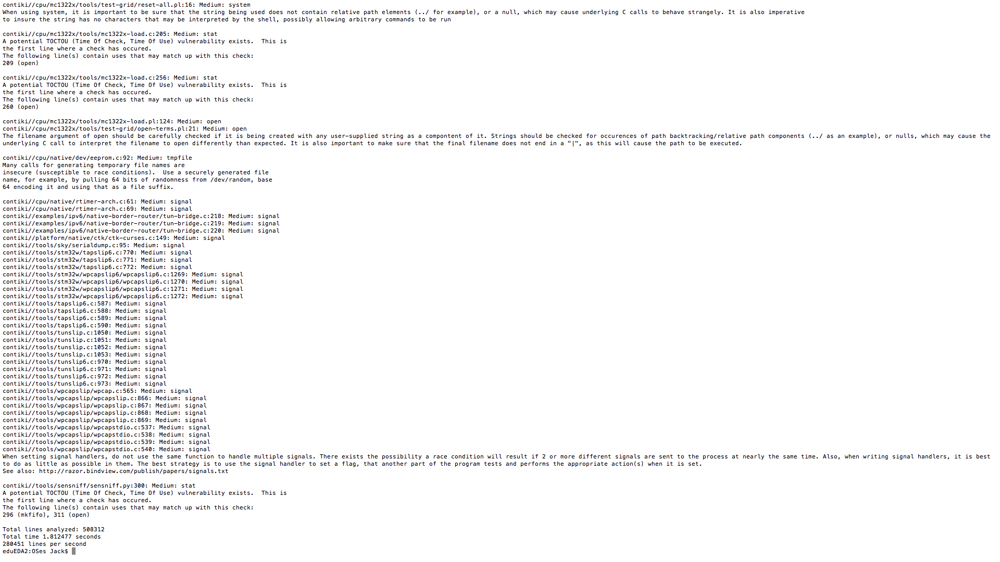
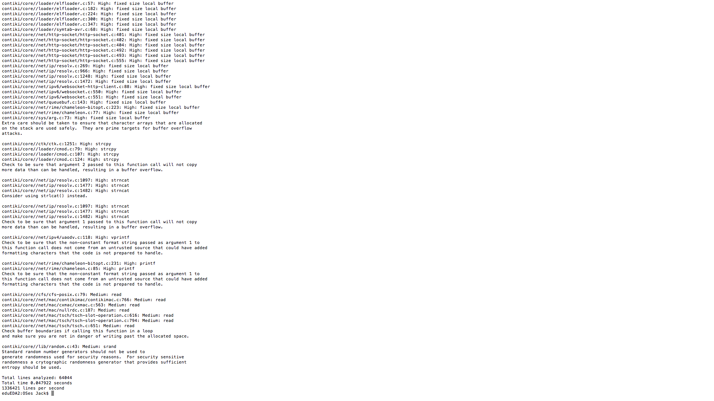

#Rough Auditing Tool for Security (RATS)

RATS, or "rough auditing tool for security", is a simplistic open source software tool designed for scanning a variety of languages and reporting on vulnerabilities. It was developed as part of the CERN Computer Security group, and is currently being distributed by Fortify as open source software. Similar to Flawfinder, RATS is a very fast tool, and can be easily integrated into a building process without noticeably increasing overhead. For C/C++ code, RATS is noted for detecting several typical types of errors, including Buffer overflows and race conditions. However, it is explicity stated in the documentation as being unable to report on design flaws present in programs. It was released around the same time as Flawfinder, but has been cited by both developers as being catered for discovering different types of vulnerabilities: making the tool a useful accompaniment. The inspiration to use RATS came from research conducted by McLean et al. (2012) during which the tool RATS was used alongside Flawfinder to analyse critical vulnerabilities in a set of programs, including Wireshark and Mozilla Firefox. Concluding their results, it was believed that Flawfinder was a more useful tool in its ability to convey a greater quantity of valuable information to the user. However,  The latest version of the tool is 2.4, which is currently available on Google Code Archive: https://code.google.com/archive/p/rough-auditing-tool-for-security/downloads. 

To find out additional information regarding the usage of RATS in this project, the directory <a href = "Static_Analysis/Open_source_tools/RATS">`Static_Analysis/Open_source_tools/RATS`</a> contains the complete documentation and results of the tool, including screenshots, test outputs and help files.

Additionally, consult <a href = "/Statistics/">Statistics</a> for an overview of general tool results, many of which involve reportings from RATS. 

Within this report, you can also read more about RATS under the under the [Static Analysis](#static-analysis) section.

##Features 

RATS scanning tool provides a security analyst with a list of potential trouble spots on which to focus, along with describing the problem, and potentially suggest remedies. It also provides a relative assessment of the potential severity of each problem, to better help an auditor prioritize. This tool also performs some basic analysis to try to rule out conditions that are obviously not problems.

As its name implies, the tool performs only a rough analysis of source code. It will not find every error and will also find things that are not errors. Manual inspection of your code is still necessary, but greatly aided with this tool.

* Provides a rough overview of source code and can be run quickly.
* Although only a rough auditing tool, provides an intelligent filtering mechanism to differentiate false positives and false negatives. This filtering system is more aggressive than that of Flawfinder.
* Specialises in detecting format string vulnerabilities.
* Also features a built-in understanding of common vulnerabilities, similarly to Flawfinder.
* Makes security suggestions in its report output, as with Flawfinder.
* Incorporates a severity level system to rank the vulnerabilities it discovers.
* Provides code metrics on total number of lines analyzed, number of lines read per second and time taken in seconds.

##Images

RATS is a command line driven program. All of the reports it generates are then printed to the console, but can also be piped to a text file for later analysis. Some screenshots of this working in action can be seen below:

####Scanning directories for bugs

####Sample output of the "core" directory

##Limitations

* Known to only provide limited coverage of a program.
* Its filtering mechanism causes it to output a lower volume of errors than competing tools such as Flawfinder.
* It is unclear what type of CWE or CVE it is primarily aimed towards detecting, so applying it to detecting a specific type of error is very difficult.
* The severity levels reported by the tool only consist of 3 tiers against Flawfinder's 5, meaning there is less granularity and meaning behind the error outputs. 

##Conclusion

In conclusion, as its name suggests, RATS is a useful tool for quickly scoping the general security of a software system. It can be applied readily via the command line as with other similar tools, and is able to recursively search directories and parsing entire files; returning metrics regarding the physical lines of code it has analysed. RATS also features a pattern matching system capable of detecting commonly known errors, with respect to the database of CWEs. Furthermore, the tool implements an intelligent filtering system to separate errors into three categories: low, medium and high. It is however unclear as to the basis on which these categories are separated. The filtering system is also applied more heavily than Flawfinder's equivalent, leading to considerably more errors being interpreted as false positive; and therefore harmless. RATS is therefore a useful addition to our collection of tools, as it will assist in averaging the findings gathered by the heavily verbose Flawfinder, and the concise Cppcheck tool. It is, in a sense an effective 'middle ground' between the two. 