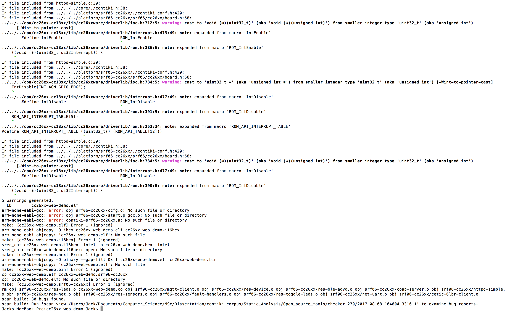
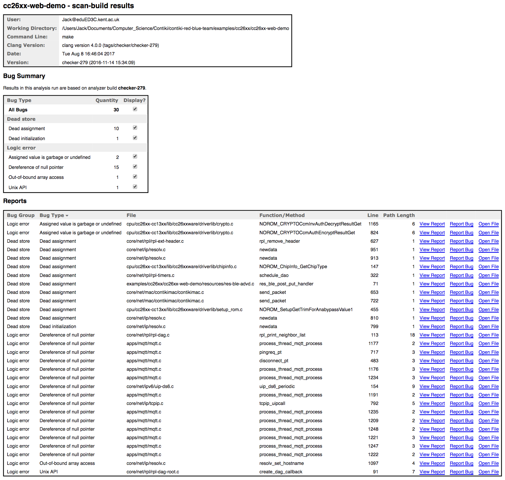

#Clang Analyzer

##Brief

The Clang Static Analyzer is a source code analysis tool that finds bugs in C, C++, and Objective-C programs. Currently it can be run either as a standalone tool or within Xcode. The standalone tool is invoked from the command line, and is intended to be run in tandem with a build of a codebase. The analyzer is 100% open source and is part of the Clang project. Like the rest of Clang, the analyzer is implemented as a C++ library that can be used by other tools and applications. One of the excellent features of the Clang Static Analyzer is its ability to be run in tandem with a project build command: allowing the tool to gain a context of control flow not previously possible with our other selection of open source tools. Resultantly, we can use Clang to build individual instances of Contiki, for example the cc26xx-web-demo project, which contains much of the core functionality featured across many typical Contiki deployments. In doing so, we can maximise the coverage of errors we obtain in a single run of the tool, and generate a progression of reproducible steps in the program's execution that leads to the evocation of a bug. This makes it an invaluable tool in assessing the actual likelihood of certain undefined behaviour occurring. 

To find out additional information regarding the usage of Clang-Analyzer in this project, the directory <a href = "Static_Analysis/Open_source_tools/checker-279">`Static_Analysis/Open_source_tools/checker-279`</a> contains the complete documentation and results of the tool, including screenshots, test outputs and help files.

Additionally, consult <a href = "/Statistics/">Statistics</a> for an overview of general tool results, many of which involve reportings from Clang-Analyzer. 

Within this report, you can also read more about Clang-Analyzer under the [Static Analysis](#static-analysis) section. In the corpus directory, there are also files related to the reports which the tool generates. These can be viewed in an output of your choice, but the most visually useful would be as HTML reports. 


##Features

* C++ library used to find bugs in C/C++/Objective C programs.
* Can be run as a standalone tool, or through XCode.
* Can also be run as a project is built, allowing for error checking on the fly. Using this feature, Clang Analyzer also has a graphical user interface (GUI), which can be used to visually relay the location of areas with explicit steps in control flow.
* Built into many existing static analysis tools.
* Produce results in HTML/XML/CSV format for database storage and viewing.

##Images

Clang-Analyzer is a command line driven tool with an external GUI option for viewing reports. The following screenshots demonstrate how it can be run from the command line, and the various formats that its results can be observed in.

####Executing build analysis of cc26xx-web-demo

####Clang-Analyzer Bug Categories

####Output of build analysis

####GUI example of a null pointer dereference bug in mqtt.c


##Limitations

* Requires previous experience in C programming to understand output.
* Since the tools performs deep analysis of the code, using it for static analysis can be much slower than compilation.
* Suffers from very high false positive rates.
* Whilst it seems to discover a larger number of errors than similar tools such as Cppcheck, it isn’t so easy to distinguish between those which are stylistic compared to legitimate errors that affect Contiki’s stability.
* A large emphasis on "dead code" related bugs, which may be viewed as false positives.
* No clear distinction of bug types. There are two main categories of "Logic Error" and "Dead Store" but a lack of granularity in terms of error severity.


##Conclusion

Clang is a C/C++ static analyser which is implemented across a few different C compilers and static analysis tools. It is very easy to run, and can be easily used on multiple directories to analyse multiple C/C++ files. It is also comprehensive and diverse in the number of errors it can detect, ranging across incorrect type declarations, to warnings about the structures of arrays. As a tool, Clang possesses some versatility with regards to how it can be run, with options allowing the user to execute it via XCode, as normal through the command line, or with a GUI enabled. This versatility also translates across its results formatting, which can be viewed in HTML format and exported to CSV. There is however a lack of indication to error severities, meaning that establishing granularity between its output for certain projects is difficult. This is a feature commonly employed across the other tools, so it is surprising that a basic weighting scheme to its error detection was not employed e.g. a severity rating distinguishing redundant "dead code" from critical logic flaws. 