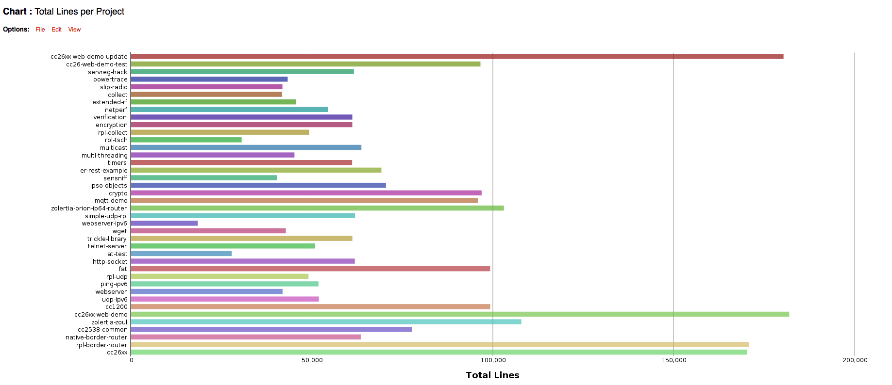
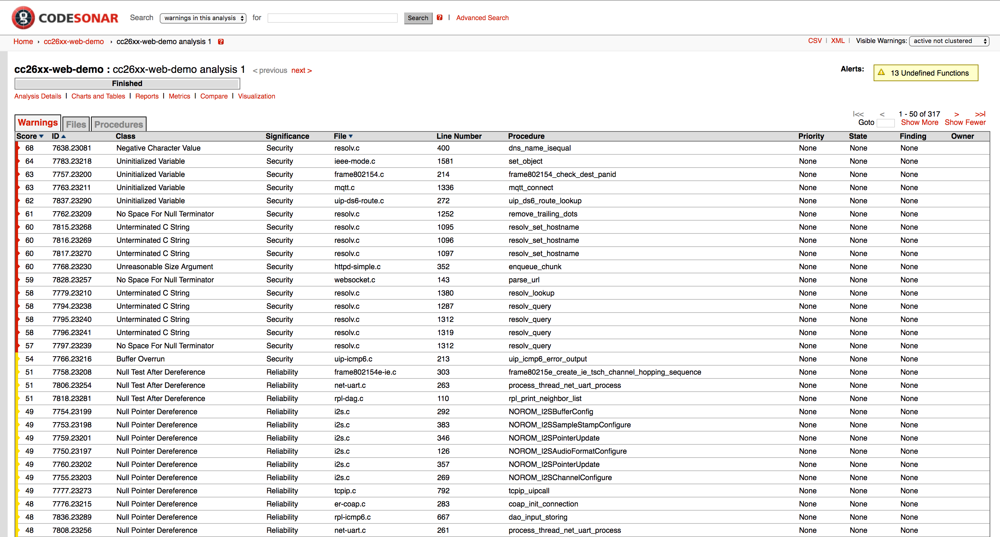
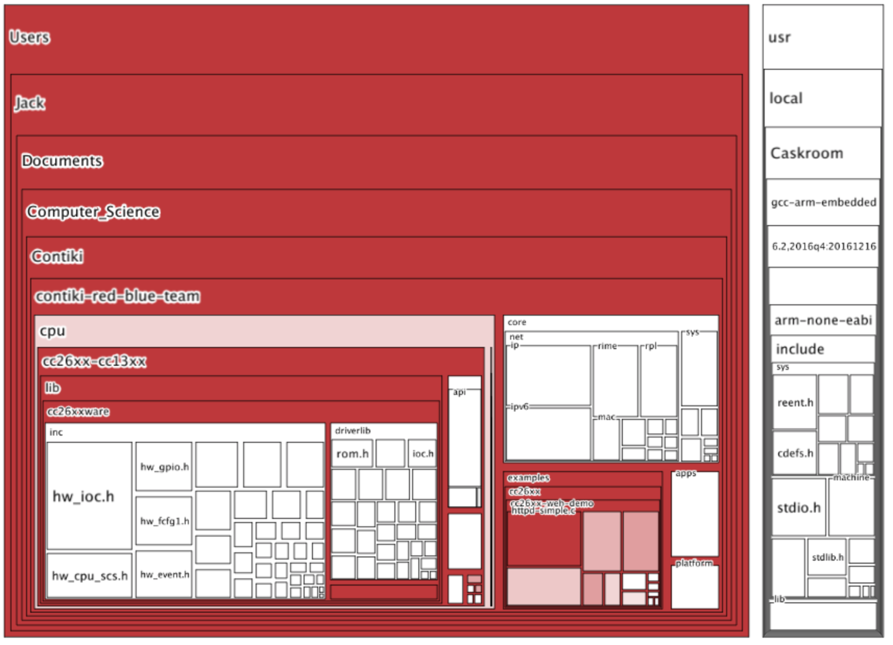

#GrammaTech CodeSonar

CodeSonar by GrammaTech is a suite of advanced static analysis tools which enable deep inspection and vulnerability analysis of source code. Designed primarily for Java and C/C++ based projects, CodeSonar is capable of measuring control flow and performing taint analysis of a program, by being executed as part of the build process or through being deployed on the source code. Resultantly, we used it in this project to build 40 different examples of Contiki applications, which we then subsequently analysed for bugs during their build sequence. This provided us with extensive coverage over the operating system's code, which we believe has afforded us an in-depth analysis of the majority of all possible code executions between the system builds. 

According to the tool's website, CodeSonar has been successful in finding more vulnerabilities than any other static analysis tool on the market. As it can analyse both source code and binaries, it is able to determine security flaws in a more dynamic setting than with typical pattern matching based tools. In this project, CodeSonar was used entirely within the context of analysing binaries of programs, and was used as a basis of comparison for its closest open source equivalent used in this study: Clang-analyzer. Due to its capabilities, CodeSonar is often used within the Software Development Life Cycle by teams of professionals to analyse complete applications in a short space of time.

A general pattern behind our use of the tool involved deploying the tool on a given application, observing the error output generated by it, and sorting the errors in terms of severity. As the tools reports on a large number of harmless errors, our focus was naturally drawn towards those which were more critical. Resultantly, we found several major flaws in Contiki's critical applications which would have otherwise gone unnoticed with the use of the more simplistic open source tools. 

To find out additional information regarding the usage of CodeSonar in this project, the directory <a href = "Static_Analysis/Proprietary_tools/CodeSonar">`Static_Analysis/Proprietary_tools/CodeSonar`</a> contains the complete documentation and results of the tool, including screenshots, test outputs and help files.

Within this report, you can also read more about CodeSonar under the [Static Analysis](#static-analysis) section.

##Features

* Identify complex security vulnerabilities.
* CodeSonar provides support for detecting and correcting multicore / multithreaded flaws.
* CodeSonar generates customised PDF reports documenting flaws, helping to increase code quality and provide transparency to a project.
* The tool also enforces coding standards based off of CVE/CWE. This allows the user to audit code against regulatory requirements.
* CodeSonar features extensive forms of application visualisation: such as Treemaps, Control Flow diagrams and standard graphs and charts for visualising data in a meaningful way. 
* Can be used effectively in a team, using a centralised "hub" system to store analysis reports.
* Incorporates a graphical user interface (GUI) to visualise reproducible steps for encountering bugs, allowing the user to easily understand the path to a problem.
* Specialises in detecting a variety of vulnerability types, including static memory issues, resource management, concurrency bugs and other defects.
* Severity level of each vulnerability with a corresponding "score", offering granularity within the three main error categories.
* Three additional "significance" classes to further express the nature of the bug: "Security", "Redundancy" and "Reliability".
* CodeSonar can perform a whole-program analysis on 10M+ lines of code.

####Security Issues

* Buffer Overrun
* Uninitialized Variable
* Free Non-Heap Variable
* Use After Free
* Double Free/Close
* Format String Vulnerability
* Return Pointer to Local

####Reliability Issues

* Data Race
* Deadlock
* Null-Pointer Dereference
* Division by Zero
* Double Close
* Dangerous Function Cast
* Resource Leak

##Images

Below is a series of select screenshots of CodeSonar in action. For a more comprehensive overview of the reporting capabilities of the tool, navigate to `/Static_Analysis/Proprietary_tools/CodeSonar/Reports` to view the reports of 40 different Contiki applications.

####CodeSonar Overview

An overview of the projects we deployed CodeSonar across, including metrics and datetime information.

####Warnings per project

####Files per project

####Lines per project

After having initiated several runs of the CodeSonar tool, we were able to produce several useful metrics exploring the number of warnings, files and lines of code per project. 

####Application Report

Overview of errors detected for the cc26xx-web-demo project. On the left is a "score" assigned to each vulnerability detected by the tool. Each flaw is also provided an ID, for keeping track of individual cases, as well as a classification depending upon the type of error. Additionally, there is information regarding the line on which the major error occurs, the name of the procedure affected, and some configurable options for setting priorities on certain bugs. As we handled this largely through Bitbucket, this was not a feature we made use of. 

####MQTT Uninitialized Variable Bug

By selecting individual errors in the report, you are then able to view the specific details regarding them: featuring reproducible steps referred to as "events", and justifications made by the tool as to when and how they may occur. In the project, this formed an excellent basis for analysing the bugs at a closer level, and establishing the causes behind them. Reports such as this, which is for an MQTT bug which we ended up patching, was used to formulate our bug reports which we submitted on Bitbucket; using images such as this for evidence. The above MQTT bug was responsible for causing a system crash experienced using our CC2650 launchpad testing environment. 

####Application Metrics

Resulting from CodeSonar's extensive reporting capabilities, we were able to use it to generate simple warning metrics such as the one above, allowing us to grasp an understanding of the volume of errors as well as the nature of them. The complete collection of these across the projects we analysed can be seen in `/Static_Analysis/Proprietary_tools/CodeSonar/Reports`. To see more documentation of confirmed bugs in the Contiki project, navigate to the `/Static_Analysis/Proprietary_tools/CodeSonar/Bug_Screenshots` and `/Static_Analysis/Proprietary_tools/CodeSonar/Critical_Bugs` folders. 

####Application: cc26xx-web-demo comparison

During the project we conducted multiple runs on the same source code to evaluate the effects of our patches. It was important to be certain that our proposed fixes were not responsible for the propagation of more errors. In the image above, after having fixed several major issues embedded in the cc26xx-web-demo application, we conducted a second analysis run, which shows the updated metrics. A particular issue we solved was the unitialised variable issue in mqtt.c, which, as a result, no longer appears in the updated chart as all instances of the bug have been patched.

####Data Visualisation

Amongst the typical graph and chart forms of visualisation, CodeSonar also features its own custom treemaps and callgraphs. Both forms of visualisation are used to express the hierachical links between specific parts of a given system: the above treemap showing the project hierarchy of the cc26xx-web-demo example. The below call graph of sicslowpan.c shows the control flow of the file, linking together the functions which invoke each other. Both forms of visualisation can aid the programmer in understanding where certain bugs may originate from, and the wider scope of procedures which may be affected as a consequence. 

Example Application| Redundancy | Security | Reliability
-------------------|------------|----------|------------
cc2538	| 152 | 10 | 26
cc26xx | 174 | 40 | 26
cc26xx-web-demo | 219 | 61 | 37
encryption | 95 | 61 | 29
er-rest-example | 110 | 80 | 31
native-border-router | 109 | 65 | 30
rpl-border-router | 184	 | 40 | 28
rpl-tsch | 27	 | 21 | 10
sensniff | 6 | 0 | 0
simple-rpl-udp | 98 | 67 | 32
slip-radio | 6 | 0 | 0
telnet-server | 132 | 92 | 23
udp-ipv6 | 80 | 64 | 25
webserver | 54 | 43 | 10
webserver-ipv6 | 20 | 8 | 1
TOTAL | 1466 | 652 | 308

 

CodeSonar output in terms of error type.

##Limitations

* "A fool with a tool is still a fool" - CodeSonar errors require just as much interpretation as those found in others tools. Due to its high level of reportage, a human programmer still needs to filter the results. 
* Verbose in terms of reportage. This can be very time consuming for a security analyst to determine the false positives from the false negatives.
* Requires some understanding of makefiles and compilers to be able to run during the build sequence of a project.
* Timely execution.
* Requires a license to run.
* Decentralised storage of tool results on a webserver referred to as the CodeSonar "hub".

##Conclusions

CodeSonar is a very inclusive software suite for determining security bugs. It is very scalable, and offers an in-depth analysis of critical flaws found in either program binaries or source code. As far as static analysis tools go, it requires configuration to work correctly, which may cause it to be less user friendly. However, a single analysis can yield a wealth of information about a project, and often reports of vulnerabilities which would otherwise be impossible to discover. Resultantly, it serves as a great benchmark for static analysis tools on the market, and has successfully been used in this project to retrieve findings where other open-source tools fall short. Additionally, it provides a great comparison against Clang-Analyzer, which we consider its open source equivalent. 