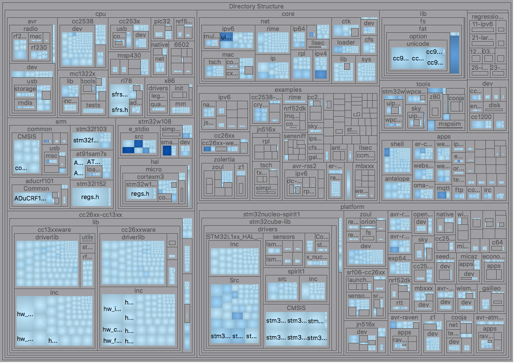
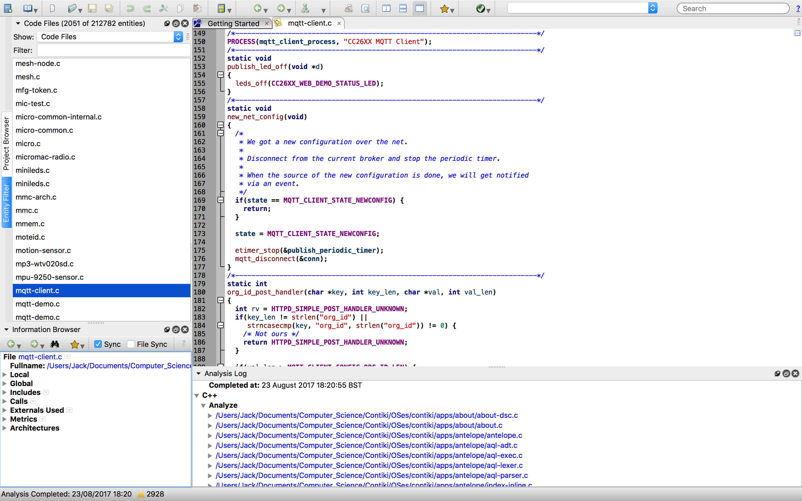
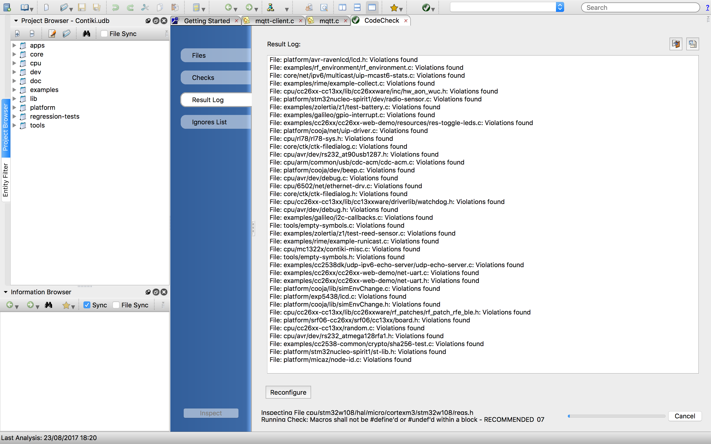
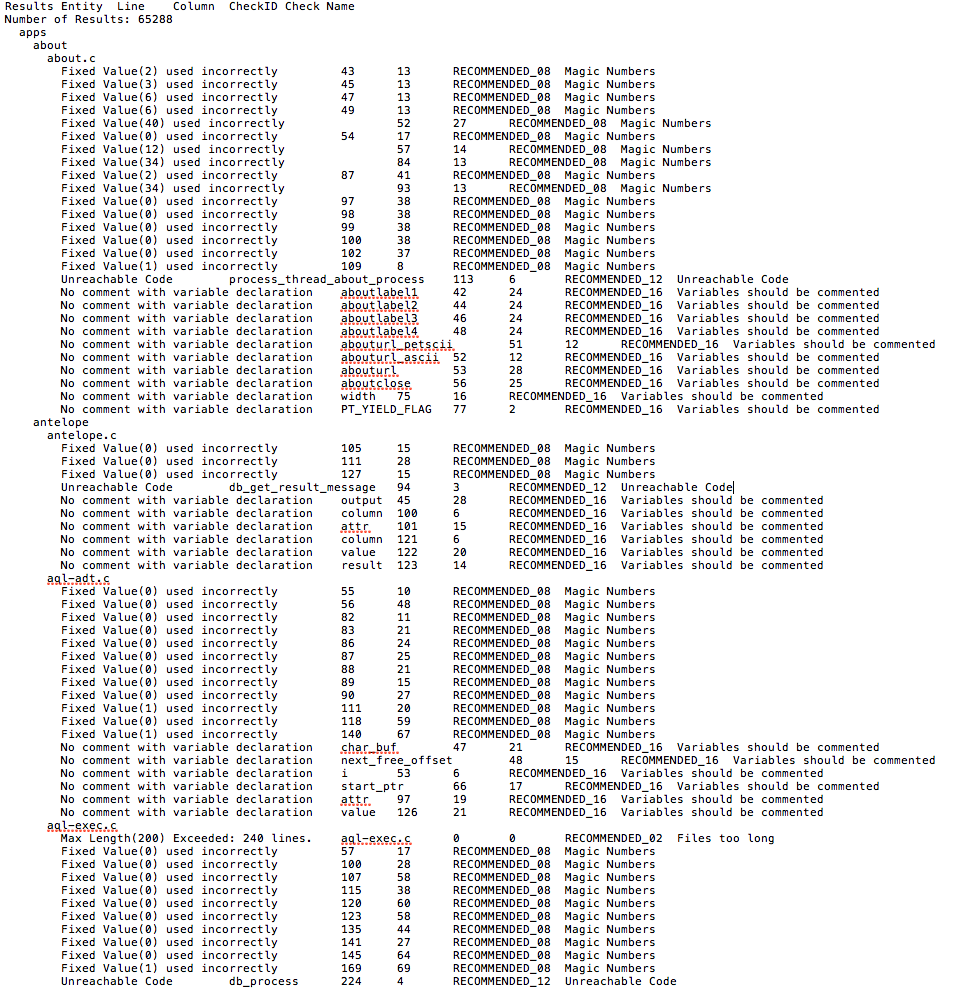

#SciTools Understand

Understand combines a code editor with a powerful static analysis tool, several forms of data visualisation such as a treemap, and software metrics reporting system. It can be executed as a desktop application, and when supplied with a project directory (such as Contiki) it offers a suite of analyzers for spotting vulnerabilities in the source code. 

As we didn't use Understand to a large extent in this project, this section will be brief. Additionally, it was later revealed that Understand uses a built-in variation of the Clang Static Analyzer, so we did not expect the findings to be novel in light of what we had obtained with the open source tools. It does, however provide a useful basis for showcasing the additional features that proprietary tools have to offer. We managed to use this tool having obtained access to a year long student license.

Understand combines the Clang Static Analyzer, as well as its own specific analysis tool with some more useful metrics and visualisations regarding the Contiki source code, which have helped us in fully comprehending how different functions interact with one another. This was particulary true in the case of the mqtt_connect function, which is integral to most devices running Contiki irrespective of platform. 

To find out additional information regarding the usage of Understand in this project, the directory <a href = "Static_Analysis/Proprietary_tools/Understand">`Static_Analysis/Proprietary_tools/Understand`</a> contains the complete documentation and results of the tool, including screenshots, test outputs and help files.

Within this report, you can also read more about Understand under the [Static Analysis](#static-analysis) section.

##Features 

* Combines a beta version of the Clang Static Analyzer with several other static analysis tools, which can be implemented either simultaneously or one by one to observe differences.
* Different analysers for different purposes: Features the Sci-tools "recommended" analyser for universal standards of software stability, published standards agreed upon by academic experts, as well as the Clang Static Analyzer.
* Provides in-depth visualisation of software, including UML diagrams, treemaps, call graphs, cluster calls and butterfly charts. 
* Incorporates a GUI for viewing code.
* Understand implements an "Entity Filter" used to detect all areas of a project. This allows the user to isolate specific areas of the source code, e.g. the "core" directory for closer inspection.
* Allows the user to set several parameters when analysing code - such as analysing only the files that have changed since a given date/time.
* Keeps track of localised changes to files, and subsequently recomputes results to reflect changes. 

##Images

####Understand overview

An overview of the Understand graphical user interface. On the left, are the directories of the Contiki project, which we imported into the application.

####Contiki Project Treemap

Above is a colour-coded treemap of the Contiki project, displaying the hierarchical dependencies of the main directories and the files within.

####MQTT Source Code

Understand features a simple source code view of each "entity" it parses from a project. Having arranged the project in alphabetical order, it is easy to locate a particular file (in this case mqtt.c) and view its source code. From here, by right clicking a particular procedure, we can observe graphical representations of it, such as a control flow diagram.

####MQTT Control Flow

Understand is capable of mapping out the entire control flow of a given procedure: in this case, that of mqtt_connect(). This is valuable in terms of understanding a procedure's interlinked functions, and therefore determining the scope of which a bug can affect a system's performance.

####MQTT Butterfly Chart

This can be viewed in multiple ways. The above chart  is referred to as a "Butterfly". It provides an abstracted view of the dependencies of any given function. In the case of "mqtt_connect", we can see that "process_post" and "uiplib_ip6addrconv" are dependencies, and so we should be careful in making sure they still work as planned whenever we modify the source code of "mqtt_connect". 

####Static Analysers

When running Understand's suite of static analysis tools, the result log displays the filename of each subsequent file it has analysed, followed by an indication of whether it has located bugs in the given file. 

####Static Analysis Report: "SciTools' Recommended Checks"

The SciTools Recommended Checks scan is largely redundant in this project, as it is based on stylistic issues associated with code. When we ran this through Contiki, the majority of the issues detected were concerned with code readability and "Magic Numbers". As a result, no bugs of serious concern were discovered.

####Static Analysis Report: "Clang Static Analyzer (beta)"

The Clang Static Analyzer, on the other hand documented some more useful findings, highlighting areas of "dead code" which could be removed to improve the overrall efficiency of the operating system, as well as instances of unsafe function usage. 

##Limitations

* Running the Understand static analysis tools takes a long period of time. This is particularly an issue when running multiple analysers at one time.
* Occasionally reports on largely irrelevant details - such as stylistic issues associated with comments.
* Error output format is difficult for humans to interpret.
* No option to perform binary analysis such as with CodeSonar. 

##Conclusions

After more use, some more substantial conclusions on the tool would be drawn. On the surface, Understand appears to effectively combine several powerful static analysers into one, providing multi-faceted coverage over a project. It can be executed very easily and requires minimal prior knowledge of programming to interpret errors. One of Understand's main strengths lies in the wealth of visualisation options it has at its disposal, as when processing large and complex codebases, they can be used to seamlessly understand the interlinking of code modules without having to closely examine source code.

