#Static Analysis 

An overview of our use of static code analysis in the project.

##Overview

The first stage in the Contiki project is to analyse the security limitations through the use of static code analysis tools. Static analysis involves using code analysis tools on the Contiki source code to determine the existence of bugs or logic flaws without executing the code dynamically. The aim of this is to determine the bug density of Contiki based on the number of potential programming errors, and from there, to evaluate the main areas where the operating system may have vulnerabilities. Static code analysis is considered a highly effective tool for measuring software security, and essentially is capable of highlighting flaws before the system is dynamically executed or even deployed in the wild. For Internet of Things devices, which are notoriously regarded as having exploitable security features, static analysis is an invaluable tool in the developer’s arsenal.

For sensor based systems such as Contiki, which support Internet and network connectivity of multiple devices through mesh networking and micro IP, exploitation is high risk. In the current climate of IoT insecurity, a recently amassed horde of compromised devices, known as the Mirai Botnet, have been reported as capable of delivering Denial of Service attacks of up to 1.2 Tbps (source: https://www.theguardian.com/technology/2016/oct/26/ddos-attack-dyn-mirai-botnet). This has been known to significantly impact and disrupt public services as well as specific targets; with an earlier attack on the information security blog of Brian Krebs, as well as DNS server Dyn; surpassing traffic of 665 Gbps (source: https://www.flashpoint-intel.com/mirai-botnet-linked-dyn-dns-ddos-attacks/).

As IoT security is a widespread issue, we also considered the security of other operating systems in our results. To establish a measure of the integrity of Contiki relative to its other open source competitors, we deployed our tools on the codebases of TinyOS, RIOT, and openWSN, and compared the results. This was done on an average tool-by-tool basis, in which we compared the error output for each respective system using a selection of tools, as well as longitudinally, using releases of each operating system from the past five years and generating an average output of errors. This was used to give us an understanding of how each system was developing in terms of its stability over time, but most importantly how our primary focus, Contiki, was shaping up in light of its competitors. 

To find tool specific examples of static analysis results, navigate to the <a href = "Static_Analysis/">`Static_Analysis/`</a> directory to find our collection of open source and proprietary tools, or visit the individual tool section.

##Static Analysis Tools

To commence the static analysis of the Contiki source code, we initially looked at free and open source tools available at our disposal. As Contiki is written in C/C++, there were a variety of tools available for installation across several operating systems. After having found a suitable selection of open source tools, we then utilised funding to obtain some potentially more powerful licensed-based tools; with the aim to perform a more in-depth analysis of the source code. This process involved researching a bank of applicable tools which were compatible with C/C++ code, testing the effectiveness of approximately ten different open source tools, generating and evaluating their result outputs, and finally streamlining our selection of tools for further use in the project.

The first stage of undertaking static analysis of the Contiki source code, is to first explore our bank of static analysis tools and run them on the code; documenting their features, drawbacks, results, and drawing conclusions about them. This will be done to determine the capabilities of open source tools, and evaluate where their strengths and weaknesses lie. From here, we can speculate on additional features that may be useful to our extended analysis of the Contiki source code, which can then be used as a basis for comparison against more sophisticated tools which require purchasing or academic license agreements. The tools used in this study will all be subjected to the same Contiki Source code, which we have split into several areas based on the functionality they provide to the Contiki project. As of the current release (3.x) they are: 

Directory | # of files | Information
----------|------------|------------
apps | 142 | Applications to be run on the Contiki Operating System to provide functionality e.g. web server.
core | 173 | Core functionality behind Contiki.
cpu | 349 | Defines the functionality depending on which chip is being used to run Contiki e.g. ARM, AVR, pic32.
dev | 7 | Device driver APIs.
doc | 6 | Documentation behind the system. Contains some example .c files.
examples | 230 | Examples fully fledged Contiki application programs e.g. base code for a TCP server.
lib | 12 | Library files for FAT filesystem support.
platform | 298 | Support files for integrating Contiki with device platforms and standards.
regression-tests | 9 | Library of tests to measure code functionality and errors. 
tools | 39 | Contiki OS configuration files.
<b>Total</b> | <b>1,265</b>

Our provisional list of static analysis tools included the following, as obtained from a wikipedia article on C/C++ static analysis tools (https://en.wikipedia.org/wiki/List_of_tools_for_static_code_analysis): 

* Astrée: A tool which finds all potential runtime errors and data races by abstract interpretation, can prove their absence, and can prove functional assertions. Tailored towards safety-critical C code. Includes MISRA checker.
* Axivion Bauhaus Suite: A static code analysis tool suite that performs various analyses such as architecture checking, interface analyses, MISRA checking, and clone detection.
* BLAST (Berkeley Lazy Abstraction Software verification Tool): An open-source software model checker for C programs based on lazy abstraction.
* Cppcheck: Open-source tool that checks for several types of errors, including use of STL.
* Cpplint: An open-source tool that checks for compliance with Google's style guide for C++ coding.
* Clang: An open-source compiler that includes a static analyzer.
* Coccinelle: An open-source source code pattern matching and transformation.
* Coverity: A static analysis tool for C/C++.
* Cppdepend: Simplifies managing a complex C/C++ code base by analyzing and visualizing code dependencies, by defining design rules, by doing impact analysis, and comparing different versions of the code.
* ECLAIR: A platform for the automatic analysis, verification, testing and transformation of C and C++ programs.
* Eclipse (software): An open-source IDE that includes a static code analyzer.
* Flawfinder: A python based program which uses pattern matching to detect and report possible security weaknesses against a database of common weaknesses (CWE).
* Fluctuat: Abstract interpreter for the validation of numerical properties of programs.
* Frama-C: An open-source static analysis framework for C.
* Goanna: A software analysis tool for C/C++.
* GrammaTech CodeSonar: A proprietary static analysis tool suite capable of deep inspection of C/C++ code, identifies bugs that can result in system crashes, unexpected behavior, and security breaches.
* Klocwork Static Code Analysis: A static analysis tool for C/C++.
* Lint: The original static code analyzer for C.
* LDRA Testbed: A software analysis and testing tool suite for C/C++.
* Parasoft C/C++test: A C/C++ tool that does static analysis, unit testing, code review, and runtime error detection; plugins available for Visual Studio and Eclipse-based IDEs.
* FlexeLint/PC-Lint: A software analysis tool for C/C++.
* Polyspace: Uses abstract interpretation to detect and prove the absence of run time errors, Dead Code in source code as well as used to check all MISRA (2004, 2012) rules (directives, non directives).
* PRQA QA·C and QA·C++: Deep static analysis of C/C++ for quality assurance and guideline/coding standard enforcement with MISRA support.
* RATS (Rough Auditing Tool for Security): An open source tool which priotises detection of Buffer overflows and race conditions in C/C++ code.
* SciTools Understand: A license based tool which combines a code editor together with an array of static analysis tools and forms of data visualisation.
* SLAM project: A project of Microsoft Research for checking that software satisfies critical behavioral properties of the interfaces it uses.
* Sparse: An open-source tool designed to find faults in the Linux kernel.
* Splint: An open-source evolved version of Lint, for C.

During the project, we conducted code evaluation using a variety of static analysis tools on the Contiki codebase. We had eight main tools at our disposal: four of which were open source, and the remaining four which were licensed based (in the case of CodeSonar, Coverity and FlexeLint) or evaluation copies (Understand). We compared the relative performances of the tools in terms of the number of issues they detected and their perceived levels of severity, detection of unsafe function usage, and ratio of false positive and false negative results. Additionally, we evaluated them within the subcategories of open source and proprietary, drawing conclusions on whether licensed based tools offered more holistic and detailed reportage of vulnerabilities in the system. To a small extent, we also evaluate the usability of the tools, with a focus on the general ease-of-use of obtaining findings, and rough time taken to analyse the code.

The tools themselves were diverse in operation and capability: some of which functioned as simple pattern matchers for known vulnerabilities, and others which dynamically executed the code to provide a complete measure of all possible control flows. Consequently, interpreting the results varied greatly between the tools. The more simplistic cases offered basic "hit counters" as well as a measure of bug severity levels, whereas some of the proprietary tools implemented forms of data visualisation such as Treemaps and Control Flow Graphs.

##Open Source

The four main open source tools we used included:

* Cppcheck: An analysis tool for C/C++ which prioritises low false positives. Unlike compilers and other static analysis tools, it doesn't detect syntax errors. (http://cppcheck.sourceforge.net/)
* Flawfinder: A simple program which detects and reports possible security weaknesses based on a database of common weakness enumeration (CWE). (https://www.dwheeler.com/flawfinder/) 
* RATS: A very fast tool which priotises detection of Buffer overflows and race conditions in C/C++ code. (https://security.web.cern.ch/security/recommendations/en/codetools/rats.shtml)
* Clang Static Analyzer: A source code analysis tool which finds bugs in C/C++ programs. Designed to be run in tandem with a build of a codebase. Provides a GUI visualisation for errors it detects. (https://clang-analyzer.llvm.org/)

In order to establish consistency in our comparison, we initially measured each tool based on the total number of errors it detected. To do this, we selected a subset of the static analysis tools which were capable of analysing the entire source code in a single run. This applied to Cppcheck, RATS and Flawfinder, which are designed to parse entire codebases and return a measure of "hits" in relation to potential flaws they detected. Unfortunately, this made it difficult to directly compare the effectiveness of open source to proprietary tools, but it did however allow us to analyse them within their own category. It also drew our attention to the reporting priorities of each tool: for example, in the case of Cppcheck, which prioritised low levels of false positives, its overall findings were the lowest in terms of the number of errors it detected. This may provide some indication of this particular tool being sophisticated, implying it uses a filtering mechanism to relay only the most important information to the user. Conversely, its findings may also suggest that the other tools return considerable levels of highly redundant results which can be safely ignored by the user as ``baggage'', or perhaps even that Cppcheck does not offer as extensive a coverage of the source code as the other tools.

To find more information about the open source tools used in this project, visit the <a href = "Static_Analysis/Open_source_tools">`Static_Analysis/Open_source_tools`</a> directory

##Errors in Contiki OS

Our initial use of the open source tools involved assessing the total number of errors in the Contiki source code. This would later be used as a basis of comparison against the license based tools, and to provide general metrics regarding the stability of the operating system. The idea behind this is to establish a baseline measurement of errors in the operating system, and to reveal some information regarding the areas which are most heavily affected by bugs at present. Furthermore, this allows us to establish the error rate over time between releases, and draw conclusions and even estimations about its future development, with regards to its past trajectory. Additionally, this data will be used for comparison purposes when looking at other operating systems similar to Contiki.

We begin by analysing this at a codebase level, and then individually by directory, in order to determine the highest concentration of errors detected by the tools.

###By codebase

To begin, we start with measuring the total number of errors found in consecutive releases of Contiki, over the entirety of the codebase. We conduct this measure over the past 10 years of releases, starting with version 2.0 and concluding with the current release, 3.0. During this phase, we recursively run our three source-code checking tools, Flawfinder, RATS and Cppcheck, all three of which are capable of measuring the errors in the entire source code as well as on a directory by directory basis. 

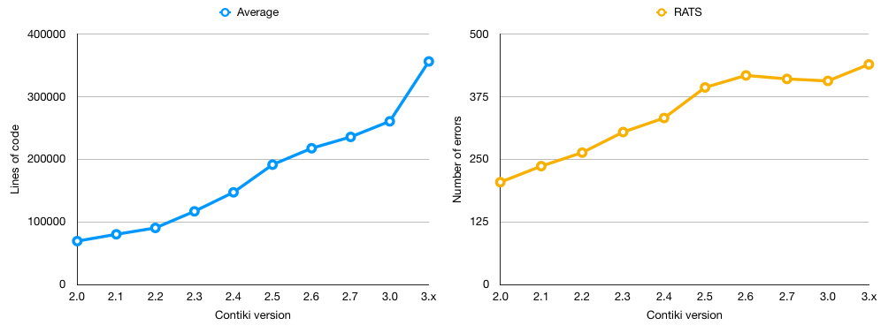

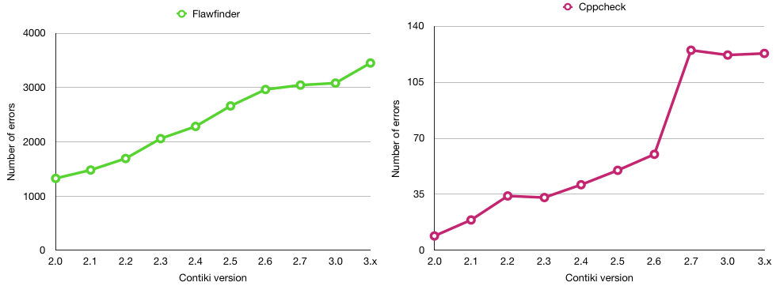

####Conclusion

According to the graph, the number of errors in Contiki OS has steadily increased over time, with the latest release exhibiting upwards of 4,000 errors. This is perhaps to be expected though, as over time, the size of the codebase of any project grows, driving complexity levels higher; and therefore increasing the likelihood that bugs are introduced into the system. That said, over time studies have increasingly highlighted the dangers of unsafe programming practices in ANSI C. These findings are also generally reflected in the outputs of each tool; each of which show a gradual incline in number of errors detected between versions.

###By directory

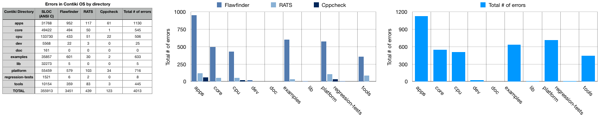

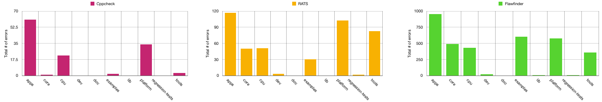

####Conclusion

In general, according to the graph outputs, the highest distribution of errors seem to be located within the "apps" directory, followed closely by those reported in "core" and "cpu". This could be down to the majority of the system critical code being stored in these directories, where it is likely that some of the more complicated or volatile functions, such as those responsible for task handling across many Contiki systems are kept. In general, the three static analysis tools seem to be in accordance of this, with the highest error output being generated by Flawfinder, and the lowest by Cppcheck, as expected. Having this range of three tools with some very different reporting habits is an advantage here, as it allows us to investigate how the Contiki codebase is interpreted at different levels of sensitivity. It is clear that Flawfinder is amongst the more sensitive of static analysis tools, based on the sheer breadth of errors it reports on. Cppcheck, on the other hand, appears to be more concise in its reportage. Resultantly, we can conclude that there is an advantage to using a range of tools so as to provide extensive code coverage. As far as other quality measures go, such as the amount of work each tool output generates for the programmer, it can be argued that those with more concise results are ranked higher, simply because the programmer spends less time filing through redundant bug reports.

##Bug density in Contiki OS

In this section, we describe our investigation into the distribution of errors in the Contiki source code, also known as the ``bug density''. It involves a summary of the tools we used, our methodology, and the results we obtained.

According to several studies, it is believed that having an average of 1 bug per thousand lines of code is an indicator of good project quality. However, there are a few factors which affect the bug density metric, such as: 

* Code complexity
* The type of defects taken into account for the calculation
* Time duration of bug density calculation
* Developer or Tester skills

This is particularly relatable to the tools we used, in that each of them prioritises a different subset of bugs to flag as vulnerabilities. In our results, we observe a scale of sorts, in that Flawfinder reports very openly on a variety of bugs; and so returns a high result of bug density. Conversely, Cppcheck, which is known to eliminate false positives, outputs a comparatively small figure for bug density. The breakdown for the results is explained for each separate measure below.

All of the report screenshots and images from this section can be seen in directory <a href = "Statistics/">`Statistics/`</a> and
<a href = "Statistics/Bug_Density">`Statistics/Bug_Density`</a>.

###By codebase

To begin our investigation, we first made a general measure of the number of bugs detected by each tool, over the entirety of the Contiki code base. To do so, we simply ran each tool in a recursive fashion over the past 10 years of Contiki releases. Each of the tools possess the capability to recursively navigate each directory of the project, extract C files and analyse them, making this process trivial. Using the code metrics we obtained during our statistical analysis of Contiki with David A. Wheeler's 'SLOCCount' tool, we generated a measure of bug density in the Contiki operating system across its several release versions. This was calculated by determining the average number of bugs generated by Cppcheck, Flawfinder and RATS, and averaging that value over the LOC of each Contiki distribution. This was coducted for each release of Contiki, ranging from version 2.0 to 3.0. Using the data, we then generated the total bug density across the SLOC, and scaled it by a thousand to determine the number of bugs per 1,000 lines of code; which is considered a typical measure of system security. As there is no standard way of determining bug density, we calculated it first by taking the average number of bugs across the tools, as well as by generating a separate output for each individually, to allow us to compare the differences in tool output. 

The bug density was initially measured by codebase to establish a general overview of the bugs in Contiki. Whilst the tools are capable of reporting on specific cases of error prone behaviour in the source code, exploring those capabilities was considered at a later point. From this point, the intention was to establish the critical areas of Contiki i.e. the areas most key to its functionality, most frequently featured in Contiki deployments, as well as those with the highest population of defects. This would be used as a strong indicator for the areas of the OS on which to deploy the more accurate proprietary tools, and begin targeting some of the core issues in place. Also considering that Contiki features a plethora of ``examples'' i.e. builds which are suited for specific example purposes, this practice also narrows down the scope at which we examine them.

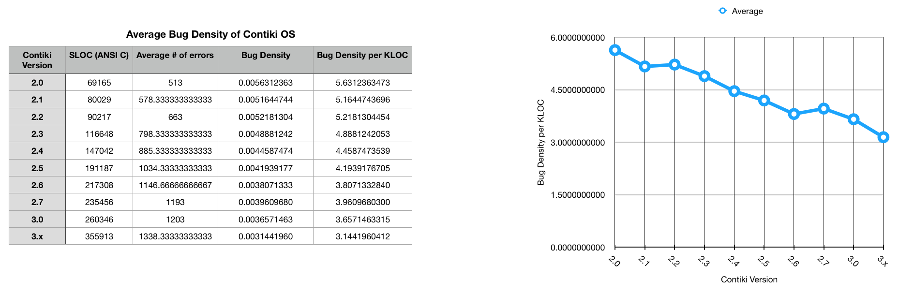

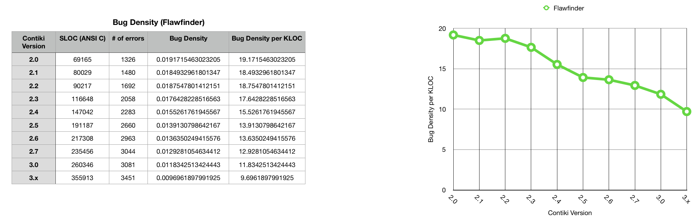

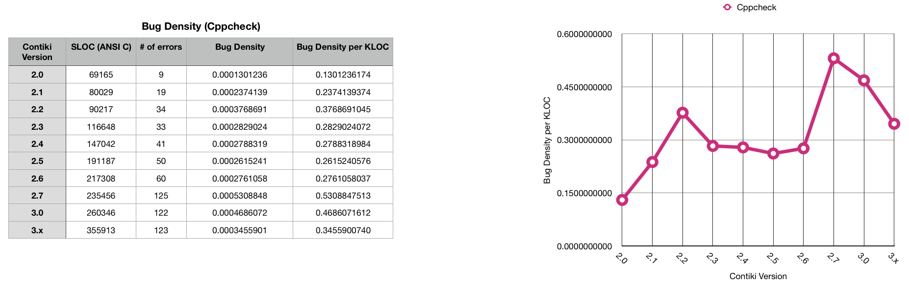

####Conclusion

Whilst it appears from the first figure that the average number of bugs is increasing between Contiki releases, on average the bug density is decreasing. This is reflected both in terms of the average measure taken across all three tools, as well as in the individual cases besides that of Cppcheck, for which the bug density appears to peak twice: at Contiki version 2.2 and once more at 2.7, before decreasing. This may be attributed to the nature of Cppcheck in targeting a specific subset of bugs, and eliminating false positives flagged during analysis. However, it may also indicate a fluctuation in the frequency of a particular bug which it is accurate at locating, prompting a more in-depth analysis. We look closer into this in the next phase, where we consider the bug density by directory.

###By directory

Besides measuring the entire source code with each tool, we also measured each separate directory of the Contiki source code, in order to further understand the areas of the project which were most error prone. This was carried out with the latest build of Contiki. In doing so, we split the source files into their constituent directories, and ran each tool consecutively over each directory, recording the number of bugs detected. The aim of this was to increase the level of granularity in our existing results for bug density, and determine possible areas that may be the culprit in those figures to create a form of "heatmap" of the operating system. The results of this can be seen in the charts below:

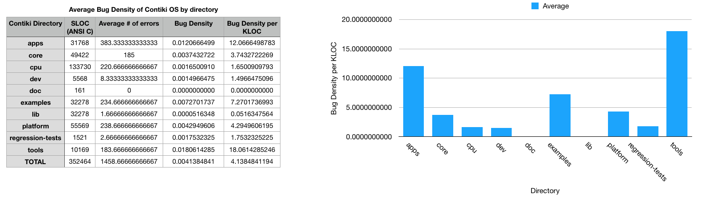
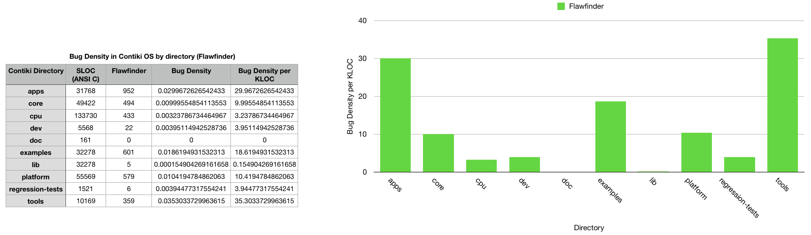

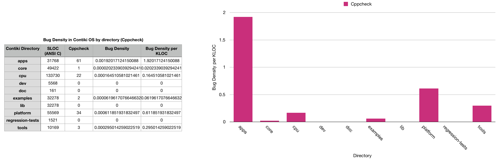

####Conclusion

Concluding our results, across the majority of the tools, the highest bug densities seem to be located around the "apps" and "tools" directories. This is unsurprising, as most of the code from these directories form the underlying functionality in Contiki, and as such are featured in most, if not all of the builds the programmer can issue. Once again, this result is shown clearly in the relationship between Flawfinder and RATS, but less so for Cppcheck: which interprets "tools" as having a lower bug density. Given the measure of "Bug Density per KLOC", the general consensus in research states that a frequency of 1 bug per 1,000 LOC is indicative of a stable system. This is challenged in the reportage of these tools, which in the cases of RATS and Flawfinder demonstrate bug density values of up to 29 potential bugs per 1,000 lines of code (Flawfinder). As the definition of what constitutes a bug is, however, down to interpretation, it may be that this particular result demonstrates high levels of false positives. That definition is something which would have to be decided with the developers of the Contiki source code, and for the most part is beyond the scope of this project.

##Unsafe function usage

For the tools that reported explicity on unsafe function usage (RATS and Flawfinder) we drew comparisons on their performances; collecting data longitudinally on the past 10 years of Contiki releases, starting from version 2.0 (30/03/2007) and concluding with the current release (23/08/2017), all of which were obtained from the project's GitHub repository (https://github.com/contiki-os/contiki/releases). Determining occurrences of unsafe function usage was largely provided by the tools themselves in their outputs, although this avenue of work is in response to previous research conducted by Alnaeli et al. (2016) on Contiki and its competitors, and is based on their definition of what they consider "unsafe" in terms of functions in C, in their work "Vulnerable C/C++ Code Usage in IoT Software Systems". Furthermore, we consider the functions that have been deprecated and replaced with safer alternatives, as well as the wider knowledge base of professional C programmers, researchers, and the documentation of the language found online.

###By codebase

To measure the occurrences of unsafe function usage, we began by simply evaluating the entire codebases of the past 10 versions of Contiki, generating the frequencies of each given unsafe function

Out of our tools, the two main ones which explicitly reported on usage of unsafe functions were Flawfinder and RATS. As such, we used them to measure the number of occurrences of unsafe functions across the past 10 versions of Contiki, to establish a picture of the operating system's progression. In the case of Flawfinder, this was far more trivial, as the warning associated with each function can be easily extracted from the tool's output based on its "CWE" (common weakness enumeration) identifier. However, with RATS it was less straightforward, and required extensive use of pattern matching tools such as grep to determine the number of unsafe functions it detected. The results can be seen in the charts below:

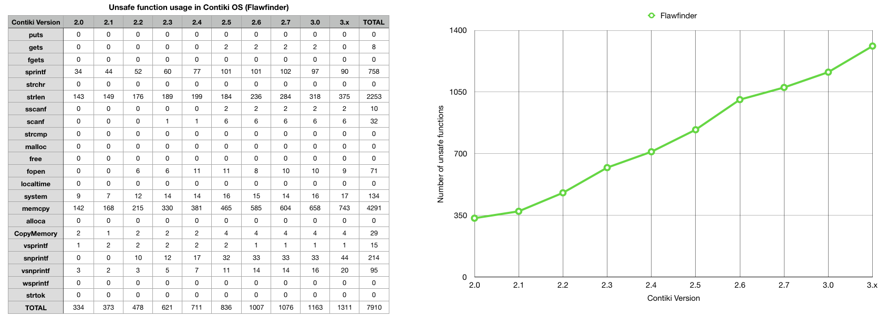
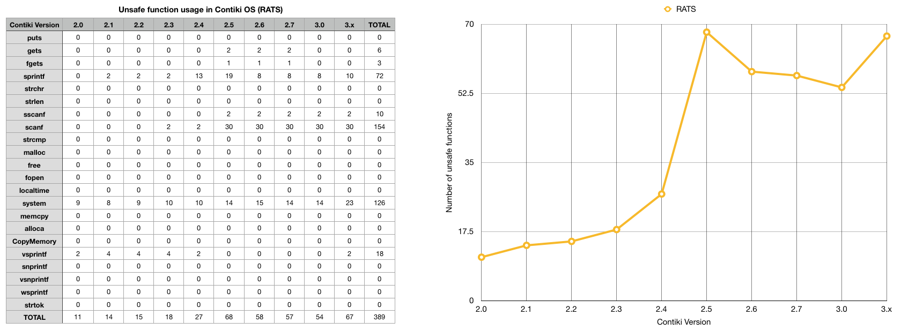

####Conclusion

Flawfinder, which is designed to report specifically on the usage of unsafe functions, uses a system of pattern matching to detect when and where known, volatile functions are invoked. This generally works off of a preconceived list of known dangerous functions which Flawfinder then uses for comparison against the source code. Resultantly, there is a high number of findings across most functions which were detected. Interestingly, there was a lack of consistency between the findings produced here, and those in the research by Alnaeli et al. (2016), the work showing a considerably higher number of unsafe functions found in Contiki. 

###By directory 

We also investigated this on a directory level, to close in the scope of where the most vulnerable function usage was located. These findings can be used to narrow the scope on the most problematic areas of the project, and advise developers as to which areas they should take extra time in working on. Further to this, it may also be a positive influence on the use of static analysis tools on the source code, as all of this information has been obtained quickly and easily through use of open source tools.

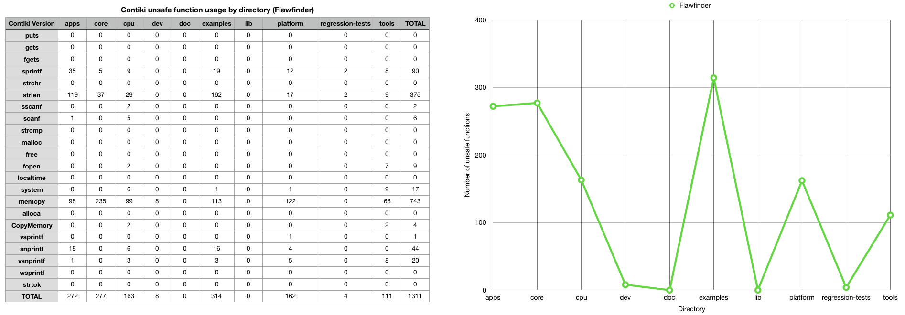
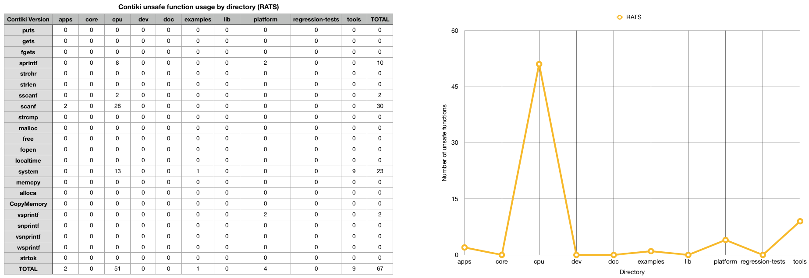

####Conclusion

In the results above, once again Flawfinder conclusively delivers more detail in terms of total number of unsafe functions detected, and concentration on particular project areas. There is a clear indication that "apps", "core", "cpu" and "examples" are the areas of interest here. These findings will be used to target specific directories when using our cohort of more advanced tools for deep analysis, such as those which perform analyses during build execution.

##Common Weakness Enumeration

A list of all of the common weaknesses found in software written in C has been documented by the programming community, and is available as an online database for the benefit of other programmers. A condensed version can be found in the table below. This list of community compiled errors has assisted in forming the general basis of our security analysis, as it clearly documents some of the clear ways in which parts of a C based system may be exploited by attackers, or suffer operational instability. When we collected data on the source code, some of our tools reported their error findings with respect to the categories mentioned here; with most having the tendency to specialise in a particular class of weakness: e.g. the buffer overflow vulnerability. As the following list is a superset of general weaknesses associated with the C programming language, not every entry is directly applicable to the Contiki source code. This is reflected in our later results, where only a subset of errors are reported on by the tools; on the basis that some of the vulnerabilities listed are unapplicable to Contiki in particular.

####CWE: Weaknesses in Software Written in C

Name | CWE ID #
-----|-------
Access of Resource Using Incompatible Type ('Type Confusion') | 843
Addition of Data Structure Sentinel | 464
Assigning instead of Comparing | 481
Assignment of a Fixed Address to a Pointer | 587
Buffer Access Using Size of Source Buffer | 806
Buffer Access with Incorrect Length Value | 805
Buffer Copy without Checking Size of Input ('Classic Buffer Overflow') | 120
Buffer Over-read | 126
Buffer Under-read | 127
Buffer Underwrite ('Buffer Underflow') | 124
Comparing instead of Assigning | 482
Compiler Optimization Removal or Modification of Security-critical Code | 733
Compiler Removal of Code to Clear Buffers | 14
Concurrent Execution using Shared Resource with Improper Synchronization ('Race Condition') | 362
Creation of chroot Jail Without Changing Working Directory | 243
Deletion of Data Structure Sentinel | 463
Double Free | 415
Duplicate Key in Associative List (Alist) | 462
Exposed IOCTL with Insufficient Access Control | 782
Function Call With Incorrect Number of Arguments | 685
Function Call With Incorrect Variable or Reference as Argument | 688
Heap-based Buffer Overflow | 122
Improper Address Validation in IOCTL with METHOD_NEITHER I/O Control Code | 781
Improper Cleanup on Thrown Exception | 460
Improper Clearing of Heap Memory Before Release ('Heap Inspection') | 244
Improper Handling of Length Parameter Inconsistency | 130
Improper Null Termination | 170
Improper Release of Memory Before Removing Last Reference ('Memory Leak') | 401
Improper Restriction of Operations within the Bounds of a Memory Buffer | 119
Improper Update of Reference Count | 911
Improper Validation of Array Index | 129
Incorrect Block Delimitation | 483
Incorrect Calculation of Buffer Size | 131
Incorrect Calculation of Multi-Byte String Length | 135
Incorrect Pointer Scaling | 468
Incorrect Type Conversion or Cast | 704
Integer Coercion Error  | 192
Integer Underflow (Wrap or Wraparound) | 191
Mismatched Memory Management Routines | 762
Missing Default Case in Switch Statement | 478
NULL Pointer Dereference | 476
Numeric Range Comparison Without Minimum Check | 839
Numeric Truncation Error | 197
Often Misused: String Management | 251
Omitted Break Statement in Switch | 484
Operator Precedence Logic Error | 783
Out-of-bounds Read | 125
Passing Mutable Objects to an Untrusted Method | 374
Permission Race Condition During Resource Copy | 689
Private Array-Typed Field Returned From A Public Method | 495
Public Data Assigned to Private Array-Typed Field | 496
Race Condition in Switch | 365
Race Condition within a Thread | 366
Reliance on Data/Memory Layout | 188
Return of Pointer Value Outside of Expected Range | 466
Return of Stack Variable Address | 562
Returning a Mutable Object to an Untrusted Caller | 375
Signal Errors | 387
Signal Handler Race Condition | 364
Signal Handler Use of a Non-reentrant Function | 479
Signed to Unsigned Conversion Error | 195
Stack-based Buffer Overflow | 121
Unchecked Return Value to NULL Pointer Dereference | 690
Uncontrolled Memory Allocation | 789
Unexpected Sign Extension | 194
Unsigned to Signed Conversion Error | 196
Use After Free | 416
Use of Expired File Descriptor | 910
Use of Externally-Controlled Format String | 134
Use of Function with Inconsistent Implementations | 474
Use of getlogin() in Multithreaded Application | 558
Use of Incorrect Operator | 480
Use of Inherently Dangerous Function | 242
Use of Path Manipulation Function without Maximum-sized Buffer | 785
Use of Pointer Subtraction to Determine Size | 469
Use of Potentially Dangerous Function | 676
Use of sizeof() on a Pointer Type | 467
Use of umask() with chmod-style Argument | 560
Use of Uninitialized Variable | 457
Wrap-around Error | 128
Write-what-where Condition | 123

Of the vulnerabilities specified in the table above, some of the more high priority bugs we were expecting to see included: 

* Buffer Over-flow (120) : The program copies an input buffer to an output buffer without verifying that the size of the input buffer is less than the size of the output buffer, leading to a buffer overflow.
* Buffer Over-read (126) : This typically occurs when the pointer or its index is incremented to a position beyond the bounds of the buffer or when pointer arithmetic results in a position outside of the valid memory location to name a few. This may result in exposure of sensitive information or possibly a crash.
* Buffer Under-read (127) : The software reads from a buffer using buffer access mechanisms such as indexes or pointers that reference memory locations prior to the targeted buffer.
* Improper Null Termination (170) : The software does not terminate or incorrectly terminates a string or array with a null character or equivalent terminator.
* NULL Pointer Dereference (476) : A NULL pointer dereference occurs when the application dereferences a pointer that it expects to be valid, but is NULL, typically causing a crash or exit.
* Use of Uninitialized Variable (457) : The code uses a variable that has not been initialized, leading to unpredictable or unintended results.

This was based on the nature of the Contiki operating system, and were later to be found amongst the highest occurrences of bugs spotted by our tools. In the case of NULL Pointer Dereference (476) for instance, what may be a small error overlooked by programmers can result in a program crash. In the case of Contiki, which generally operates as a series of interconnected devices running the same operating system, encountering this bug in the wild can result in a catastrophic distributed crash, having potential to bring down parts of a wireless sensor network. As such, targeting the more discrete flaws such as this is crucial. This is applicable to many of the current IoT operating systems available to the public. To explore this further, we briefly considered the security of some of Contiki's fellow open source competitors, including: RIOT, TinyOS and OpenWSN. This investigation is designed as an extension to previous research comparing Contiki to other systems, but we have replicated the results using our own selection of tools.

##Operating System Comparison

Following on from work by Alnaeli et al. (2016) we used our tools to gather more up to date results on the security of Contiki OS and its ANSI C based competitors, using our own tools as a benchmark. To do so, we conducted two methods of comparison: the first was "over-time" in which we downloaded the releases of each operating system from the past 5 years (2013-2017) and ran static analysis tests using Flawfinder on the code; documenting the relationship between time and number of bugs. Secondly, we ran further tests to measure the distinct output of each of all 3 open source tools on the latest release of each operating system. For some systems, such as TinyOS, this was as far back at 2012, making it interesting to see how well it had matured with time. For other systems such as Contiki and RIOT, which had consistent yearly releases, the main point of focus was on how well maintained the levels of bugs were between releases, and whether there were particular years that saw all 4 of the systems scale in volatility.

###Over time

Operating System | 2013 | 2014 | 2015 | 2016 | 2017
-----------------|------|------|------|------|------
Contiki | 2660 | 2963 | 3044 | 3081 | 3451
OpenWSN | 230 | 219 | 248 | 242 | 296
TinyOS | 799 | 799 | 799 | 799 | 799
RIOT | 409 | 966 | 1049 | 1372 | 1744

 

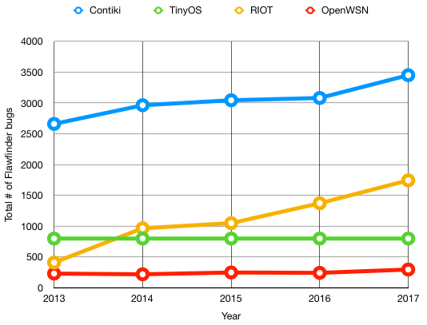

####Conclusion

In support of the findings produced from the research by Alnaeli et al. (2016), on average, Contiki has the highest distribution of errors compared to its competitors, by a considerable margin. As these results are exploratory, and have been generated using only the Flawfinder tool, it will take further investigation to draw a conclusion, but so far there is consistency between our findings and that of previous research. The next step of the study will be to measure whether there is consistency across the three main open source tools. 

###By tool

As the above figures are purely based on the output of Flawfinder, the results below document the findings of each tool for coverage.

Operating System | Flawfinder | RATS | Cppcheck
-----------------|------|------|------
Contiki | 3451 | 439 | 125 
OpenWSN | 296 | 16 | 15
TinyOS | 799 | 3 | 22 
RIOT | 1744 | 27 | 7 

 

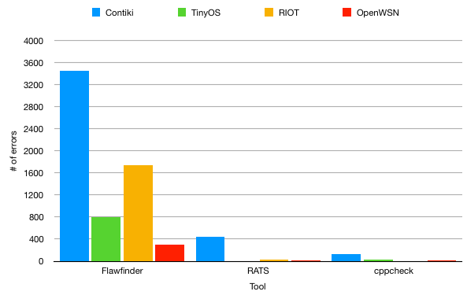

####Conclusion

According to our findings, there is a distinctly higher detection of errors found in Contiki when compared to the other three systems. In the next stage, we will explore what this means for the bug density of the latest version release of each operating system.

##Bug density of competing OSes

After having computed the general output of errors from each tool, the next stage was to calculate the overall bug density for each operating system. As a general measure, a bug density of 1 bug per 1,000 lines is indicative of a stable operating system. The results are as shown below.

 

Operating System | Contiki | TinyOS | RIOT | OpenWSN
-----------------|---------|--------|------|--------
SLOC (ANSI C) | 355913 | 108121 | 860917 | 244798
# of errors | 4013 | 824 | 1778 | 327
Average # of errors | 1337.6666 | 274.6666 | 592.6666 | 109
Bug Density | 0.003758 | 0.002540 | 0.000688 | 0.000445
Bug Density per KLOC | 3.7584 | 2.5403 | 0.6884 | 0.4452

 

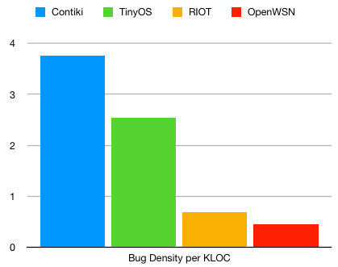

####Conclusion

In conclusion, Contiki has the highest bug density out of our 4 open source systems, with almost 4 bugs per 1,000 lines of code, as calculated by the averaged results of our 3 tools. This is closely followed by TinyOS, which, although having approximately 1/3 of the size of Contiki's codebase, still has an average of 2.5 bugs per 1,000 lines of code. Further to this, RIOT OS, which has over 800,000 SLOC, still features a large number of errors. It does however still fit within the boundary of what is considered a safe operating system by the general measure. As a result of the findings, it is clear that Contiki should be further assessed for ways of improving stability.

##License-based static analysis tools

In this stage of the project, we will be applying a range of license-based static analysis tools to the Contiki source code. In general, tools of this nature provide a considerably greater depth of analysis, and are capable of detecting a range of errors which have a higher sense of imperceptibility; for example logic flaws which only execute under a specific set of conditions in the control flow of the program. As such, we intend to use them to reinforce our current findings obtained from the open source tools, and develop a more concrete understanding of the security vulnerabilities in Contiki.

Our set of license based tools for static analysis include the following:

* GrammaTech CodeSonar: A deep static analysis tool capable of analysing source code and binaries, and providing an error granularity system as well as visualisation. (https://www.grammatech.com/products/codesonar)
* Synopsys Coverity: A comprehensive static and dynamic analysis tool capable of hooking into IDEs such as Netbeans and Eclipse. (http://www.coverity.com/)
* SciTools Understand: A documentation, maintenance and reverse engineering tools combining a code editor with static analysers. (https://scitools.com/)
* Gimpel FlexeLint: A complex command line tool which aims to provide cost-effective and precise analysis of C/C++ code. (http://www.gimpel.com/html/flex.htm)

Of the aforementioned tools, the most frequently used was CodeSonar: which, as a powerful and versatile static analyser, was capable of returning most, if not all of the bugs reported upon by the other tools. Additionally, as far as setup and usage was concerned, it was the most straightforward relative to the wealth of information it output to the user. Resultantly, CodeSonar will be the main focus on this next section. Alongside this, SciTools Understand will also be briefly discussed based on the visualisation options it offered in its output. In the case of FlexeLint, it was discovered that setting it up to work alongside Contiki was very difficult, and the same coverage provided by the tool would be better made up for by using other more deployable tools. 