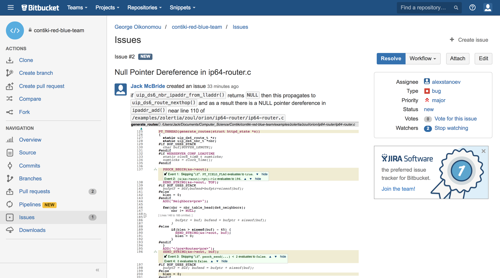

#Bitbucket workflow

In order to share and collaborate our work on Contiki, we established a workflow using the Bitbucket platform, for documenting and submitting vulnerabilities we discovered using our static analysis tools. The general process of submitting a bug, writing a concise report on its behaviours and eventually getting it patched into the main Contiki GitHub repository can be seen in the flowchart below. During the project, the Bitbucket workflow served as a collaborative platform with the Bristol team, and as such was critical to sharing ideas and opinions on vulnerabilities we found, as well as staying in touch with the changes being made to the Contiki codebase. 

During our work with Bristol, at this time of writing, we collaboratively formulated 33 bug reports referred to as "Issues" and submitted them to the platform for further analysis. From there, we put together 12 pull requests consisting of program patches to be submitted to the main Contiki repository. We currently have 8 open pull requests to be assessed by the Contiki developers, which will then be integrated into the main repository once a solution is determined. The screenshots documenting this can be seen below.  

On Bitbucket, we worked as a team of 4 to submit issues detected by our tools, or otherwise discovered through analysing the Contiki source code. It was generally agreed that the responsibility of the Bristol team (blue team) was to fix bugs, whereas our Kent team (red team) was largely in charge of discovering them.

Resultantly, we performed the majority of the static analysis, formulation of bug reports, and evidence gathering reponsibilities. The handling of providing patches, formulating pull requests and submitting changes to the main Contiki repository was largely down to Bristol, although they also provided some bug reports of their own, based on the static analysis tools they themselves also had access to. 

###Screenshots

Total list of Bitbucket issues, ordered by datetime.

List of all open Bitbucket issues, ordered by datetime.

Pull requests being made to the main Contiki GitHub repository.

A list of the open issues I am watching. This relates to bug reports which I have submitted personally.

When submitting a bug report, a standard format which is parsed using markdown is used. This is typical to most version control platforms, making it straightforward to quickly gather details related to a bug, specify critical line numbers in an easily recognisable way, as well as integrating any accompanying evidence such as bug screenshots into the report. Below are some example bug reports which we filed, featuring some vulnerabilities discovered by CodeSonar. 

A bug report detail a possible Null Pointer Dereference in ip64-router.c; the result of which could lead to undefined behaviour in Contiki. 

Providing visual evidence in the form of code screenshots is intrinsic to communicating a set of reproducible steps for evoking a bug. The patcher can then analyse these steps, and provide secure measures to ensure they are not executed. For example, in this case a null check would be put in place to check the value of the specified pointer before it is dereferenced. This would ensure that an unexpected value isn't later used in the program. 

To see some additional information of the Bitbucket platform, navigate to `/Bitbucket` in the corpus directory. There you will find screenshots associated with the numerous bug reports and pull requests we made, as well as evidence of submissions to the main Contiki GitHub repository.

In addition, some of the open issues raised by this project can be seen on the Contiki Github: https://github.com/contiki-os/contiki/issues