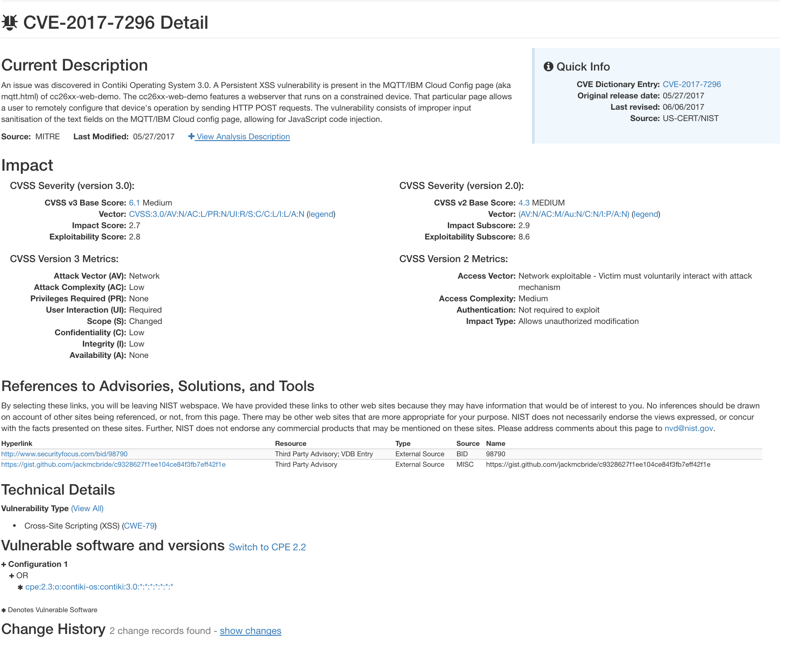

#CVE Disclosure

As a result of testing the Contiki operating system in a testbed environment (documented below) we came across the discovery of two major common vulnerabilty enumerations, (CVEs) which we disclosed to CVE mitre (https://cve.mitre.org/). Also featured is a video of us reproducing one of the vulnerabilities: which was in fact a cross-site-scripting (XSS) attack on a live Contiki device running as a network node. This could result in a considerable threat level if an attacker successfully implemented it. The details are below.

The CVE mitre website. This is a community driven database of vulnerabilities discovered in many different platforms. Submitting reports to this site is a way of legitimising errors, making the wider community aware of them, and maintaining a backlog of a system's progression. 

##CVE-2017-7295

The first CVE applied to a board crashing vulnerability discovered following a "use-after-free" vulnerability in the httpd-simple.c file in the cc26xx-web-demo. A use after free typically entails when a memory resource, which has already been released back to the free store after being used, is called upon again by the program. The consequence of this is a program crash, which, resultantly ended up freezing the operation of a TI CC2650 Launchpad board running Contiki. There was a possibility that an attacker could somehow manipulate this to cause malicious crashes in a network in the wild, and potentially damage network infrastructure as a result.

###Screenshots

##CVE-2017-7296

The second vulnerability was centred around a cross-site-scripting attack, which essentially, due to a lack of input sanitisation in a given field, allows an attacker to execute scripted code of their choice. This vulnerability was documented with the addition of a video replicating our proof-of-concept attack, in which we launched our own arbitrary Javascript code inside a input box in an MQTT cloud configuration page being hosted by a Contiki node. The result of this, if manipulated by an attacker is undefined, but it has potential to cause huge issues depending on what script they may devise. 

###Screenshots

The accompanying video to this exploit can be found in the directory <a href = "Videos/mqtt-xss.mp4">`Videos/mqtt-xss.mp4`</a> .