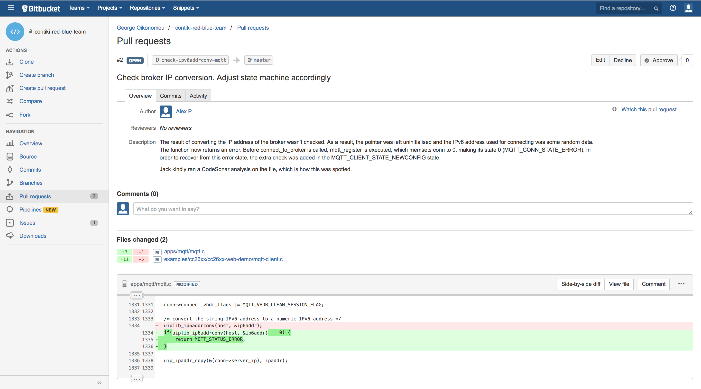

#Results

Resulting from our work with the Contiki operating system, we have successfully set up a collaborative workflow between teams at Kent and Bristol, facilitating the discovery, documentation, and patching of security bugs found in the project. We have demonstrated the effectiveness of deploying static analysis tools to improve system stability, by locating and patching several critical flaws in Contiki with the assistance of open source and proprietary tools including CodeSonar, Flawfinder and Cppcheck.

Additionally, we have assessed the capabilities of the tools; using their findings as a benchmark of their effectiveness, and drawing comparisons between the performances of those capable of deep analysis which are typically proprietary, and those which are open source. We have evaluated them in terms of their ease of use, time taken to configure and deploy, and their ability to detect critical flaws whilst filtering false positives. We have found overall that cross-usage of tools is advantageous; both for the purpose of providing greater code coverage, but also because specific tools have a tendency to specialise in detecting particular vulerabilities. As such, a security analyst can evaluate a system more holistically by deploying a range of different tools.

Our work has also contributed towards IoT security as a whole. As Contiki is a rising contender in the market for popular IoT operating systems currently in use, it is likely that we will see its presence increase. A key aspect of maintaining system security is the patching of vulnerabilities before their inevitable release into the wild. Resultantly, by using static analysis tools which can be deployed free of executing code, we afford ourselves a safe environment in which to perform security analyses without the possibility of affecting the infrastructure of a running system.

As the motivations of this project are mainly to provide small improvements to the security of the Contiki operating system, we have provided specific tool results and the patches we have developed in response to them in the [Static Analysis](#staticanalysis) section. Additionally, the  directory contains some metrics regarding the bug density of Contiki OS. 

Pictured below are some of the critical errors we solved as a result of deploying the static analysis tools.

* Our list of CVE disclosures can be found here: <a href = "/CVEs">CVEs</a>
* Our results concerning Contiki's software metrics can be found here: <a href = "/Statistics">Statistics</a>
* Our issues and pull requests made on bitbucket can be found here: <a href =  "https://bitbucket.org/antzougias/contiki-red-blue-team">https://bitbucket.org/antzougias/contiki-red-blue-team</a>
* Our integrated changes can be found on the main Contiki GitHub repository here: <a href = "https://github.com/contiki-os/contiki/pulls">https://github.com/contiki-os/contiki/pulls</a>

 