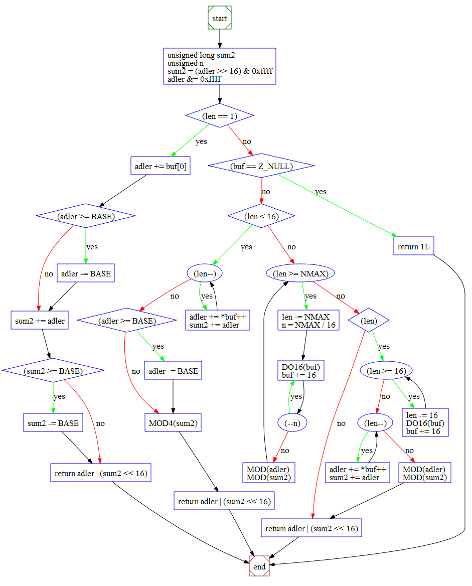
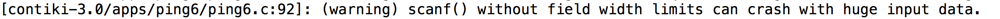
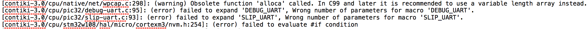
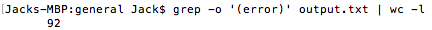
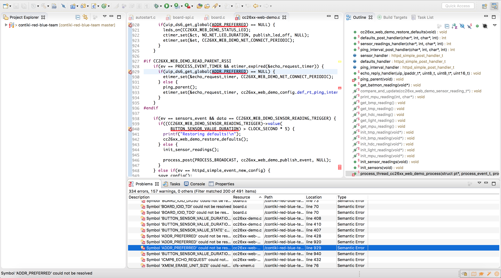

<h1 style = "font-size: 50px; font-family: Century Schoolbook Bold">Contiki Project</h1>

Jack McBride & Arthur Taggart

(Supervised by: Budi Arief & Julio Hernandez-Castro)

##Contents

[TOC]

##CO885 Workshop 1 

CO885 – Workshop 1
“What is research?”
Rogério de Lemos 

Participative exercise: topic/project analysis – Feedback form

####Topic/project chosen: 

Security analysis of Contiki: The Open Source OS for the Internet of Things

####In lay terms, describe what this topic/project is about: 

Contiki is an open source operating system designed to connect Internet of Things devices to the Internet. It is typically used in networked devices which work on constrained memory and low power, across a myriad of different applications such as in wireless sensor networks, alarm systems, and smart cities. 
	The purpose of the project is to examine the Contiki code base, initially using a series of static analysis tools to determine and document the presence of bugs or other exploitable features which are currently undiscovered. I then intend to document the findings on any vulnerable aspects found, and report them to the Contiki developer community, therefore making an active contribution to the Contiki project and to Internet of Things security in general. 

####Give an indication of the type of project (exploratory, testing out, problem solving):

This project is mainly based on exploration and investigation of the operating system, and will involve many aspects of code verification to test components of the Contiki Operating System. Alongside this, it may involve some problem solving work based on the issues I come across in the system.
	
####Give at least one reason why this research is of value:

The research aims to contribute towards the overall security of IoT based systems. Since Contiki is an open source operating system, it allows me to take any findings from our research and apply it to other IoT systems, such as those produced by manufacturers such as Texas Instruments or Zolertia. Since IoT is a rapidly developing technology, it is likely we will see a huge increase in their market presence; and so ensuring these systems are properly secured is an important step for security vendors to take. 
	Considering recent issues to do with IoT security (such as the Mirai botnet of IoT devices being used for large scale denial of service attacks) it is clear that there are some major issues with the current state of IoT security. Also, considering that Contiki operating systems are present in the environment, in the forms of physical sensors and actuators, if such devices were compromised it could cause significant issues on a public scale. 

####Give at least one milestone for this research (what by when):

The first milestone will be in using some free or open source static analysis tools to analyse the codebase. Contiki, which is written in C, can be put through several code analysis tools designed for C/C++ which can be freely downloaded. Before moving onto more in depth software, it would be useful to analyse the capabilities of these tools, and see if there are any consistent conclusions made across the tools about the code. I intend to do this over the next few weeks, whilst developing my understanding of Contiki. 
	A long term milestone is to develop a framework for analysing the codebases of Open Source IoT operating systems similar to Contiki, and to look into how static analysis tools are developed. From here, a potential direction from here would be to develop a tool of my own.

####Describe how do you intend to achieve this milestone:

To achieve this milestone, I will first research some reliable static analysis tools which are available for free online. From there, I will compile them into a list, and one by one will use them to analyse the code. After the analysis of each tool has been complete, I will write up any findings, and give an overview on the capabilities of each tool. To conclude, I will consider how certain features across different tools might be combined into a single suite, so as to achieve a more in depth analysis and prevent missing any details. 

####Three useful publications in this area (justify briefly your choices):

>Dunkels, Adam, Bjorn Gronvall, and Thiemo Voigt. "Contiki-a lightweight and flexible operating system for tiny networked sensors." Local Computer Networks, 2004. 29th Annual IEEE International Conference on. IEEE, 2004.

This publication provides an overview of what Contiki is, including its features and how it works with Internet of Things devices. 

>Chess, Brian, and Gary McGraw. "Static analysis for security." IEEE Security & Privacy 2.6 (2004): 76-79.

This publication provides an overview of how static analysis tools can be used for security, and would be useful in directing the kind of techniques that static analysis has at its disposal. 

>Teixeira, Fernando A., et al. "Siot: Securing the internet of things through distributed system analysis." Proceedings of the 14th International Conference on Information Processing in Sensor Networks. ACM, 2015.

Here is an example of the current research done in this area for IoT, and will provide a useful addition to the literature review. The research here concerns a different IoT system for which the authors have developed a security analysis framework of their own.

##General Contiki Notes 

https://www.youtube.com/watch?v=6xJ1zbTVOnM&t=39s

Interview with Adam dunkels - founder of Contiki. 

Video description: 

Contiki connects low-power microcontrollers to the internet and supports standards like IPv6, 6lowpan, RPL and CoAP. Other key features include highly efficient memory allocation, full IP networking, very low power consumption, dynamic module loading and more. Supported hardware platforms include Redwire Econotags, Zolertia z1 motes, ST Microelectronics development kits and Texas Instruments chips and boards.

####GENERAL

Contiki is an operating system for internet of things devices. 
For wireless microprocessors
Makes it possible for devices to connect to the internet.
Uses a condensed version of the TCP/IP protocol stack.
Uses IPv6 - of course for the HUGE number of IOT devices in existence 
IOT is an extension to the internet - and so will use the internet protocol (IPv6). 
MQTT has been added in. 
Contiki runs on a large number of different platforms and microprocessor types. 
Low end to high end such as ARM Cortex. Ported to many platforms. Worth checking security against each other - are the implementations consistently secure? How do the implementations differ? 
Prides itself on portability. 

####TRANSPORT LAYER 

Internet protocols themselves - extended to IOT for wireless application.
Extend networks by added new nodes 
Mesh networking 
UDP and TCP support, CO-AP, HTTP, Web sockets. 
“An extension of the Internet”. 
Mesh network standards - “Ripple” - IETF standard protocol for mesh networking IPv6. 
We might have a lossy environment - so the protocol can deal with this by adapting how to move packets through the network. 
Ripple protocol works well here. 
Regression test suite used with Contiki - every time code is changed in the codebase. 
Simulations are run to test that the mesh is working.
Very hard to test in the real world, so relies on the simulation.

####DISTANCE AND DENSITY 

Depends on what radio you are using
You can easily have hundreds / thousands of nodes. 
In larger numbers, performance decreases. 
For larger numbers, they have a data collection scheme - for those networks. Rarely collect data from all the nodes, and more often from some of the nodes. 
Moving to larger networks / long range radios which cover several KM - e.g. Streetlight network. 
Density of a metropolitan area. 

####WIRELESS COMMUNICATIONS PROTOCOLS AND STANDARDS 

Connect the world to you in fascinating ways. 

####DEVELOPER COMMUNITY WITHIN CONTIKI 

Hierarchical - small team of dev merging patches - 10 people 
50 or 60 actively contributing code back to the codebase. 
Moving steadily 
Comparable OS - embedded systems. (RIOT) - very similar to CONTIKI as to how RIPPLE is used. 
TinyOS - focused on the wireless part. 
Systems like Linux are typically aimed at much larger microprocessors.  
Contiki might typically have 100kb of flash ROM and 30/20 kb of RAM. 
Run a full mesh network stack on 20kb of RAM. 

####QUALITY CONTROL 

Contiki is commercially used. 
Every time a change to the code base is made, a testing system is used (regression testing) a simulation system called Cooja. 
This is used to set up a scenario of a wireless network with mesh nodes. They add an application to that, run the application and make sure it still works - 20 or 30 scenarios for Ripple alone. Typically this application will get a node to request data from the internet, making sure the data is received into the simulator network. 
Tests that compile the system for a large number of platforms. 8-9 different platforms, 4-5 different CPU architectures. 
Uncovered a great number of bugs. So, how good is this simulation system? 

####NEW FEATURES 

* Contiki 3.0
* Connectivity from the mesh network to the internet (IPv6/4) through proxies and firewalls. 
* Test port 80, HTTP protocols etc. 
* Add proxy support. 
* System on a chip platforms - 2.4 GHz support + BTLE. 
* BTLE and mesh network connected to the internet. 
* Device discovery from a smart phone 
* Bluetooth beacons etc. 
* Push towards new platforms, internet connectivity. 

https://www.youtube.com/watch?v=xE0zUwclgAo

###“What is Contiki OS and why is uIP special?”

####Features 

Designed specifically to work with IoT 
Devices which are low power, constrained devices - microcontrollers, wireless sensors 
Highly portable, multi tasking 
New features - MicroIP (uIP) and 6LoWPAN.

####uIP (Micro IP)

* Implements a skeleton TCP/IP 
* Designed for 8 and 16 bit micro controllers 
* Stack includes TCP, UDP, ICMP protocols. 
* Size of uIP is a few Kilobytes, ram requirements are a few hundred bytes. 
* uIPv6 - the world’s smallest certified IPv6 stack - designed by CISCO for sensors and actuators. 

####6LoWPAN
 
* IPv6 - low power and wireless personal area network. 
* Enables the use of IPv6 over the MAC and PHY layer of 802.15.4 (LR-WPAN). 
* Challenges - each MAC layer has a limitation for data e.g. MTU - allowing in this case only 127 bytes. 
* Networking layer - the IPv6 MTU was 280 bytes. 

####Transition from IPv4 to IPv6 

* IPv4 is a 32 bit IP address - 2^32 = 4 billion or so available addresses, which is soon to run out. 
* IPv6 is 128 bit IP addresses - which is considerably more. 
* How does this transition? Slowly, and gradually. 
* Enabled from three popular technologies: Dual stack, tunnelling and header translation. 

####Dual Stack 

* TCP/IP protocol stack where we contain bother IPv4 and IPv6 parts of the protocol in the stack. 
* If we need to communicate with an IPv4 node, use that part of the stack. Or with IPv6 address, use that part of the stack. 
* Source queries the DNS - the DNS responds back with IPv4 or IPv6 address - based on which one, the source may respond with an IPv4 packet or an IPv6 packet which it sends to the destination node. 

####Tunnelling 

Implemented when different IP versions exist on path. 
E.G. if two IPv6 machines communicate through IPv4 routers, the IPv6 packets are placed inside IPv4 packets and then forwarded towards the destination machine.

####Header Translation 

* Necessary when most of the Internet has moved to IPv6, but some systems still use IPv4. 
* Sender uses IPv6, receiver uses IPv4. Tunnelling doesn’t work here, as destination machine only understands IPv4. 
* So the header format is changed on route. 
* It is converted from IPv6 to IPv4 on route. 
* Done by mapped address. 

####RPL 

* Routing protocol for Low power and Lossy networks (RPL) 
* A distance vector routing protocol.
* The routing is based on Destination oriented Acyclic graphs or DODAGs.

####Terminology related to RPL

* Direct acyclic graph (DAG) - a spanning tree graph when we don’t have any cycles 
* Root - destination of the nodes in the DAG.
* Up - any edge that is directed towards the root. 
* Down - any edge that is directed away from the root. 

####Destination Oriented Direct acyclic graph (DODAG) 

* Special DAG where all nodes are trying to reach a single destination. 
* Objective function - helps us determine how close we are to the root - e.g. number of intermediary nodes. 
* Rank - distance from the root. 
* RPL instance - When we have one or more DODAGs, then each DODAG is an instance. 
* DODAG ID - Each DODAG has an IPv6 ID (128 bit). This ID is given to the root only. As long as the root doesn’t change, the ID doesn’t change. 
* DODAG version - each different shape of a DODAG has a different version. E.g. if nodes sleep or turn off for a couple of weeks, the shapes will change to fill in the gaps. 
* Goal - where a DODAG wants to reach. 
* Grounded - when a DODAG reaches its goal. 
* Floating - when DODAG hasn’t reached its goal. 
* Parent - the parent node - the node to which the arrow is pointing 
* Child - the child node - the node from which the arrow is extending. 
* Sub-DODAG - any subtree of a given DODAG 
* Storing nodes - keeps the whole routing table. They know how to go from one node to the other. 
* Non storing nodes - only know about their parents. 

####RPL Control Messages 

5 control messages that form the spanning tree: 

* DODAG Information object (DIO) - Message sent by a node present in a DODAG. Multicasted from the node, message contains information about whether the node is storing/non storing, floating/grounded. 
* DODAG Information Solicitation (DIS) - Message sent by a new node when it doesn’t receive announcements - “Is there any DODAG out there”. 
* DODAG Advertisement Object (DAO) - Request made by a new node to a parent or a root to request to be a part of their DODAG. 
* DAO-ACK - an acknowledgement - yes or no, consistency check

##Contiki 3.0 

https://github.com/contiki-os/contiki 

http://contiki-os.org/

###Features

#####Memory Allocation 

>Contiki is designed for tiny systems, having only a few kilobytes of memory available. Contiki is therefore highly memory efficient and provides a set of mechanisms for memory allocation: memory block allocation memb, a managed memory allocator mmem, as well as the standard C memory allocator malloc.

Found in: contiki/core/lib/{memb,mmem}.[ch].

#####Full IP Networking 

>Contiki provides a full IP network stack, with standard IP protocols such as UDP, TCP, and HTTP, in addition to the new low-power standards like 6lowpan, RPL, and CoAP. The Contiki IPv6 stack, developed by and contributed to Contiki by Cisco, is fully certified under the IPv6 Ready Logo program.

Find the code in contiki/core/net/.

#####Power Awareness 

>Contiki is designed to operate in extremely low-power systems: systems that may need to run for years on a pair of AA batteries. To assist the development of low-power systems, Contiki provides mechanisms for estimating the system power consumption and for understanding where the power was spent.

Find the code in contiki/sys/energest.[ch].

#####6lowpan, RPL, CoAP

>Contiki supports the recently standardized IETF protocols for low-power IPv6 networking, including the 6lowpan adaptation layer, the RPL IPv6 multi-hop routing protocol, and the CoAP RESTful application-layer protocol.

Find the code in contiki/core/net/rpl/ and contiki/apps/erbium/.

#####Dynamic Module Loading

>Contiki supports dynamic loading and linking of modules at run-time. This is useful in applications in which the behavior is intended to be changed after deployment. The Contiki module loader can load, relocate, and link standard ELF files that can optionally be stripped off their debugging symbols to keep their size down.

Find the code in contiki/core/loader/.

#####Examples

>There are plenty of examples in the Contiki source code tree to help you get started with your own code. Some examples show how to program network code, others show how to interact with the platform hardware, yet others demonstrate different aspects of the Contiki system. Most have a corresponding Cooja simulation available.

Find the code in contiki/examples/.

#####The Cooja Network Simulator

>Contiki devices often make up large wireless networks. Developing and debugging software for such networks is really hard. Cooja, the Contiki network simulator, makes this tremendously easier by providing a simulation environment that allows developers to both see their applications run in large-scale networks or in extreme detail on fully emulated hardware devices.

Find the code in contiki/tools/cooja/.

#####Sleepy Routers

>In wireless networks, nodes may need to relay messages from others to reach their destination. With Contiki, even relay nodes, so-called routers, can be battery-operated thanks to the ContikiMAC radio duty cycling mechanism which allows them to sleep between each relayed message. Some call this sleeping routers, we call it sleepy routers.

Find the code in contiki/core/net/mac/.

#####Hardware Platforms

>Contiki runs on a wide range of tiny platforms, ranging from 8051-powered systems-on-a-chip through the MSP430 and the AVR to a variety of ARM devices. There are also a number of more exotic platforms thrown in there for good measure. Read more about Contiki hardware platforms:

#####Contiki hardware »

Find the code in contiki/platform/ and contiki/cpu/.

#####Protothreads

> To save memory but provide a nice control flow in the code, Contiki uses a mechanism called protothreads. Protothreads is a mixture of the event-driven and the multi-threaded programming mechanisms. With protothreads, event-handlers can be made to block, waiting for events to occur.

Find the code in contiki/core/sys/pt.h.

#####Coffee flash file system

> For devices that has an external flash memory chip, Contiki provides a lightweight flash file system, called Coffee. With Coffee, application programs can open, close, read from, write to, and append to files on the external flash, without having to worry about flash sectors needing to be erased before writing or flash wear-leveling. The performance of Coffee is within 95% of the raw throughput of the flash memory.

Find the code in contiki/core/cfs/cfs-coffee.[ch].

#####The Contiki shell

> Contiki provides an optional command-line shell with a set of commands that are useful during development and debugging of Contiki systems. With Unix-style pipelines, shell commands can be combined in powerful ways. Applications can define their own shell commands that work together with existing commands.

Find the code in contiki/apps/shell/.

#####Regression Tests

>To ensure that the Contiki code works as expected, the Contiki developers use a set of nightly regression tests that test important aspects of Contiki on a daily basis in the Cooja simulator. The regression test scripts can be used as a starting point for setting up simulations or to investigate how different Contiki mechanisms work.

Find the code in contiki/regression-tests/.

#####The Rime Stack

>In situations when bandwidth is at a premium or where the full IPv6 networking stack is overkill, Contiki provides a tailored wireless networking stack called Rime. The Rime stack supports simple operations such as sending a message to all neighbors or to a specified neighbor, as well as more complex mechanisms such as network flooding and address-free multi-hop semi-reliable scalable data collection. Everything runs with sleepy routers to save power.

Find the code in contiki/core/net/rime/.

#####Build System

>The Contiki build system makes it easy to compile applications for any of the available Contiki platforms. This makes it easy to try out applications on a range of different platforms. Don't have the hardware available? Use the Cooja simulator to emulate any of the available hardware devices!

Find the code in contiki/Makefile.include.

##Static Code Analysis 

The first stage in the Contiki project is to analyse the security limitations through the use of static code analysis tools. Static analysis involves using code analysis tools on the Contiki source code to determine the existence of bugs or logic flaws without executing the code dynamically. The aim of this is to determine the "bug density" of the Contiki source code, based on the number of potential programming errors and from there, to evaluate the main areas where the operating system may have vulnerabilities. As a best practice, static code analysis is considered a highly effective tool for measuring software security, and essentially is capable of highlighting flaws before the system is to be dynamically executed; or even deployed in the wild. For Internet of Things devices; which are notoriously regarded as having exploitable security features, static analysis is an invaluable tool in the developer's arsenal. 

For sensor based systems such as Contiki, which support Internet and network connectivity of multiple devices through mesh networking and micro IP, exploitation can be high risk. In the current climate of IoT insecurity, a recently amassed horde of compromised devices, known as the Mirai Botnet, have been reported as capable of delivering Denial of Service attacks of up to 1.2 Tbps (source: https://www.theguardian.com/technology/2016/oct/26/ddos-attack-dyn-mirai-botnet). This has been known to significantly impact and disrupt public services as well as specific targets; with an earlier attack on the information security blog of Brian Krebs, as well as DNS server Dyn; surpassing traffic of 665 Gbps (source: https://www.flashpoint-intel.com/mirai-botnet-linked-dyn-dns-ddos-attacks/). 

To commence the static analysis of the Contiki source code, we initially looked at free and open source tools available at our disposal. As Contiki is written in C/C++, there were a variety of tools available for installation across several operating systems.

Contiki 3.0 consists of _1,253_ files.   

Our provisional list includes: 

* Astrée – finds all potential runtime errors and data races by abstract interpretation, can prove their absence, and can prove functional assertions; tailored towards safety-critical C code (e.g. avionics and automotive). Includes MISRA checker.
* Axivion Bauhaus Suite – A static code analysis tool suite that performs various analyses such as architecture checking, interface analyses, MISRA checking, and clone detection.
* BLAST – (Berkeley Lazy Abstraction Software verification Tool) – An open-source software model checker for C programs based on lazy abstraction (follow-on project is CPAchecker.[4]).
* Cppcheck – Open-source tool that checks for several types of errors, including use of STL.
* cpplint – An open-source tool that checks for compliance with Google's style guide for C++ coding.
* Clang – An open-source compiler that includes a static analyzer.
* Coccinelle – An open-source source code pattern matching and transformation.
* Coverity – A static analysis tool for C/C++.
* Cppdepend – Simplifies managing a complex C/C++ code base by analyzing and visualizing code dependencies, by defining design rules, by doing impact analysis, and comparing different versions of the code.
* ECLAIR – A platform for the automatic analysis, verification, testing and transformation of C and C++ programs.
* Eclipse (software) – An open-source IDE that includes a static code analyzer.
* Fluctuat – Abstract interpreter for the validation of numerical properties of programs.
* Frama-C – An open-source static analysis framework for C.
* Goanna – A software analysis tool for C/C++.
* Klocwork Static Code Analysis – A static analysis tool for C/C++.
* Lint – The original static code analyzer for C.
* LDRA Testbed – A software analysis and testing tool suite for C/C++.
* Parasoft C/C++test – A C/C++ tool that does static analysis, unit testing, code review, and runtime error detection; plugins available for Visual Studio and Eclipse-based IDEs.
* PC-Lint – A software analysis tool for C/C++.
* Polyspace – Uses abstract interpretation to detect and prove the absence of run time errors, Dead Code in source code as well as used to check all MISRA (2004, 2012) rules (directives, non directives).
* PRQA QA·C and QA·C++ – Deep static analysis of C/C++ for quality assurance and guideline/coding standard enforcement with MISRA support.
* SLAM project – a project of Microsoft Research for checking that software satisfies critical behavioral properties of the interfaces it uses.
* Sparse – An open-source tool designed to find faults in the Linux kernel.
* Splint – An open-source evolved version of Lint, for C.

> A control flow graph (CFG) can be used to deconstruct and analyse the control flow of a given function. The one above does this for a C++ function. This is considered a useful exercise for visualising the state of a program as different segments of code are executed. 

##Analysing Static Analysis Tools 

>https://media.blackhat.com/bh-us-11/Willis/BH_US_11_WillisBritton_Analyzing_Static_Analysis_Tools_WP.pdf

The first stage of undertaking static analysis of the Contiki source code, is to first explore our bank of static analysis tools and run them on the code; documenting their features, drawbacks, results, and drawing conclusions about them. This will be done to determine the capabilities of open source tools, and evaluate where their strengths and weaknesses lie. From here, we can speculate on additional features that may be useful to our extended analysis of the Contiki source code, which can then be used as a basis for comparison against more sophisticated tools which require purchasing or academic license agreements. The tools used in this study will all be subjected to the same Contiki Source code, which we have split into several areas based on the functionality they provide to the Contiki 3.0 project. They are: 

<table style = "margin: auto; padding: 20px">
<tr style = "font-weight: bold">
<td>Directory</td>
<td># of files</td>
<td>Information</td>
</tr>
<tr>
<td>apps</td>
<td>142</td>
<td>Applications to be run on the Contiki Operating System to provide functionality e.g. web server.</td>
</tr>
<tr>
<td>core</td>
<td>173</td>
<td>Core functionality behind Contiki.</td>
</tr>
<tr>
<td>cpu</td>
<td>349</td>
<td>Defines the functionality depending on which chip is being used to run Contiki e.g. ARM, AVR, pic32.</td>
</tr>
<tr>
<td>dev</td>
<td>7</td>
<td>Device driver APIs.</td>
</tr>
<tr>
<td>doc</td>
<td>6</td>
<td>Documentation behind the system. Contains some example .c files.</td>
</tr>
<tr>
<td>examples</td>
<td>230</td>
<td>Examples of how a Contiki program looks and functions, e.g. how to write a TCP server.</td>
</tr>
<tr>
<td>platform</td>
<td>298</td>
<td>List of Contiki device platforms.</td>
</tr>
<tr>
<td>regression-tests</td>
<td>9</td>
<td>Library of tests to measure code functionality and errors.</td>
</tr>
<tr>
<td>tools</td>
<td>39</td>
<td>Tools implemented as part of the Contiki OS, configuration files.</td>
</tr>
<tr>
<td style = "font-weight: bold">Total</td>
<td>1,253</td>
</tr>
</table> 

##Cppcheck

####Brief 

Cppcheck is an analysis tool for C/C++ code. Unlike C/C++ compilers and many other analysis tools, it
doesn't detect syntax errors. Instead, Cppcheck detects the types of bugs that the compilers normally fail
to detect. The goal is no false positives.

* You can check non-standard code that includes various compiler extensions, inline assembly code, etc.
* Cppcheck should be compilable by any C++ compiler that handles the latest C++ standard.
* Cppcheck should work on any platform that has sufficient CPU and memory.

* You will find more bugs in your software by testing your software carefully, than by using Cppcheck.

* You will find more bugs in your software by instrumenting your software, than by using Cppcheck. But Cppcheck can still detect some of the bugs that you miss when testing and instrumenting your software.

http://cppcheck.net/manual.pdf

####Features

* Recursively checks directories for C/C++ code. 
* Evaluates code using an error system. 
* Makes programming suggestions to aid prevention of bugs. 
* Able to evaluate an entire project at once.
* Integrated into several programming IDEs as plugins. 

 

>Cppcheck offers a systems of errors and warnings based on the bugs it uncovers in a file. When parsed a directory, it recursively analyses the contents of c++ files stored within. Above is an example warning which indicates a potential vulnerability in Contiki. 

 

>Here is a block of several warning and errors found across several files.

 

>Using grep to count the errors in the cppcheck output using the '(error)' regex.

<table style = "margin: auto; font-size: 15px">
<tr>
<td>error</td>
<td>Used when bugs are found</td>
</tr>
<tr>
<td>warning</td>
<td>suggestions about defensive programming to prevent bugs</td>
</tr>
<tr>
<td>style</td>
<td>stylistic issues related to code cleanup (unused functions, redundant code, constness,
and such)</td>
</tr>
<tr>
<td>performance</td>
<td>Suggestions for making the code faster. These suggestions are only based on common
knowledge. It is not certain you'll get any measurable difference in speed by fixing
these messages.</td>
</tr>
<tr>
<td>portability</td>
<td>portability warnings. 64-bit portability. code might work different on different
compilers. etc.</td>
</tr>
<tr>
<td>information</td>
<td>Configuration problems. The recommendation is to only enable these during
configuration.</td>
</tr>
</table>

> Table detailing the types of warnings returned by the cppcheck tool. 

<table style = "margin: auto; font-size: 15px">
<tr style = "font-weight: bold">
<td>Severity</td>
<td># of occurrences</td>
</tr>
<tr>
<td>error</td>
<td>204</td>
</tr>
<tr>
<td>warning</td>
<td>199</td>
</tr>
<tr>
<td>style</td>
<td>844</td>
</tr>
</table>

>Breakdown of severity occurrences across the 1,277 Contiki files.

####Limitations

* Cppcheck seems to be quite minimal in terms of descriptions of the errors it encounters in the code. Some more context would be useful. 
* There are inconsistencies between the number of errors reported by the tool over the entire project, against the number reported on a directory by directory basis. Could this mean it misses some errors when quickly "sweeping" over the entire project? 
* From the Cppcheck manual: "Please understand that there are limits of Cppcheck. Cppcheck is rarely wrong about reported errors. But there are many bugs that it doesn't detect".

####Analysis results 

<table style = "margin: auto; padding: 40; font-size: 15px">
<tr style = "font-weight: bold;">
<td>Directory</td>
<td># of '(error)'</td>
<td># of '(style)'</td>
</tr>
<tr>
<td>apps</td>
<td>15</td>
<td>135</td>
</tr>
<tr>
<td>core</td>
<td>3</td>
<td>156</td>
</tr>
<tr>
<td>cpu</td>
<td>41</td>
<td>262</td>
</tr>
<tr>
<td>dev</td>
<td>0</td>
<td>2</td>
</tr>
<tr>
<td>doc</td>
<td>4</td>
<td>0</td>
</tr>
<tr>
<td>examples</td>
<td>28</td>
<td>91</td>
</tr>
<tr>
<td>platform</td>
<td>72</td>
<td>107</td>
</tr>
<tr>
<td>regression-tests</td>
<td>8</td>
<td>7</td>
</tr>
<tr>
<td>tools</td>
<td>33</td>
<td>84</td>
</tr>
<tr style = "font-weight: bold; color: red;">
<td>TOTAL</td>
<td>204</td>
<td>844</td>
</tr>
</table>

>Results of static analysis of code using the Cppcheck tool.

#####Example Bugs 

Below are some example outputs from using the Cppcheck tool: 

<b>[contiki-3.0/cpu/mc1322x/tests/printf.c:90]: (error) Signed integer overflow for expression '(1<<(bs-1))+1'.</b>
> Integer overflow.

<b>[contiki-3.0/cpu/cc253x/stack.c] -> [contiki-3.0/cpu/cc253x/stack.c]: (error) syntax error</b>
> Typical syntactical error. 

<b>[contiki-3.0/apps/antelope/lvm.c:699]: (error) Array 'variables[3]' accessed at index 3, which is out of bounds.</b>
> Array out of bounds error

<b>[contiki-3.0/examples/wget/wget.c:172]: (warning) Obsolete function 'gets' called. It is recommended to use 'fgets' or 'gets_s' instead.</b>
> Warning of an obsolete function being called. 

<b>[contiki-3.0/cpu/mc1322x/tools/ftditools/bbmc.c:412]: (style) Variable 'input' is assigned a value that is never used. </b>
> Style warning about unused variables.

#####Error Taxonomy

After having collected and analysed the errors highlighted by the tool, we were able to create a taxonomy of them. The table below is an attempt at this:

 

<table style = "margin: auto">
<tr style = "font-weight: bold">
<td>Error</td>
<td>Example</td>
</tr>
<tr>
<td>Array accessed out of bounds</td>
<td>(error) Array 'variables[3]' accessed at index 3, which is out of bounds.</td>
</tr>
<tr>
<td>Buffer accessed out of bounds</td>
<td>(error) Buffer is accessed out of bounds: numbuf</td>
</tr>
<tr>
<td>Uninitialized variable</td>
<td>(error) Uninitialized variable: ucInt0</td>
</tr>
<tr>
<td>syntax error</td>
<td>(error) syntax error }</td>
</tr>
<tr>
<td>Signed integer overflow for expression</td>
<td>(error) Signed integer overflow for expression '(1<<(bs-1))+1'.</td>
</tr>
<tr>
<td>Failed to evaluate #if condition</td>
<td>(error) failed to evaluate #if condition</td>
</tr>
<tr>
<td>Incorrect number of parameters</td>
<td>(error) failed to expand 'DEBUG_UART', Wrong number of parameters for macro 'DEBUG_UART'.</td>
</tr>
<tr>
<td>Null pointer dereference</td>
<td>(error) Null pointer dereference: np</td>
</tr>
<tr>
<td>Invalid number of characters</td>
<td>(error) Invalid number of character '{' when no macros are defined.</td>
</tr>
<tr>
<td>No header file</td>
<td>(error) No header in #include</td>
</tr>
<tr>
<td>Internal Error</td>
<td>(error) Internal Error. MathLib::normalizeCharacterLiteral: Unhandled char constant 'print ".global $2\n$2 = 0x$1\n" if(/([0-9a-f]+) [ABDRST] (.+)$/);'.</td>
</tr>
</table>

>Table demonstrating the errors outputted by the tool.

 

<table style = "margin:auto; padding = 20px;">
<tr style = "font-weight: bold">
<td>Warning</td>
<td>Example</td>
</tr>
<tr>
<td>Assert statement modification</td>
<td>(warning) Assert statement modifies 'ret'.</td>
</tr>
<tr>
<td>Size limits on container objects</td>
<td>(warning) scanf() without field width limits can crash with huge input data.</td>
</tr>
<tr>
<td>Type mismatch</td>
<td>(warning) %x in format string (no. 2) requires 'unsigned int *' but the argument type is 'unsigned short *'.</td>
</tr>
<tr>
<td>Obsolete function called</td>
<td>(warning) Obsolete function 'alloca' called. In C99 and later it is recommended to use a variable length array instead.</td>
</tr>
<tr>
<td>Conditional statement error</td>
<td>(warning) Either the condition 'p!=0' is redundant or there is possible null pointer dereference: p.</td>
</tr>
<tr>
<td>Possible null pointer dereference</td>
<td>(warning) Possible null pointer dereference: data</td>
</tr>
<tr>
<td>Boolean comparison misuse</td>
<td>(warning) Comparison of a boolean expression with an integer other than 0 or 1.</td>
</tr>
<tr>
<td>Redundant variable assignment</td>
<td>(warning) Redundant assignment of 'fd' to itself.</td>
</tr>
<tr>
<td>Function parameter assignment</td>
<td>(warning) Assignment of function parameter has no effect outside the function. Did you forget dereferencing it?</td>
</tr>
<tr>
<td>Size allocation</td>
<td>(warning) Size of pointer 'page_buffer' used instead of size of its data.</td>
</tr>
<tr>
<td>Ineffective statement</td>
<td>(warning) Ineffective statement similar to '*A++;'. Did you intend to write '(*A)++;'?</td>
</tr>
</table>

>Table demonstrating the warnings outputted by the tool.

 

####Conclusion

Cppcheck is a useful tool for static analysis of C/C++. It has an impressive set of features for an open source tool, and produces error checking in a human readable output format. It also makes suggestions on how the programmer can improve the project he is analysis, with the use of defensive programming tips. Furthermore, the tool manages to classify errors into sub categories based on their nature, and seemingly strips out useless information. As such, it is easy to get a general understanding of ways the tested code may be exploited. With the limited information the tool is given, it returns an excellent amount of feedback. 

##Cpplint

####Brief

Cpplint is an automated checker program used to make sure a C/C++ files follows Google's C++ style guide. 

As it heavily relies on regular expressions, cpplint.py won't catch all violations of
the style guide and will very occasionally report a false positive.

This tool may be implemented file by file for close static analysis of code. However, in our case, we implemented the tools to run recursively over several of the directories containing the Contiki code.

A useful feature of this tool is that it counted the number of errors generated for you. However, the definition of error here is different to that of cppcheck, and so, as it is shown in the results, we get a considerably higher number of errors in outputs from this tool when compared to the cppcheck output. See the table below for more details. 

####Features 

* Compares the C/C++ code to a highly regarded standard set by Google.
* Has the potential to capture a wide range of errors based on the closeness of the analysis it performs. 

####Limitations

* Picks up on some somewhat useless information with regards to style of code; e.g. counting white spaces and tabs picked up by the compiler. 
* Favours stylistic tendencies of code over flaws in logic, or exploitable aspects.
* Suffers from very high false positive rates.

####Analysis results 

 

<table style = "margin: auto; padding: 40; font-size: 15px">
<tr style = "font-weight: bold;">
<td>Directory</td>
<td># of errors</td>
</tr>
<tr>
<td>apps</td>
<td>9,288</td>
</tr>
<tr>
<td>core</td>
<td>10,842</td>
</tr>
<tr>
<td>cpu</td>
<td>68,464</td>
</tr>
<tr>
<td>dev</td>
<td>566</td>
</tr>
<tr>
<td>doc</td>
<td>61</td>
</tr>
<tr>
<td>examples</td>
<td>5,189</td>
</tr>
<tr>
<td>platform</td>
<td>12,066</td>
</tr>
<tr>
<td>regression-tests</td>
<td>111</td>
</tr>
<tr>
<td>tools</td>
<td>9,393</td>
</tr>
<tr style = "font-weight: bold; color: red">
<td>TOTAL</td>
<td>115,980</td>
</tr>
</table>

>Output from Cpplint program. The Cpplint tool analyses C++ code and compares it to Google code standards. 

####Conclusion

Cpplint is a very effective tool for C/C++ programmers in aiding them to improve the stylistic aspects of their code. However, I would not consider it a tool for evaluating errors or bugs in the Contiki software, due to the lack of distinction between real "errors" and those that are merely and aspect of code aesthetic. It was promising to see how closely the tool analysed the Contiki source code, owing to the huge number of observations it seemed to make. It this could be somehow condensed and adapted to suit error and bug checking instead, it would make a very effective tool for quickly sweeping through a relatively large codebase such as the one Contiki supports. 

##Clang 

####Brief

The Clang Static Analyzer is a source code analysis tool that finds bugs in C, C++, and Objective-C programs.

Currently it can be run either as a standalone tool or within Xcode. The standalone tool is invoked from the command line, and is intended to be run in tandem with a build of a codebase.

The analyzer is 100% open source and is part of the Clang project. Like the rest of Clang, the analyzer is implemented as a C++ library that can be used by other tools and applications.

https://clang-analyzer.llvm.org/

####Features

* C++ library used to find bugs in C/C++/Objective C programs. 
* Can be run as a standalone tool, or through XCode. 
* Can also be run as a project is built, allowing for error checking on the fly. 
* Open Source.
* Built into many existing static analysis tools.

####Limitations

From the Clang website:

While we believe that the static analyzer is already very useful for finding bugs, we ask you to bear in mind a few points when using it.

* The analyzer is a continuous work-in-progress. There are many planned enhancements to improve both the precision and scope of its analysis algorithms as well as the kinds of bugs it will find. While there are fundamental limitations to what static analysis can do, we have a long way to go before hitting that wall.

* Operationally, using static analysis to automatically find deep program bugs is about trading CPU time for the hardening of code. Because of the deep analysis performed by state-of-the-art static analysis tools, static analysis can be much slower than compilation.

* While the Clang Static Analyzer is being designed to be as fast and light-weight as possible, please do not expect it to be as fast as compiling a program (even with optimizations enabled). Some of the algorithms needed to find bugs require in the worst case exponential time.

* The Clang Static Analyzer runs in a reasonable amount of time by both bounding the amount of checking work it will do as well as using clever algorithms to reduce the amount of work it must do to find bugs.

* Static analysis is not perfect. It can falsely flag bugs in a program where the code behaves correctly. Because some code checks require more analysis precision than others, the frequency of false positives can vary widely between different checks. Our long-term goal is to have the analyzer have a low false positive rate for most code on all checks.

* Please help us in this endeavor by reporting false positives. False positives cannot be addressed unless we know about them.

* Static analysis is not magic; a static analyzer can only find bugs that it has been specifically engineered to find. If there are specific kinds of bugs you would like the Clang Static Analyzer to find, please feel free to file feature requests or contribute your own patches.

* Whilst it seems to have picked up on a considerably larger number of errors than similar tools such as Cppcheck, it isn't so easy to distinguish between stylistic indications that the tool picks up, and the legitimate errors that affect the program logic, and may be open to exploitation. 

* Errors are less human friendly than in tools such as cppcheck.

 

####Analysis results 

<table style = "margin: auto; padding: 40; font-size: 15px">
<tr>
<td colspan = 2>Clang</td>
</tr>
<tr style = "font-weight: bold">
<td>Directory</td>
<td># of errors</td>
<td># of warnings</td>
</tr>
<tr>
<td>apps</td>
<td>238</td>
<td>49</td>
</tr>
<tr>
<td>core</td>
<td>110</td>
<td>21</td>
</tr>
<tr>
<td>cpu</td>
<td>112</td>
<td>87</td>
</tr>
<tr>
<td>dev</td>
<td>11</td>
<td>0</td>
</tr>
<tr>
<td>doc</td>
<td>0</td>
<td>0</td>
</tr>
<tr>
<td>examples</td>
<td>92</td>
<td>177</td>
</tr>
<tr>
<td>platform</td>
<td>162</td>
<td>106</td>
</tr>
<tr>
<td>regression-tests</td>
<td>0</td>
<td>0</td>
</tr>
<tr>
<td>tools</td>
<td>5</td>
<td>84</td>
</tr>
<tr style = "font-weight: bold; color: red">
<td>TOTAL</td>
<td>730</td>
<td>524</td>
</tr>
</table>

> Static analyis of Contiki code using Clang compiler tool. 

####Conclusion

Clang is a C/C++ static analyser which is implemented across a few different C compilers and static analysis tools. It is very easy to run, and can be easily used on multiple directories to analyse multiple C/C++ files. It is also comprehensive and diverse in the number of errors it can detect, ranging across incorrect type declarations, to warnings about the structures of arrays. However, it does seem to be largely consisted of errors related to '.h' header files not being found which; whilst it is true that they can be considered errors, do not necessarily impact or give any indication as to how the program can be exploited by attackers. As such, the number of error counts is considerably larger than earlier tools, as there is more of a raw dump of "errors" fed back, with a lack of classification between the types, and their implications. As a fundamental tool to C compilers, however, Clang has been combined in multiple tools to offer extended functionality to static analysers. 

##CCCC

####Brief

The CCCC tool was developed as a testing ground for a number of ideas related to software metrics. 

* Internal database recoded using standard template library (STL).
* Consistent file format allows analysis outcomes to be saved across runs, reloaded, read by other tools.
All output files are generated into a single directory, (by default .cccc under the current working directory). This makes it very easy to 
* Each class identified has a detailed report (as in 2.1.4), in this report, low-level data are accompanied by HTML links to the location in the source file which gave rise to the data, and they take you directly to the relevant line in an HTML-ized clone of the analyzed source code.
* configuration directory no longer required (some configuration items can be loaded from a file specified on the command line)

####Features 

* The CCCC tool provides an overview of software metrics regarding a program. 
* It uses C/C++ files as an input, and produces a HTML, XML and .db file describing several aspects regarding the complexity of the program.
* Characterises this in terms of LOC and use of "McCabe's Cyclomatic Complexity" metric: *A measure of the decision complexity of the functions which make up the program.The strict definition of this measure is that it is the number of linearly independent routes through a directed acyclic graph which maps the flow of control of a subprogram. The analyser counts this by recording the number of distinct decision outcomes contained within each function, which yields a good approximation to the formally defined version of the measure.*
* This can then be easily viewed in a browser, and is formulated by breaking the program down into modules, and providing metrics for each module. 

####Limitations 

* Is very limited in terms of indicating errors of the program. 
* Quite dated. 
* The majority of the metrics used in the program don't appear to apply directly to the Contiki source code, and so much of the proposed functionality is unused. 

####Analysis Results  

<table style = "margin: auto">
<tr style = "font-weight: bold">
<td>Directory</td>
<td>Lines of code</td>
<td>Lines of comment</td>
<td>McCabe's Cyclomatic Number</td>
</tr>
<tr>
<td>apps</td>
<td>23,658</td>
<td>12,081</td>
<td>3,615</td>
</tr>
<tr>
<td>core</td>
<td>7,760</td>
<td>10,397</td>
<td>1,338</td>
</tr>
<tr>
<td>cpu</td>
<td>11,947</td>
<td>7,732</td>
<td>553</td>
</tr>
<tr>
<td>dev</td>
<td>1,994</td>
<td>1,123</td>
<td>287</td>
</tr>
<tr>
<td>examples</td>
<td>5,597</td>
<td>4,225</td>
<td>633</td>
</tr>
<tr>
<td>platform</td>
<td>12,118</td>
<td>10,513</td>
<td>1,530</td>
</tr>
<tr>
<td>regression-tests</td>
<td>288</td>
<td>195</td>
<td>28</td>
</tr>
<tr>
<td>tools</td>
<td>1,637</td>
<td>462</td>
<td>384</td>
</tr>
</table>

*<b>NOM</b> = Number of modules
Number of non-trivial modules identified by the analyser. Non-trivial modules include all classes, and any other module for which member functions are identified.*

*<b>LOC</b> = Lines of Code
Number of non-blank, non-comment lines of source code counted by the analyser.*

*<b>COM</b> = Lines of Comments
Number of lines of comment identified by the analyser.*

*<b>MVG</b> = McCabe's Cyclomatic Complexity
A measure of the decision complexity of the functions which make up the program.The strict definition of this measure is that it is the number of linearly independent routes through a directed acyclic graph which maps the flow of control of a subprogram. The analyser counts this by recording the number of distinct decision outcomes contained within each function, which yields a good approximation to the formally defined version of the measure.*

*<b>L_C</b> = Lines of code per line of comment
Indicates density of comments with respect to textual size of program.*

*<b>M_C</b> = Cyclomatic Complexity per line of comment
Indicates density of comments with respect to logical complexity of program.*

*<b>IF4</b> = Information Flow measure
Measure of information flow between modules suggested by Henry and Kafura. The analyser makes an approximate count of this by counting inter-module couplings identified in the module interfaces.*

####Conclusion

Whilst this tool didn't offer direct contributions to evaluating the attack surface of the Contiki source code, it was useful it drawing some general software metrics and determining its complexity. This will serve as useful material alongside our main investigation. 

##Overall Conclusion

After having explored some of the open source options that can be run from the command line, the next stage in performing static analysis on the Contiki source code was to investigate IDE plug in tools such as those available to Eclipse and Visual Studio. Of the tools already used, Cppcheck seemed to be the most effective in terms of providing precise coverage of errors, providing error output in a descriptive, human readable format, and avoiding the abundance of false positive errors that tools such as Cpplint suffered from. The next stage of the project will consider the findings generated by the Cppcheck tool, and begin to apply them to more constrained parts of the Contiki system. The isolated parts consist of system areas that are more critical to system stability and functionality; and are designed to support a more general range of devices supporting the platform. As such, device drivers for particularly less common devices are omitted from the rest of the investigation; as it is unlikely that findings in those areas would amount to major exploitable security concerns for the operating system.

##14/2/2017 Meeting with Bristol

On the 14th of February we met with Dr George Oikonomou - one of the maintainers and developers behind porting Contiki to several different hardware platforms as well as a lecturer at the University of Bristol. As our project involves the exploration and deconstruction of the Contiki platform, he gave a presentation on the underlying principles and features behind the operating system; including the protocols supported, hardware architecture, memory management and possible vulnerability areas for us to target. From the meeting, we established a greater understanding of Contiki, and identified the major areas which we would next isolate and analyse with our tools. Below are some notes behind the presentation he gave on Contiki: 

* Contiki has a concept called a protothread - a proto multi threading operating system. Multiple threads that share the same stack. 
* Micro IP (uIP) was developed from this. This, and the protothread concept were merged into what is IPV6, which implements a full TCP/IP stack. 
* Written in standard C, highly portable. 
* Strictly platform independent layer used for porting operating system across hardware devices. This eliminates fiddling with compilers and toolchains. 
* Then there are toolchains specifically configured for the hardware CPU - e.g. TI (Texas Instruments) has the launchpad, sensortags. Standard 16 bit TI microcontroller in particular is very popular, which uses a standard GCC type toolchain. 
* Many hardware devices which sit on the Contiki platform - Zolertia Z1, Wismote Sky etc.
* There are some more obsolete platforms which are supported by Contiki, which for the project we are less worried about analysing. 
* Hardware architecture CPU - different memory spaces - one for RAM, one for flash. Von Neumann type architecture - single memory space for everything. 
* Fundamental point - good software practices for one machine do not correspond to good practices for others. 
* Support for AVR CPUs - unmaintained for quite a while (Arduino devices). 
* AVR support has been going stale. It might be a testing area. 
* Cortex CPU devices - new kid on the block. 
* Launchpad download ARM GCC. 
* Targeting battery powered devices - sensor tag (single coin cell)
* Most RAM is 32KB - Zolertia, firefly.
* 512 Flash. 
* Contiki supports all of the IoT standards e.g. HTTP support, MQTT support. 
* CoAP support. 
* IPv4 and IPv6 support. 
* Ripple - de facto standard for networking devices. 
* 6LoWPAN. 
* TSCH - Time slotted channel hopping. 
* We don't currently have TSCH for sub GHz. 
* 6LoWPAN - IPv6 for low power wireless personal area networks. 
* We want to target these areas.
* Contiki has a few other core areas which may also be targeted.
* Coffee filesystem.
* LED drivers, Serial drivers etc - platform independent. Most of these things will define the Contiki API. 
* Randomness computations are platform dependent. If a certain device driver for randomness can't be provided, choose the backup built in option - which isn't very random. Pseudorandom. Can this event be forced to happen?
* Very few platforms will default into the default randomness solution; most have their own defined. 
* Entropy generation. 
* The cache is used for storage of numbers generated for entropy. 
*  Fixing areas in the platform independent parts: important. 
*  The entire network stack - CoAP, HTTP. 

##Static analysis using Eclipse for C/C++ and BitBucket / Git

Immediately following on from our meeting with the Bristol team, we established a workflow platform for which we could git pull the latest Contiki project files, analyse the source code and identify bugs, and communicate their existence or potential improvements to the remainder of the group; who werew tasked with patching the system. To achieve this, we used Eclipse to store the Contiki project and isolate the directories we were interested in analysing. As a result of the meeting, we concluded that the following areas were of interest: 

* apps/er-coap
* apps/ipso-objects
* apps/mqtt
* apps/oma-lwm2m
* apps/rest-engine
* core
* cpu/cc26xx-cc13xx
* examples/ipv6
* examples/sensniff
* platform/srf06-cc26xx
* lib
* examples
* apps

For ease of access, we configured Eclipse to display these project directories only, so that when it came to running static analysis tools via Eclipse, the tools would target only those specified areas. 

##Eclipse standard bug analysis tool 

After we configured Eclipse to target the appropriate areas of the Contiki project, we ran the basic C/C++ bug finder. 

> Eclipse configuration for analysing the Contiki source code.