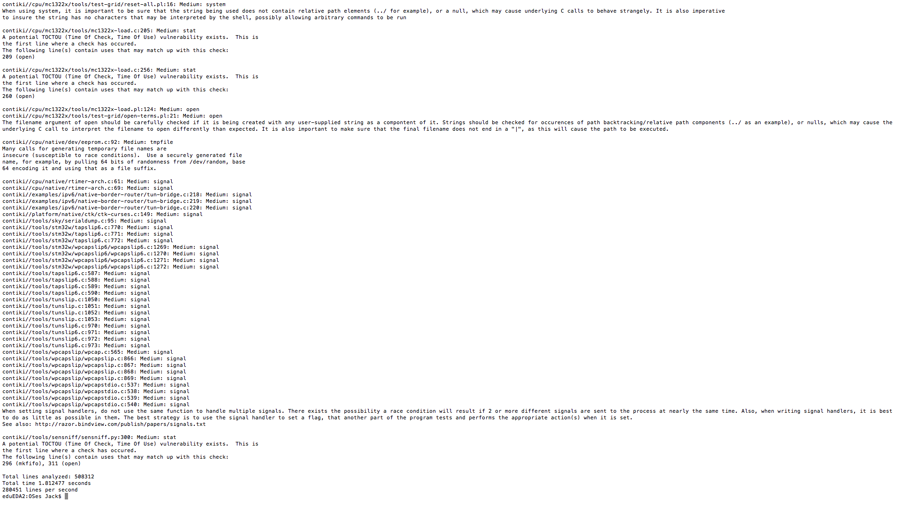
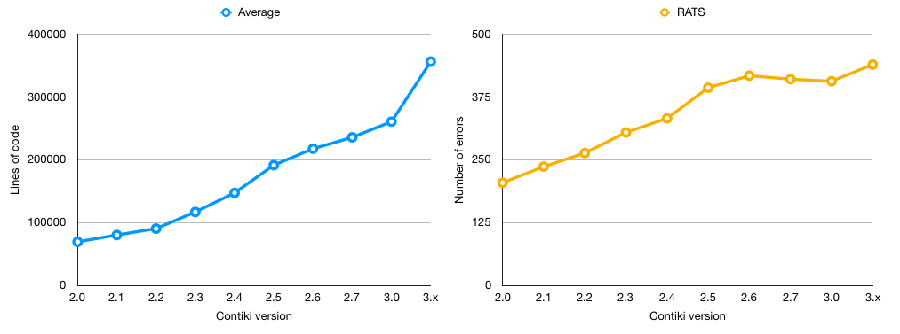
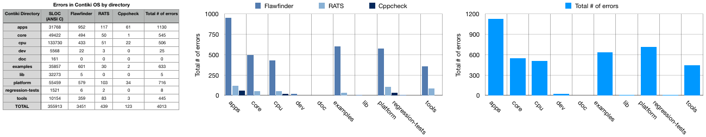
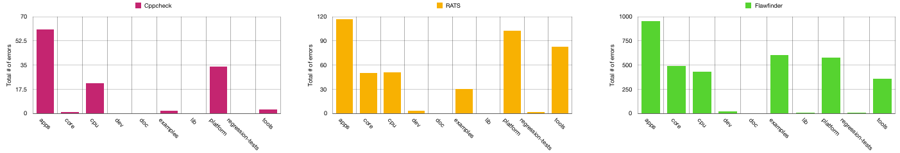
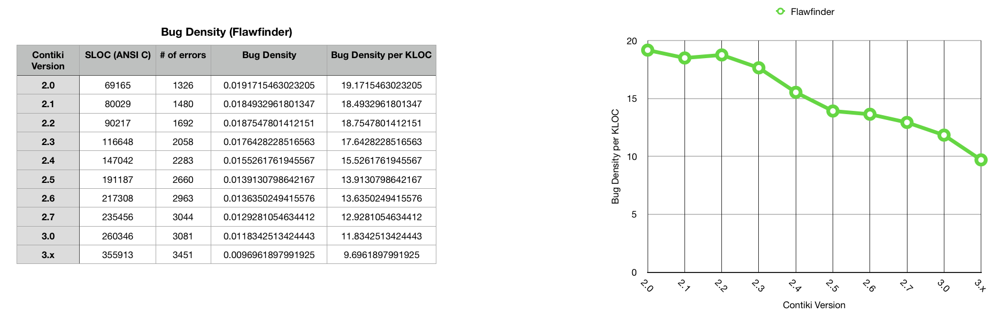
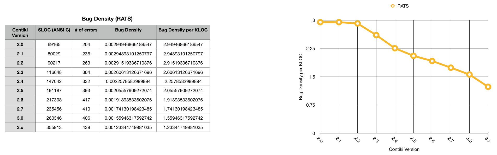
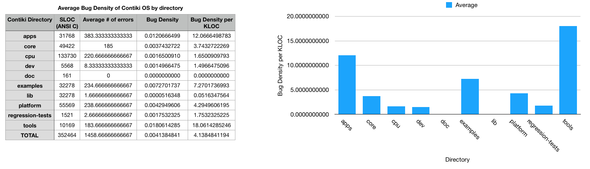
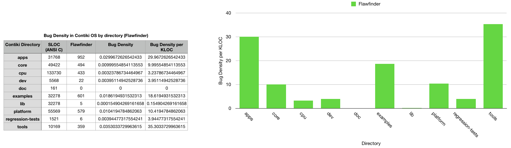
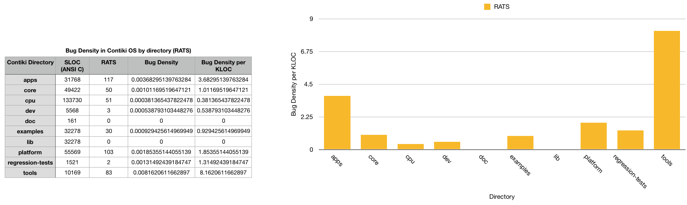
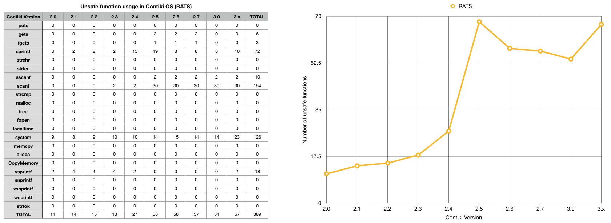

<h1 style = "font-size: 35px;">Security Analysis of Contiki: Corpus</h1>

#Contents

[TOC]

#Introduction

##Author Notes
The author of this project is Jack Lucas Gilmore McBride, as supervised by Budi Arief. The project was conducted between January of 2017, and completed in August 2017, with a finish date of 24/08/2017. If you wish to contact the author, please do so at <a href="mailto:jlgm2@kent.ac.uk">jlgm2@kent.ac.uk</a>.

##Abstract
Based on the set of resource-conscious use cases and services provided by IoT devices, the development of operating systems suited to constrained systems is on the rise; many of which thrive as open-source community driven projects. As security researchers, this affords us a unique opportunity to improve IoT stability at the heart of the issue, by working alongside developers to improve the robustness of their systems. Current open-source projects such as Contiki, TinyOS and RIOT feature open, publicly accessible repositories, allowing for the complete project source files to be scrutinised, and evaluated by the community. As such, obscuring weak security features is no longer feasible, and so the overall robustness of the system can improve beyond that of a proprietary system based on this exposure. Through this method, security techniques such as static analysis and reverse engineering can be applied to the source code and prevent vulnerabilities before they are released into the wild. This project intends to explore the effectiveness of static analysis tools on performing security analyses on the codebases of IoT systems, focusing on Contiki OS. 

##Aim
This corpus intends to provide supplementary material and evidence to support the project dissertation. Stored within are materials documenting the results of the project, as well as a record of the developmental process leading to them. This corpus provides a roadmap of the areas of the project, whereas several heavily detailed aspects will be further described within the body of the dissertation itself. 

##Acknowledgements
Special thanks go to my supervisor Dr Budi Arief for providing guidance and insight behind the project, and Dr Julio Hernandez-Castro for his additional assistance. Special thanks also go to Dr George Oikonomou for his introduction to the project and deep understanding of the Contiki operating system, as well as his team at Bristol who were a pleasure to collaborate with.
#Initial Ideas

##Overview

The purpose of this project is to perform a security analysis of Contiki: an open source operating system designed for the Internet of Things. The main focus of this investigation will involve the use of static analysis tools, which can be deployed onto the source code to automate testing, and discovery of vulnerabilities without execution. This is considered a "dry-run" of the code, and is used as a method of security analysis as a counterpart to dynamic analysis, which determines the existence vulnerabilities through code execution. 

Contiki is written in the ANSI C programming language, which is designed to provide lightweight and efficient software to be run on resource constrained sensors. As such, due to the volatile nature of C as a language, it introduces a series of potential threats to the operating system's security: including the classic buffer overflow vulnerability, which allows attackers to manipulate vulnerable systems in a number of malicious ways. Based on the overhead restriction faced by IoT systems such as Contiki, implementing the level of security typical to full scale computers is not feasible due to the incurring impact on data processing and performance. This has created a mementous issue in the Internet of Things as of lately, in striking a balance between system security and performance. 

This project, therefore, is an exploration into how static analysis tools can be used to identify, document, and patch the more elusive of vulnerabilities found to be compromising such systems. Contiki, as a popular platform for many IoT developers to develop open source applications for, is therefore a strong contender for testing the effective of static analysis tools. 

##Aims

This project has the following aims: 

* To identify and correct flaws found in the Contiki operating system.
* To work collaboratively in a team, using a red-team-blue-team approach to locating and patching flaws.
* To measure the effectiveness of several static analysis tools at our disposal.
* To develop an understanding of how static analysis tools work, and can be executed to find flaws.
* To develop an understanding of vulnerabilities commonly faced in IoT operating systems, and evaluate the status of security in the current market.

To achieve these aims, we will be amassing a collection of static analysis tools suitable for use with C/C++ code, studying and evaluating them to understand how they work, and deploying them on the source code of Contiki and that of other operating systems. Additionally, we shall be documenting the reports generated from each of these tools, formulating a work flow for which we can communicate and patch vulnerabilities alongside the project's developers, who can then integrate the suggested changes into the main Contiki git repository. Additionally, after the duration of the project, we aim to observe the improvements our research may have made, and make evaluations as to how they could have been improved. Finally, we intend to postulate on future work following the direction of this project, and perhaps look into how this method can be replicated to patch other operating systems similar to Contiki. 
#Contiki

In this section, we list some of the key features of Contiki, and explore the core concepts related to IoT driven sensor networks. This is intended to provide an overview of the technologies featured in Contiki, some of the advantages and limitations of that technology, and how it is looking to progress in future. 

####Overview

Contiki connects low-power microcontrollers to the internet and supports standards like IPv6, 6lowpan, RPL and CoAP. Other key features include highly efficient memory allocation, full IP networking, very low power consumption, dynamic module loading and more. Supported hardware platforms include Redwire Econotags, Zolertia z1 motes, ST Microelectronics development kits and Texas Instruments chips and boards.

##Features 

Designed specifically to work with IoT 
Devices which are low power, constrained devices - microcontrollers, wireless sensors 
Highly portable, multi tasking 
New features - MicroIP (uIP) and 6LoWPAN.

####uIP (Micro IP)

* Implements a skeleton TCP/IP 
* Designed for 8 and 16 bit micro controllers 
* Stack includes TCP, UDP, ICMP protocols. 
* Size of uIP is a few Kilobytes, ram requirements are a few hundred bytes. 
* uIPv6 - the world’s smallest certified IPv6 stack - designed by CISCO for sensors and actuators. 

####6LoWPAN
 
* IPv6 - low power and wireless personal area network. 
* Enables the use of IPv6 over the MAC and PHY layer of 802.15.4 (LR-WPAN). 
* Challenges - each MAC layer has a limitation for data e.g. MTU - allowing in this case only 127 bytes. 
* Networking layer - the IPv6 MTU was 280 bytes. 

####Transition from IPv4 to IPv6 

* IPv4 is a 32 bit IP address - 2^32 = 4 billion or so available addresses, which is soon to run out. 
* IPv6 is 128 bit IP addresses - which is considerably more. 
* How does this transition? Slowly, and gradually. 
* Enabled from three popular technologies: Dual stack, tunnelling and header translation. 

####Dual Stack 

* TCP/IP protocol stack where we contain bother IPv4 and IPv6 parts of the protocol in the stack. 
* If we need to communicate with an IPv4 node, use that part of the stack. Or with IPv6 address, use that part of the stack. 
* Source queries the DNS - the DNS responds back with IPv4 or IPv6 address - based on which one, the source may respond with an IPv4 packet or an IPv6 packet which it sends to the destination node. 

####Tunnelling 

Implemented when different IP versions exist on path. 
E.G. if two IPv6 machines communicate through IPv4 routers, the IPv6 packets are placed inside IPv4 packets and then forwarded towards the destination machine.

####Header Translation 

* Necessary when most of the Internet has moved to IPv6, but some systems still use IPv4. 
* Sender uses IPv6, receiver uses IPv4. Tunnelling doesn’t work here, as destination machine only understands IPv4. 
* So the header format is changed on route. 
* It is converted from IPv6 to IPv4 on route. 
* Done by mapped address. 

####RPL 

* Routing protocol for Low power and Lossy networks (RPL) 
* A distance vector routing protocol.
* The routing is based on Destination oriented Acyclic graphs or DODAGs.

####Terminology related to RPL

* Direct acyclic graph (DAG) - a spanning tree graph when we don’t have any cycles 
* Root - destination of the nodes in the DAG.
* Up - any edge that is directed towards the root. 
* Down - any edge that is directed away from the root. 

####Destination Oriented Direct acyclic graph (DODAG) 

* Special DAG where all nodes are trying to reach a single destination. 
* Objective function - helps us determine how close we are to the root - e.g. number of intermediary nodes. 
* Rank - distance from the root. 
* RPL instance - When we have one or more DODAGs, then each DODAG is an instance. 
* DODAG ID - Each DODAG has an IPv6 ID (128 bit). This ID is given to the root only. As long as the root doesn’t change, the ID doesn’t change. 
* DODAG version - each different shape of a DODAG has a different version. E.g. if nodes sleep or turn off for a couple of weeks, the shapes will change to fill in the gaps. 
* Goal - where a DODAG wants to reach. 
* Grounded - when a DODAG reaches its goal. 
* Floating - when DODAG hasn’t reached its goal. 
* Parent - the parent node - the node to which the arrow is pointing 
* Child - the child node - the node from which the arrow is extending. 
* Sub-DODAG - any subtree of a given DODAG 
* Storing nodes - keeps the whole routing table. They know how to go from one node to the other. 
* Non storing nodes - only know about their parents. 

####RPL Control Messages 

5 control messages that form the spanning tree: 

* DODAG Information object (DIO) - Message sent by a node present in a DODAG. Multicasted from the node, message contains information about whether the node is storing/non storing, floating/grounded. 
* DODAG Information Solicitation (DIS) - Message sent by a new node when it doesn’t receive announcements - “Is there any DODAG out there”. 
* DODAG Advertisement Object (DAO) - Request made by a new node to a parent or a root to request to be a part of their DODAG. 
* DAO-ACK - an acknowledgement - yes or no, consistency check

##Contiki 3.0

This section contains several developer notes concerning the features of Contiki 3.0: the latest release of Contiki as of 2016. It also provides signposting for where particular functionalities of the operating system are kept, with regard to the project directories. 

GitHub Repository: https://github.com/contiki-os/contiki 

Contiki Website: http://contiki-os.org/

###Features

#####Memory Allocation 

>Contiki is designed for tiny systems, having only a few kilobytes of memory available. Contiki is therefore highly memory efficient and provides a set of mechanisms for memory allocation: memory block allocation memb, a managed memory allocator mmem, as well as the standard C memory allocator malloc.

Found in: contiki/core/lib/{memb,mmem}.[ch].

#####Full IP Networking 

>Contiki provides a full IP network stack, with standard IP protocols such as UDP, TCP, and HTTP, in addition to the new low-power standards like 6lowpan, RPL, and CoAP. The Contiki IPv6 stack, developed by and contributed to Contiki by Cisco, is fully certified under the IPv6 Ready Logo program.

Find the code in contiki/core/net/.

#####Power Awareness 

>Contiki is designed to operate in extremely low-power systems: systems that may need to run for years on a pair of AA batteries. To assist the development of low-power systems, Contiki provides mechanisms for estimating the system power consumption and for understanding where the power was spent.

Find the code in contiki/sys/energest.[ch].

#####6lowpan, RPL, CoAP

>Contiki supports the recently standardized IETF protocols for low-power IPv6 networking, including the 6lowpan adaptation layer, the RPL IPv6 multi-hop routing protocol, and the CoAP RESTful application-layer protocol.

Find the code in contiki/core/net/rpl/ and contiki/apps/erbium/.

#####Dynamic Module Loading

>Contiki supports dynamic loading and linking of modules at run-time. This is useful in applications in which the behavior is intended to be changed after deployment. The Contiki module loader can load, relocate, and link standard ELF files that can optionally be stripped off their debugging symbols to keep their size down.

Find the code in contiki/core/loader/.

#####Examples

>There are plenty of examples in the Contiki source code tree to help you get started with your own code. Some examples show how to program network code, others show how to interact with the platform hardware, yet others demonstrate different aspects of the Contiki system. Most have a corresponding Cooja simulation available.

Find the code in contiki/examples/.

#####The Cooja Network Simulator

>Contiki devices often make up large wireless networks. Developing and debugging software for such networks is really hard. Cooja, the Contiki network simulator, makes this tremendously easier by providing a simulation environment that allows developers to both see their applications run in large-scale networks or in extreme detail on fully emulated hardware devices.

Find the code in contiki/tools/cooja/.

#####Sleepy Routers

>In wireless networks, nodes may need to relay messages from others to reach their destination. With Contiki, even relay nodes, so-called routers, can be battery-operated thanks to the ContikiMAC radio duty cycling mechanism which allows them to sleep between each relayed message. Some call this sleeping routers, we call it sleepy routers.

Find the code in contiki/core/net/mac/.

#####Hardware Platforms

>Contiki runs on a wide range of tiny platforms, ranging from 8051-powered systems-on-a-chip through the MSP430 and the AVR to a variety of ARM devices. There are also a number of more exotic platforms thrown in there for good measure. Read more about Contiki hardware platforms:

#####Contiki hardware »

Find the code in contiki/platform/ and contiki/cpu/.

#####Protothreads

> To save memory but provide a nice control flow in the code, Contiki uses a mechanism called protothreads. Protothreads is a mixture of the event-driven and the multi-threaded programming mechanisms. With protothreads, event-handlers can be made to block, waiting for events to occur.

Find the code in contiki/core/sys/pt.h.

#####Coffee flash file system

> For devices that has an external flash memory chip, Contiki provides a lightweight flash file system, called Coffee. With Coffee, application programs can open, close, read from, write to, and append to files on the external flash, without having to worry about flash sectors needing to be erased before writing or flash wear-leveling. The performance of Coffee is within 95% of the raw throughput of the flash memory.

Find the code in contiki/core/cfs/cfs-coffee.[ch].

#####The Contiki shell

> Contiki provides an optional command-line shell with a set of commands that are useful during development and debugging of Contiki systems. With Unix-style pipelines, shell commands can be combined in powerful ways. Applications can define their own shell commands that work together with existing commands.

Find the code in contiki/apps/shell/.

#####Regression Tests

>To ensure that the Contiki code works as expected, the Contiki developers use a set of nightly regression tests that test important aspects of Contiki on a daily basis in the Cooja simulator. The regression test scripts can be used as a starting point for setting up simulations or to investigate how different Contiki mechanisms work.

Find the code in contiki/regression-tests/.

#####The Rime Stack

>In situations when bandwidth is at a premium or where the full IPv6 networking stack is overkill, Contiki provides a tailored wireless networking stack called Rime. The Rime stack supports simple operations such as sending a message to all neighbors or to a specified neighbor, as well as more complex mechanisms such as network flooding and address-free multi-hop semi-reliable scalable data collection. Everything runs with sleepy routers to save power.

Find the code in contiki/core/net/rime/.

#####Build System

>The Contiki build system makes it easy to compile applications for any of the available Contiki platforms. This makes it easy to try out applications on a range of different platforms. Don't have the hardware available? Use the Cooja simulator to emulate any of the available hardware devices!

Find the code in contiki/Makefile.include.

##Code Metrics

To get an overall understanding of the Contiki software, we first conducted an investigation into the general code metrics behind the operating system. This consisted of measuring the total number of lines of code, expressed as SLOC over the entire codebase and over each directory. In addition to this, we analysed the ratio of programming languages present in Contiki: focusing on the core language of ANSI C. When it came to measuring errors, bug density, or general security of the system, we did this purely on the basis of the code written in ANSI C, as with it being the primary language of Contiki, it gave us the most accurate representation of its general behaviour when deployed on the wild. As such, all of the bug detection and patching is also performed exclusively on C code. In the sections below, we describe the method we used for obtaining the code metrics and discuss the statistics of the Contiki codebase.

###By codebase

The first measure we took was to collect data on the SLOC of Contiki irrespective of the programming language. At later stages, we filtered specifically to focus on C based metrics, after having broken down the weighting of each language in the project overall. 

Contiki Version | SLOC (Total)
:----------------:|:-----:
2.0 (2007) | 91099
2.1 (2007) | 111983
2.2 (2008) | 127057
2.3 (2009) |	163321
2.4 (2010) | 	198561
2.5 (2011) |	246627
2.6 (2012) |	278368
2.7 (2013) |	301189
3.0 (2015) |	328945
3.x (2017) |	425652

 

This is then condensed more explicity for each version in the tables below. 

####Contiki 2.0

Programming Language | SLOC
:----------------:|:-----:
ANSI C | 69165
Java | 17840
ASM | 3242
Python | 704
Perl | 91
Shell Script | 57
<b>Total</b> | <b>91099</b>

####Contiki 2.1

Programming Language | SLOC
:----------------:|:-----:
ANSI C | 80029
Java | 22629
Python	| 4832
ASM	| 4010
Perl | 390
Shell Script	| 89
AWK	 | 4
<b>Total</b>	| <b>111983</b>

####Contiki 2.2

Programming Language | SLOC
:----------------:|:-----:
ANSI C	| 90217
Java | 26971
Python	| 4832
ASM	 | 4356
Perl | 498
Shell Script | 143
PHP	| 36
AWK	| 4
<b>Total</b> | <b>127057</b>

####Contiki 2.3

Programming Language | SLOC
:----------------:|:-----:
ANSI C	| 116648
Java | 36609
Python	| 4832
ASM	 | 4356
Perl | 563
Shell Script | 267
PHP	 | 36
Lisp | 6
AWK	 | 4
<b>Total</b> | <b>163321</b>

####Contiki 2.4

Programming Language | SLOC
:----------------:|:-----:
ANSI C	| 147042
Java | 40995
Python	| 4832
ASM	 | 4356
Perl | 1023
Shell Script | 261
PHP	 | 36
Lisp | 12
AWK	 | 4
<b>Total</b> | <b>198561</b>

####Contiki 2.5

Programming Language | SLOC
:----------------:|:-----:
ANSI C	| 191187
Java | 45258
Python | 5528
ASM	 | 2233
Perl | 2101
Shell Script | 254
PHP	 | 49
Lisp | 13
AWK	 | 4
<b>Total</b> | <b>246627</b>

####Contiki 2.6

Programming Language | SLOC
:----------------:|:-----:
ANSI C | 217308
Java | 50313
Python	| 5832
Perl | 2362
ASM	 | 2233
Shell Script | 254
PHP	 | 49
Lisp | 13
AWK	 | 4
<b>Total</b> | <b>278368</b>

####Contiki 2.7

Programming Language | SLOC
:----------------:|:-----:
ANSI C	| 235456
Java | 53228
Python	| 7662
Perl | 2434
ASM	 | 2270
Shell Script | 93
PHP	| 29
Lisp | 13
AWK	 | 4
<b>Total</b> | <b>301189</b>

####Contiki 3.0

Programming Language | SLOC
:----------------:|:-----:
ANSI C	| 260346
Java | 56033
Python	| 6971
ASM	 | 3008
Perl | 2434
Shell Script | 149
AWK	 | 4
<b>Total</b> | <b>328945</b>

####Contiki 3.x

Programming Language | SLOC
:----------------:|:-----:
ANSI C	| 355913
Java | 56497
Python	| 7185
ASM	 | 3302
Perl | 2452
Shell Script | 299
AWK	 | 4
<b>Total</b> | <b>425652</b>

 

In order to generate the code metrics, we used SLOCCOUNT (https://www.dwheeler.com/sloccount/) an open source set of tools for calculating properties of code; such as number of physical lines (SLOC). According to its documentation it is suitable for large systems such as Contiki, and has been used to perform estimations on systems as complex as the Linux kernel (https://www.dwheeler.com/sloc/redhat71-v1/redhat71sloc.html).

Contiki Release |	platform | core	| tools | apps | cpu | examples | doc |backyard | regression tests	| dev	| lib |	TOTAL
:--------:|:---------:|:----------:|:------:|:-------:|:------:|:------:|:---------:|:-----:|:--------:|:------:|:--------------------:|:------:|:-----:|:----:|
2.0| 22324 | 25520 | 1381	| 10654 | 8078 | 978 | 230 |  |  |  |  | 69165 |
2.1 | 17947 |	22627 | 1383	 | 10125 |	10828	| 1945	| 185	 | 14989 | | | |80029
2.2 | 17465 | 24695 | 2855 | 13071 | 11053 | 3243 | 185 | 17650 | | | |90217
2.3 | 23090 | 30774 | 4578	|15552 | 19715 | 4627 | 187 | 18125 | | | |116648
2.4 | 24002 | 31591	| 8562	 | 16190 | 43526 | 4859 | 187	 | 18125 | | | | 147042
2.5 | 37154 |	38233 |	12519 | 21037 |	73861 |	8196 |	187 | | | | |191187
2.6 | 40731 | 40514 |	12613 | 31959 |	76524	|14780 | 187 | | | | | |217308
2.7 | 43740 | 42597 | 12596 | 35386 | 84834 | 15699 | 152	 | | 452 | | |235456
3.0 | 36624 | 41450 | 13264 | 28583 | 116320	| 20803 |154	 | | 494 | 2654	| |	260346
3.x | 55459 | 49422	| 10154 | 31768 | 133730 | 32273 |161	 | | 1521 | 5568 |	35857 | 355913

 

All of the above data was generated using David A. Wheeler's 'SLOCCount'.

The chart above demonstrates the growth of Contiki over 10 years. There is a particular increase to the "cpu" directory, which, for the past 7 releases has contained the highest SLOC. This is mainly owed to the substantial increase in platform support that Contiki has exhibited over time, resulting in consistently large amounts of additional code to be added at each consecutive update. As of version 3.x (current version of Contiki) cpu has grown to 133,730 lines of code. In the next sections, we explore the ratio of bugs encountered in the entire codebase as well as in each directory, in order to establish a measure of which areas of the project are most stable, and those which are perhaps more error prone.

##Areas of Interest

As of our initial meeting with the Bristol team of researchers, we established a few areas of interest to consider for analysis. We also established a workflow platform for which we could git pull the latest Contiki project files, analyse the source code and identify bugs, and disclose them alongside some potential improvements to the Bristol "blue-team"; who were tasked with patching the system. To achieve this, we used Eclipse to store the Contiki project and isolate the directories we were interested in analysing. As a result of the meeting, we concluded that the following areas were of interest:

* apps/er-coap
* apps/ipso-objects
* apps/mqtt
* apps/oma-lwm2m
* apps/rest-engine
* core
* cpu/cc26xx-cc13xx
* examples/ipv6
* examples/sensniff
* platform/srf06-cc26xx
* lib
* examples
* apps

For ease of access, we configured Eclipse to display these project directories only, so that when it came to running static analysis tools via Eclipse, the tools would target only those specified areas. This was used throughout the project as the workbench for getting to grips with the Contiki code, and as a testing ground for making modifications when patching vulnerabilities.

#Cppcheck

##Brief

Cppcheck is an analysis tool for C/C++ code. Unlike C/C++ compilers and many other analysis tools, it doesn’t detect syntax errors. Instead, Cppcheck detects the types of bugs that the compilers normally fail to detect. In order to establish a realistic overview of errors in Contiki, The goal is to avoid false positives; concentrating instead on critical flaws affect- ing its core stability. The developers behind Cppcheck lay out some key points regarding its use:

* You can check non-standard code that includes various compiler extensions, inline assembly code, etc.
* Cppcheck should be compilable by any C++ compiler that handles the latest C++ standard.
* Cppcheck should work on any platform that has sufficient CPU and memory.
* You will find more bugs in your software by testing your software carefully, than by
using Cppcheck.
* You will find more bugs in your software by instrumenting your software, than by using Cppcheck. But Cppcheck can still detect some of the bugs that you miss when testing and instrumenting your software.

To find out additional information regarding the usage of Cppcheck in this project, the directory <a href = "Static_Analysis/Open_source_tools/cppcheck">`Static_Analysis/Open_source_tools/cppcheck`</a> contains the complete documentation and results of the tool, including screenshots, test outputs and help files.

Additionally, consult <a href = "/Statistics/">Statistics</a> for an overview of general tool results, many of which involve reportings from Cppcheck. 

Within this report, you can also read more about Cppcheck under the [Static Analysis](#static-analysis) section.

##Features


Cppcheck incorporates a classification system in order to describe the errors it flags and provide granularity. This is particularly useful in separating its results in terms of serious- ness, and is an effective measures to differentiate between superficial, stylistic issues, and those which are critical. The error categories can be seen in Table 5.2. Additionally:

* Recursively checks directories for C/C++ code.
* Evaluates code using an error system.
* Makes programming suggestions to aid prevention of bugs.
* Capable of evaluating an entire project at once.
* Integrated into several programming IDEs as plugins e.g. Eclipse.

Below is a breakdown on the types of errors that Cppcheck is capable of reporting on. For the duration of this project, we were interested in documenting, locating and patching security bugs associated with the Contiki operating system. As such, our main interests were related to the "error" bracket of the tool's reportage, with less emphasis being focused on "warning" or "style" which mostly relayed stylistic information about the code. As such, in our statistical findings, we report only on the number of "errors" in our figures, particularly when comparing this tool with the others at our disposal.

 

Category | Description
---------|------------
error | Used when legitimate bugs are found.
warning | Suggestions about defensive programming to prevent bugs.
style | Stylistic issues related to code cleanup (unused functions, redundant code, constness).
performance | Suggestions for making the code faster.
portability | Code portability warnings. E.g. code might work different on different compilers.
information | Configuration problems. The recommendation is to only enable these during configuration.

##Images

Cppcheck is run as a command line tool, and is suitable for recursively checking multiple directories of a complex project. Below are some screenshots of the tool being executed.

####Scanning directories for bugs

####Sample output of the "apps" directory

##Limitations

* Cppcheck seems to be quite minimal in terms of descriptions of the errors it encounters in the code. Some more context would be useful.
* There seem to be inconsistencies between the number of errors reported by the tool over the entire project, against the number reported on a directory by directory basis. Could this mean it misses some errors when quickly sweeping over the entire project?
* From the Cppcheck manual: “Please understand that there are limits of Cppcheck. Cppcheck is rarely wrong about reported errors. But there are many bugs that it doesn’t detect”.
* No focus on detecting unsafe function usage. By implementing a pattern matching based approach

##Conclusion

Cppcheck is a useful tool for performing basis static analysis of C/C++. It has an impressive set of features for an open source tool, and produces error checking in a human readable output format. It also makes suggestions on how the programmer can improve the project being analysed, with the use of defensive programming tips. Furthermore, the tool manages to classify errors into sub categories based on their nature, and seemingly strips out useless information. As such, it is easy to get a general understanding of ways the tested code may be exploited. With the limited information the tool is given, it returns an excellent amount of feedback. However, there can also be several improvements to be made. 
#Flawfinder

##Brief

Flawfinder is a simple static analysis tool which incorporates pattern matching of source code against a database of known vulnerabilities, in order to flag bugs in software. It was developed by David Wheeler as a tool for quickly assessing the stability of C/C++ based projects, and features a reporting system based on "risk level", allowing the user to distinguish errors based on levels of severity. As a result of its pattern matching mechanism, it is known to produce a high level of results which might otherwise be deemed harmless by the programmer. Due to this, it will likely need to be averaged against more concise tools in order to make its findings more applicable. Despite this, based on the speed and ease of use of the tool, it is incredibly trivial to apply it recursively to large codebases in short spaces of time, and as such will serve as a useful asset in pinpointing which areas of the Contiki source code, if any, are most saturated with bugs. 

To find out additional information regarding the usage of Flawfinder in this project, the directory <a href = "Static_Analysis/Open_source_tools/Flawfinder">`Static_Analysis/Open_source_tools/Flawfinder`</a> contains the complete documentation and results of the tool, including screenshots, test outputs and help files.

Additionally, consult <a href = "/Statistics/">Statistics</a> for an overview of general tool results, many of which involve reportings from Flawfinder. 

Within this report, you can also read more about Flawfinder under the [Static Analysis](#static-analysis) section.

##Features

Flawfinder incorporates a built-in database of C/C++ functions with well-known problems, such as buffer overflow risks (e.g., strcpy(), strcat(), gets(), sprintf(), and the scanf() family), format string problems ([v][f]printf(), [v]snprintf(), and syslog()), race conditions (such as access(), chown(), chgrp(), chmod(), tmpfile(), tmpnam(), tempnam(), and mktemp()), potential shell metacharacter dangers (most of the exec() family, system(), popen()), and poor random number acquisition (such as random()). 

Flawfinder then takes the source code text, and matches the source code text against those names, while ignoring text inside comments and strings (except for flawfinder directives). Flawfinder also knows about gettext (a common library for internationalized programs), and will treat constant strings passed through gettext as though they were constant strings; this reduces the number of false hits in internationalized programs.

Flawfinder produces a list of “hits” (potential security flaws), sorted by risk; by default the riskiest hits are shown first. This risk level depends not only on the function, but on the values of the parameters of the function. For example, constant strings are often less risky than fully variable strings in many contexts. In some cases, flawfinder may be able to determine that the construct isn’t risky at all, reducing false positives.

Not every hit is actually a security vulnerability, and not every security vulnerability is necessarily found. Nevertheless, flawfinder can be an aid in finding and removing security vulnerabilities. A common way to use flawfinder is to first apply flawfinder to a set of source code and examine the highest-risk items. This applies directly to our project, and will generally be the way we use the tool. The intention is to begin with a high-level approach to the entire source code, and then zero-in on specific areas.

* Flawfinder can also report on hit density: hits per thousand lines of source code.
* Released simultaneously as RATS by Secure Software Solutions.
* Flawfinder is very fast: Flawfinder version 1.31 averaged an analysis speed of 45,126 lines/second when it examined the Linux kernel version 3.16 (released 2014-08-03) on a Intel Core2 Duo CPU E8400 @ 3.00GHz (each CPU running at 2GHz) running Fedora Linux version 20.
* Based on its simple tokenisation procedure, flawfinder will necessarily produce many false positives for vulnerabilities and fail to report many vulnerabilities.
* Flawfinder utilises a system of risk levels to introduce granularity into its findings. 
* Flawfinder reports explicitly on known vulnerabilities and unsafe functions by integrating its own database.
* The risk level depends on the function as well as its given parameters. For example, constant strings are often less risky than fully variable strings in many contexts, and so receive a lower level of risk.
* Flawfinder can analyze software that you can't build.
* Flawfinder provides reccommendations for improving code security e.g. usage of safe replacement functions.

###CWEs

Flawfinder can report on the following CWEs:

* CWE-20: Improper Input Validation
* CWE-22: Improper Limitation of a Pathname to a Restricted Directory (‘‘Path Traversal’’)
* CWE-78: Improper Neutralization of Special Elements used in an OS Command (‘‘OS Command Injection’’)
* CWE-119: Improper Restriction of Operations within the Bounds of a Memory Buffer (a parent ofCWE-120: Buffer Copy without Checking Size of Input (‘‘Classic Buffer Overflow’’)
* CWE-126: Buffer Over-read
* CWE-134: Uncontrolled Format String
* CWE-190: Integer Overflow or Wraparound
* CWE-250: Execution with Unnecessary Privileges
* CWE-327: Use of a Broken or Risky Cryptographic Algorithm
* CWE-362: Concurrent Execution using Shared Resource with Improper Synchronization (‘‘Race Condition’’)
* CWE-377: Insecure Temporary File
* CWE-676: Use of Potentially Dangerous Function
* CWE-732: Incorrect Permission Assignment for Critical Resource
* CWE-785: Use of Path Manipulation Function without Maximum-sized Buffer 
* CWE-807: Reliance on Untrusted Inputs in a Security Decision
* CWE-829: Inclusion of Functionality from Untrusted Control Sphere

##Images

Flawfinder can be executed via the command line as a python program. All of the reports it generates are then printed. Some screenshots of this working in action can be seen below:

####Scanning directories for bugs

####Sample output of the "cpu" directory

##Limitations

* Flawfinder does not use or have access to information about control flow, data flow, or data types when searching for potential vulnerabilities or estimating the level of risk.
* High level of false positives can somewhat obscure the general picture of the results.
* No ability to run the program during a build execution. Instead, it is simply used on general segments of code.

##Conclusion

Flawfinder is an effective tool for scoping a codebase for high level issues that may be embedded in the source code. That is to say, as a tool, Flawfinder is incapable of contextual awareness - such as control flow or data types, but can spot verifiable bugs based on pattern matching with a known bank of vulnerabilities. It is a very fast tool with low overhead, so is suitable for gaining a quick understanding of source code stability when auditing a system. However, due to its emphasis on reporting negligible errors, a tool of this kind is most effective when used alongside others which are more concise, in order to establish a balanced overview of the vulnerabilities that are being reported.  
#Rough Auditing Tool for Security (RATS)

RATS, or "rough auditing tool for security", is a simplistic open source software tool designed for scanning a variety of languages and reporting on vulnerabilities. It was developed as part of the CERN Computer Security group, and is currently being distributed by Fortify as open source software. Similar to Flawfinder, RATS is a very fast tool, and can be easily integrated into a building process without noticeably increasing overhead. For C/C++ code, RATS is noted for detecting several typical types of errors, including Buffer overflows and race conditions. However, it is explicity stated in the documentation as being unable to report on design flaws present in programs. It was released around the same time as Flawfinder, but has been cited by both developers as being catered for discovering different types of vulnerabilities: making the tool a useful accompaniment. The inspiration to use RATS came from research conducted by McLean et al. (2012) during which the tool RATS was used alongside Flawfinder to analyse critical vulnerabilities in a set of programs, including Wireshark and Mozilla Firefox. Concluding their results, it was believed that Flawfinder was a more useful tool in its ability to convey a greater quantity of valuable information to the user. However,  The latest version of the tool is 2.4, which is currently available on Google Code Archive: https://code.google.com/archive/p/rough-auditing-tool-for-security/downloads. 

To find out additional information regarding the usage of RATS in this project, the directory <a href = "Static_Analysis/Open_source_tools/RATS">`Static_Analysis/Open_source_tools/RATS`</a> contains the complete documentation and results of the tool, including screenshots, test outputs and help files.

Additionally, consult <a href = "/Statistics/">Statistics</a> for an overview of general tool results, many of which involve reportings from RATS. 

Within this report, you can also read more about RATS under the under the [Static Analysis](#static-analysis) section.

##Features 

RATS scanning tool provides a security analyst with a list of potential trouble spots on which to focus, along with describing the problem, and potentially suggest remedies. It also provides a relative assessment of the potential severity of each problem, to better help an auditor prioritize. This tool also performs some basic analysis to try to rule out conditions that are obviously not problems.

As its name implies, the tool performs only a rough analysis of source code. It will not find every error and will also find things that are not errors. Manual inspection of your code is still necessary, but greatly aided with this tool.

* Provides a rough overview of source code and can be run quickly.
* Although only a rough auditing tool, provides an intelligent filtering mechanism to differentiate false positives and false negatives. This filtering system is more aggressive than that of Flawfinder.
* Specialises in detecting format string vulnerabilities.
* Also features a built-in understanding of common vulnerabilities, similarly to Flawfinder.
* Makes security suggestions in its report output, as with Flawfinder.
* Incorporates a severity level system to rank the vulnerabilities it discovers.
* Provides code metrics on total number of lines analyzed, number of lines read per second and time taken in seconds.

##Images

RATS is a command line driven program. All of the reports it generates are then printed to the console, but can also be piped to a text file for later analysis. Some screenshots of this working in action can be seen below:

####Scanning directories for bugs

####Sample output of the "core" directory

##Limitations

* Known to only provide limited coverage of a program.
* Its filtering mechanism causes it to output a lower volume of errors than competing tools such as Flawfinder.
* It is unclear what type of CWE or CVE it is primarily aimed towards detecting, so applying it to detecting a specific type of error is very difficult.
* The severity levels reported by the tool only consist of 3 tiers against Flawfinder's 5, meaning there is less granularity and meaning behind the error outputs. 

##Conclusion

In conclusion, as its name suggests, RATS is a useful tool for quickly scoping the general security of a software system. It can be applied readily via the command line as with other similar tools, and is able to recursively search directories and parsing entire files; returning metrics regarding the physical lines of code it has analysed. RATS also features a pattern matching system capable of detecting commonly known errors, with respect to the database of CWEs. Furthermore, the tool implements an intelligent filtering system to separate errors into three categories: low, medium and high. It is however unclear as to the basis on which these categories are separated. The filtering system is also applied more heavily than Flawfinder's equivalent, leading to considerably more errors being interpreted as false positive; and therefore harmless. RATS is therefore a useful addition to our collection of tools, as it will assist in averaging the findings gathered by the heavily verbose Flawfinder, and the concise Cppcheck tool. It is, in a sense an effective 'middle ground' between the two. 
#Clang Analyzer

##Brief

The Clang Static Analyzer is a source code analysis tool that finds bugs in C, C++, and Objective-C programs. Currently it can be run either as a standalone tool or within Xcode. The standalone tool is invoked from the command line, and is intended to be run in tandem with a build of a codebase. The analyzer is 100% open source and is part of the Clang project. Like the rest of Clang, the analyzer is implemented as a C++ library that can be used by other tools and applications. One of the excellent features of the Clang Static Analyzer is its ability to be run in tandem with a project build command: allowing the tool to gain a context of control flow not previously possible with our other selection of open source tools. Resultantly, we can use Clang to build individual instances of Contiki, for example the cc26xx-web-demo project, which contains much of the core functionality featured across many typical Contiki deployments. In doing so, we can maximise the coverage of errors we obtain in a single run of the tool, and generate a progression of reproducible steps in the program's execution that leads to the evocation of a bug. This makes it an invaluable tool in assessing the actual likelihood of certain undefined behaviour occurring. 

To find out additional information regarding the usage of Clang-Analyzer in this project, the directory <a href = "Static_Analysis/Open_source_tools/checker-279">`Static_Analysis/Open_source_tools/checker-279`</a> contains the complete documentation and results of the tool, including screenshots, test outputs and help files.

Additionally, consult <a href = "/Statistics/">Statistics</a> for an overview of general tool results, many of which involve reportings from Clang-Analyzer. 

Within this report, you can also read more about Clang-Analyzer under the [Static Analysis](#static-analysis) section. In the corpus directory, there are also files related to the reports which the tool generates. These can be viewed in an output of your choice, but the most visually useful would be as HTML reports. 


##Features

* C++ library used to find bugs in C/C++/Objective C programs.
* Can be run as a standalone tool, or through XCode.
* Can also be run as a project is built, allowing for error checking on the fly. Using this feature, Clang Analyzer also has a graphical user interface (GUI), which can be used to visually relay the location of areas with explicit steps in control flow.
* Built into many existing static analysis tools.
* Produce results in HTML/XML/CSV format for database storage and viewing.

##Images

Clang-Analyzer is a command line driven tool with an external GUI option for viewing reports. The following screenshots demonstrate how it can be run from the command line, and the various formats that its results can be observed in.

####Executing build analysis of cc26xx-web-demo

####Clang-Analyzer Bug Categories

####Output of build analysis

####GUI example of a null pointer dereference bug in mqtt.c


##Limitations

* Requires previous experience in C programming to understand output.
* Since the tools performs deep analysis of the code, using it for static analysis can be much slower than compilation.
* Suffers from very high false positive rates.
* Whilst it seems to discover a larger number of errors than similar tools such as Cppcheck, it isn’t so easy to distinguish between those which are stylistic compared to legitimate errors that affect Contiki’s stability.
* A large emphasis on "dead code" related bugs, which may be viewed as false positives.
* No clear distinction of bug types. There are two main categories of "Logic Error" and "Dead Store" but a lack of granularity in terms of error severity.


##Conclusion

Clang is a C/C++ static analyser which is implemented across a few different C compilers and static analysis tools. It is very easy to run, and can be easily used on multiple directories to analyse multiple C/C++ files. It is also comprehensive and diverse in the number of errors it can detect, ranging across incorrect type declarations, to warnings about the structures of arrays. As a tool, Clang possesses some versatility with regards to how it can be run, with options allowing the user to execute it via XCode, as normal through the command line, or with a GUI enabled. This versatility also translates across its results formatting, which can be viewed in HTML format and exported to CSV. There is however a lack of indication to error severities, meaning that establishing granularity between its output for certain projects is difficult. This is a feature commonly employed across the other tools, so it is surprising that a basic weighting scheme to its error detection was not employed e.g. a severity rating distinguishing redundant "dead code" from critical logic flaws. 
#GrammaTech CodeSonar

CodeSonar by GrammaTech is a suite of advanced static analysis tools which enable deep inspection and vulnerability analysis of source code. Designed primarily for Java and C/C++ based projects, CodeSonar is capable of measuring control flow and performing taint analysis of a program, by being executed as part of the build process or through being deployed on the source code. Resultantly, we used it in this project to build 40 different examples of Contiki applications, which we then subsequently analysed for bugs during their build sequence. This provided us with extensive coverage over the operating system's code, which we believe has afforded us an in-depth analysis of the majority of all possible code executions between the system builds. 

According to the tool's website, CodeSonar has been successful in finding more vulnerabilities than any other static analysis tool on the market. As it can analyse both source code and binaries, it is able to determine security flaws in a more dynamic setting than with typical pattern matching based tools. In this project, CodeSonar was used entirely within the context of analysing binaries of programs, and was used as a basis of comparison for its closest open source equivalent used in this study: Clang-analyzer. Due to its capabilities, CodeSonar is often used within the Software Development Life Cycle by teams of professionals to analyse complete applications in a short space of time.

A general pattern behind our use of the tool involved deploying the tool on a given application, observing the error output generated by it, and sorting the errors in terms of severity. As the tools reports on a large number of harmless errors, our focus was naturally drawn towards those which were more critical. Resultantly, we found several major flaws in Contiki's critical applications which would have otherwise gone unnoticed with the use of the more simplistic open source tools. 

To find out additional information regarding the usage of CodeSonar in this project, the directory <a href = "Static_Analysis/Proprietary_tools/CodeSonar">`Static_Analysis/Proprietary_tools/CodeSonar`</a> contains the complete documentation and results of the tool, including screenshots, test outputs and help files.

Within this report, you can also read more about CodeSonar under the [Static Analysis](#static-analysis) section.

##Features

* Identify complex security vulnerabilities.
* CodeSonar provides support for detecting and correcting multicore / multithreaded flaws.
* CodeSonar generates customised PDF reports documenting flaws, helping to increase code quality and provide transparency to a project.
* The tool also enforces coding standards based off of CVE/CWE. This allows the user to audit code against regulatory requirements.
* CodeSonar features extensive forms of application visualisation: such as Treemaps, Control Flow diagrams and standard graphs and charts for visualising data in a meaningful way. 
* Can be used effectively in a team, using a centralised "hub" system to store analysis reports.
* Incorporates a graphical user interface (GUI) to visualise reproducible steps for encountering bugs, allowing the user to easily understand the path to a problem.
* Specialises in detecting a variety of vulnerability types, including static memory issues, resource management, concurrency bugs and other defects.
* Severity level of each vulnerability with a corresponding "score", offering granularity within the three main error categories.
* Three additional "significance" classes to further express the nature of the bug: "Security", "Redundancy" and "Reliability".
* CodeSonar can perform a whole-program analysis on 10M+ lines of code.

####Security Issues

* Buffer Overrun
* Uninitialized Variable
* Free Non-Heap Variable
* Use After Free
* Double Free/Close
* Format String Vulnerability
* Return Pointer to Local

####Reliability Issues

* Data Race
* Deadlock
* Null-Pointer Dereference
* Division by Zero
* Double Close
* Dangerous Function Cast
* Resource Leak

##Images

Below is a series of select screenshots of CodeSonar in action. For a more comprehensive overview of the reporting capabilities of the tool, navigate to `/Static_Analysis/Proprietary_tools/CodeSonar/Reports` to view the reports of 40 different Contiki applications.

####CodeSonar Overview

An overview of the projects we deployed CodeSonar across, including metrics and datetime information.

####Warnings per project

####Files per project

####Lines per project

After having initiated several runs of the CodeSonar tool, we were able to produce several useful metrics exploring the number of warnings, files and lines of code per project. 

####Application Report

Overview of errors detected for the cc26xx-web-demo project. On the left is a "score" assigned to each vulnerability detected by the tool. Each flaw is also provided an ID, for keeping track of individual cases, as well as a classification depending upon the type of error. Additionally, there is information regarding the line on which the major error occurs, the name of the procedure affected, and some configurable options for setting priorities on certain bugs. As we handled this largely through Bitbucket, this was not a feature we made use of. 

####MQTT Uninitialized Variable Bug

By selecting individual errors in the report, you are then able to view the specific details regarding them: featuring reproducible steps referred to as "events", and justifications made by the tool as to when and how they may occur. In the project, this formed an excellent basis for analysing the bugs at a closer level, and establishing the causes behind them. Reports such as this, which is for an MQTT bug which we ended up patching, was used to formulate our bug reports which we submitted on Bitbucket; using images such as this for evidence. The above MQTT bug was responsible for causing a system crash experienced using our CC2650 launchpad testing environment. 

####Application Metrics

Resulting from CodeSonar's extensive reporting capabilities, we were able to use it to generate simple warning metrics such as the one above, allowing us to grasp an understanding of the volume of errors as well as the nature of them. The complete collection of these across the projects we analysed can be seen in `/Static_Analysis/Proprietary_tools/CodeSonar/Reports`. To see more documentation of confirmed bugs in the Contiki project, navigate to the `/Static_Analysis/Proprietary_tools/CodeSonar/Bug_Screenshots` and `/Static_Analysis/Proprietary_tools/CodeSonar/Critical_Bugs` folders. 

####Application: cc26xx-web-demo comparison

During the project we conducted multiple runs on the same source code to evaluate the effects of our patches. It was important to be certain that our proposed fixes were not responsible for the propagation of more errors. In the image above, after having fixed several major issues embedded in the cc26xx-web-demo application, we conducted a second analysis run, which shows the updated metrics. A particular issue we solved was the unitialised variable issue in mqtt.c, which, as a result, no longer appears in the updated chart as all instances of the bug have been patched.

####Data Visualisation

Amongst the typical graph and chart forms of visualisation, CodeSonar also features its own custom treemaps and callgraphs. Both forms of visualisation are used to express the hierachical links between specific parts of a given system: the above treemap showing the project hierarchy of the cc26xx-web-demo example. The below call graph of sicslowpan.c shows the control flow of the file, linking together the functions which invoke each other. Both forms of visualisation can aid the programmer in understanding where certain bugs may originate from, and the wider scope of procedures which may be affected as a consequence. 

Example Application| Redundancy | Security | Reliability
-------------------|------------|----------|------------
cc2538	| 152 | 10 | 26
cc26xx | 174 | 40 | 26
cc26xx-web-demo | 219 | 61 | 37
encryption | 95 | 61 | 29
er-rest-example | 110 | 80 | 31
native-border-router | 109 | 65 | 30
rpl-border-router | 184	 | 40 | 28
rpl-tsch | 27	 | 21 | 10
sensniff | 6 | 0 | 0
simple-rpl-udp | 98 | 67 | 32
slip-radio | 6 | 0 | 0
telnet-server | 132 | 92 | 23
udp-ipv6 | 80 | 64 | 25
webserver | 54 | 43 | 10
webserver-ipv6 | 20 | 8 | 1
TOTAL | 1466 | 652 | 308

 

CodeSonar output in terms of error type.

##Limitations

* "A fool with a tool is still a fool" - CodeSonar errors require just as much interpretation as those found in others tools. Due to its high level of reportage, a human programmer still needs to filter the results. 
* Verbose in terms of reportage. This can be very time consuming for a security analyst to determine the false positives from the false negatives.
* Requires some understanding of makefiles and compilers to be able to run during the build sequence of a project.
* Timely execution.
* Requires a license to run.
* Decentralised storage of tool results on a webserver referred to as the CodeSonar "hub".

##Conclusions

CodeSonar is a very inclusive software suite for determining security bugs. It is very scalable, and offers an in-depth analysis of critical flaws found in either program binaries or source code. As far as static analysis tools go, it requires configuration to work correctly, which may cause it to be less user friendly. However, a single analysis can yield a wealth of information about a project, and often reports of vulnerabilities which would otherwise be impossible to discover. Resultantly, it serves as a great benchmark for static analysis tools on the market, and has successfully been used in this project to retrieve findings where other open-source tools fall short. Additionally, it provides a great comparison against Clang-Analyzer, which we consider its open source equivalent. 
#SciTools Understand

Understand combines a code editor with a powerful static analysis tool, several forms of data visualisation such as a treemap, and software metrics reporting system. It can be executed as a desktop application, and when supplied with a project directory (such as Contiki) it offers a suite of analyzers for spotting vulnerabilities in the source code. 

As we didn't use Understand to a large extent in this project, this section will be brief. Additionally, it was later revealed that Understand uses a built-in variation of the Clang Static Analyzer, so we did not expect the findings to be novel in light of what we had obtained with the open source tools. It does, however provide a useful basis for showcasing the additional features that proprietary tools have to offer. We managed to use this tool having obtained access to a year long student license.

Understand combines the Clang Static Analyzer, as well as its own specific analysis tool with some more useful metrics and visualisations regarding the Contiki source code, which have helped us in fully comprehending how different functions interact with one another. This was particulary true in the case of the mqtt_connect function, which is integral to most devices running Contiki irrespective of platform. 

To find out additional information regarding the usage of Understand in this project, the directory <a href = "Static_Analysis/Proprietary_tools/Understand">`Static_Analysis/Proprietary_tools/Understand`</a> contains the complete documentation and results of the tool, including screenshots, test outputs and help files.

Within this report, you can also read more about Understand under the [Static Analysis](#static-analysis) section.

##Features 

* Combines a beta version of the Clang Static Analyzer with several other static analysis tools, which can be implemented either simultaneously or one by one to observe differences.
* Different analysers for different purposes: Features the Sci-tools "recommended" analyser for universal standards of software stability, published standards agreed upon by academic experts, as well as the Clang Static Analyzer.
* Provides in-depth visualisation of software, including UML diagrams, treemaps, call graphs, cluster calls and butterfly charts. 
* Incorporates a GUI for viewing code.
* Understand implements an "Entity Filter" used to detect all areas of a project. This allows the user to isolate specific areas of the source code, e.g. the "core" directory for closer inspection.
* Allows the user to set several parameters when analysing code - such as analysing only the files that have changed since a given date/time.
* Keeps track of localised changes to files, and subsequently recomputes results to reflect changes. 

##Images

####Understand overview

An overview of the Understand graphical user interface. On the left, are the directories of the Contiki project, which we imported into the application.

####Contiki Project Treemap

Above is a colour-coded treemap of the Contiki project, displaying the hierarchical dependencies of the main directories and the files within.

####MQTT Source Code

Understand features a simple source code view of each "entity" it parses from a project. Having arranged the project in alphabetical order, it is easy to locate a particular file (in this case mqtt.c) and view its source code. From here, by right clicking a particular procedure, we can observe graphical representations of it, such as a control flow diagram.

####MQTT Control Flow

Understand is capable of mapping out the entire control flow of a given procedure: in this case, that of mqtt_connect(). This is valuable in terms of understanding a procedure's interlinked functions, and therefore determining the scope of which a bug can affect a system's performance.

####MQTT Butterfly Chart

This can be viewed in multiple ways. The above chart  is referred to as a "Butterfly". It provides an abstracted view of the dependencies of any given function. In the case of "mqtt_connect", we can see that "process_post" and "uiplib_ip6addrconv" are dependencies, and so we should be careful in making sure they still work as planned whenever we modify the source code of "mqtt_connect". 

####Static Analysers

When running Understand's suite of static analysis tools, the result log displays the filename of each subsequent file it has analysed, followed by an indication of whether it has located bugs in the given file. 

####Static Analysis Report: "SciTools' Recommended Checks"

The SciTools Recommended Checks scan is largely redundant in this project, as it is based on stylistic issues associated with code. When we ran this through Contiki, the majority of the issues detected were concerned with code readability and "Magic Numbers". As a result, no bugs of serious concern were discovered.

####Static Analysis Report: "Clang Static Analyzer (beta)"

The Clang Static Analyzer, on the other hand documented some more useful findings, highlighting areas of "dead code" which could be removed to improve the overrall efficiency of the operating system, as well as instances of unsafe function usage. 

##Limitations

* Running the Understand static analysis tools takes a long period of time. This is particularly an issue when running multiple analysers at one time.
* Occasionally reports on largely irrelevant details - such as stylistic issues associated with comments.
* Error output format is difficult for humans to interpret.
* No option to perform binary analysis such as with CodeSonar. 

##Conclusions

After more use, some more substantial conclusions on the tool would be drawn. On the surface, Understand appears to effectively combine several powerful static analysers into one, providing multi-faceted coverage over a project. It can be executed very easily and requires minimal prior knowledge of programming to interpret errors. One of Understand's main strengths lies in the wealth of visualisation options it has at its disposal, as when processing large and complex codebases, they can be used to seamlessly understand the interlinking of code modules without having to closely examine source code.

#Static Analysis 

An overview of our use of static code analysis in the project.

##Overview

The first stage in the Contiki project is to analyse the security limitations through the use of static code analysis tools. Static analysis involves using code analysis tools on the Contiki source code to determine the existence of bugs or logic flaws without executing the code dynamically. The aim of this is to determine the bug density of Contiki based on the number of potential programming errors, and from there, to evaluate the main areas where the operating system may have vulnerabilities. Static code analysis is considered a highly effective tool for measuring software security, and essentially is capable of highlighting flaws before the system is dynamically executed or even deployed in the wild. For Internet of Things devices, which are notoriously regarded as having exploitable security features, static analysis is an invaluable tool in the developer’s arsenal.

For sensor based systems such as Contiki, which support Internet and network connectivity of multiple devices through mesh networking and micro IP, exploitation is high risk. In the current climate of IoT insecurity, a recently amassed horde of compromised devices, known as the Mirai Botnet, have been reported as capable of delivering Denial of Service attacks of up to 1.2 Tbps (source: https://www.theguardian.com/technology/2016/oct/26/ddos-attack-dyn-mirai-botnet). This has been known to significantly impact and disrupt public services as well as specific targets; with an earlier attack on the information security blog of Brian Krebs, as well as DNS server Dyn; surpassing traffic of 665 Gbps (source: https://www.flashpoint-intel.com/mirai-botnet-linked-dyn-dns-ddos-attacks/).

As IoT security is a widespread issue, we also considered the security of other operating systems in our results. To establish a measure of the integrity of Contiki relative to its other open source competitors, we deployed our tools on the codebases of TinyOS, RIOT, and openWSN, and compared the results. This was done on an average tool-by-tool basis, in which we compared the error output for each respective system using a selection of tools, as well as longitudinally, using releases of each operating system from the past five years and generating an average output of errors. This was used to give us an understanding of how each system was developing in terms of its stability over time, but most importantly how our primary focus, Contiki, was shaping up in light of its competitors. 

To find tool specific examples of static analysis results, navigate to the <a href = "Static_Analysis/">`Static_Analysis/`</a> directory to find our collection of open source and proprietary tools, or visit the individual tool section.

##Static Analysis Tools

To commence the static analysis of the Contiki source code, we initially looked at free and open source tools available at our disposal. As Contiki is written in C/C++, there were a variety of tools available for installation across several operating systems. After having found a suitable selection of open source tools, we then utilised funding to obtain some potentially more powerful licensed-based tools; with the aim to perform a more in-depth analysis of the source code. This process involved researching a bank of applicable tools which were compatible with C/C++ code, testing the effectiveness of approximately ten different open source tools, generating and evaluating their result outputs, and finally streamlining our selection of tools for further use in the project.

The first stage of undertaking static analysis of the Contiki source code, is to first explore our bank of static analysis tools and run them on the code; documenting their features, drawbacks, results, and drawing conclusions about them. This will be done to determine the capabilities of open source tools, and evaluate where their strengths and weaknesses lie. From here, we can speculate on additional features that may be useful to our extended analysis of the Contiki source code, which can then be used as a basis for comparison against more sophisticated tools which require purchasing or academic license agreements. The tools used in this study will all be subjected to the same Contiki Source code, which we have split into several areas based on the functionality they provide to the Contiki project. As of the current release (3.x) they are: 

Directory | # of files | Information
----------|------------|------------
apps | 142 | Applications to be run on the Contiki Operating System to provide functionality e.g. web server.
core | 173 | Core functionality behind Contiki.
cpu | 349 | Defines the functionality depending on which chip is being used to run Contiki e.g. ARM, AVR, pic32.
dev | 7 | Device driver APIs.
doc | 6 | Documentation behind the system. Contains some example .c files.
examples | 230 | Examples fully fledged Contiki application programs e.g. base code for a TCP server.
lib | 12 | Library files for FAT filesystem support.
platform | 298 | Support files for integrating Contiki with device platforms and standards.
regression-tests | 9 | Library of tests to measure code functionality and errors. 
tools | 39 | Contiki OS configuration files.
<b>Total</b> | <b>1,265</b>

Our provisional list of static analysis tools included the following, as obtained from a wikipedia article on C/C++ static analysis tools (https://en.wikipedia.org/wiki/List_of_tools_for_static_code_analysis): 

* Astrée: A tool which finds all potential runtime errors and data races by abstract interpretation, can prove their absence, and can prove functional assertions. Tailored towards safety-critical C code. Includes MISRA checker.
* Axivion Bauhaus Suite: A static code analysis tool suite that performs various analyses such as architecture checking, interface analyses, MISRA checking, and clone detection.
* BLAST (Berkeley Lazy Abstraction Software verification Tool): An open-source software model checker for C programs based on lazy abstraction.
* Cppcheck: Open-source tool that checks for several types of errors, including use of STL.
* Cpplint: An open-source tool that checks for compliance with Google's style guide for C++ coding.
* Clang: An open-source compiler that includes a static analyzer.
* Coccinelle: An open-source source code pattern matching and transformation.
* Coverity: A static analysis tool for C/C++.
* Cppdepend: Simplifies managing a complex C/C++ code base by analyzing and visualizing code dependencies, by defining design rules, by doing impact analysis, and comparing different versions of the code.
* ECLAIR: A platform for the automatic analysis, verification, testing and transformation of C and C++ programs.
* Eclipse (software): An open-source IDE that includes a static code analyzer.
* Flawfinder: A python based program which uses pattern matching to detect and report possible security weaknesses against a database of common weaknesses (CWE).
* Fluctuat: Abstract interpreter for the validation of numerical properties of programs.
* Frama-C: An open-source static analysis framework for C.
* Goanna: A software analysis tool for C/C++.
* GrammaTech CodeSonar: A proprietary static analysis tool suite capable of deep inspection of C/C++ code, identifies bugs that can result in system crashes, unexpected behavior, and security breaches.
* Klocwork Static Code Analysis: A static analysis tool for C/C++.
* Lint: The original static code analyzer for C.
* LDRA Testbed: A software analysis and testing tool suite for C/C++.
* Parasoft C/C++test: A C/C++ tool that does static analysis, unit testing, code review, and runtime error detection; plugins available for Visual Studio and Eclipse-based IDEs.
* FlexeLint/PC-Lint: A software analysis tool for C/C++.
* Polyspace: Uses abstract interpretation to detect and prove the absence of run time errors, Dead Code in source code as well as used to check all MISRA (2004, 2012) rules (directives, non directives).
* PRQA QA·C and QA·C++: Deep static analysis of C/C++ for quality assurance and guideline/coding standard enforcement with MISRA support.
* RATS (Rough Auditing Tool for Security): An open source tool which priotises detection of Buffer overflows and race conditions in C/C++ code.
* SciTools Understand: A license based tool which combines a code editor together with an array of static analysis tools and forms of data visualisation.
* SLAM project: A project of Microsoft Research for checking that software satisfies critical behavioral properties of the interfaces it uses.
* Sparse: An open-source tool designed to find faults in the Linux kernel.
* Splint: An open-source evolved version of Lint, for C.

During the project, we conducted code evaluation using a variety of static analysis tools on the Contiki codebase. We had eight main tools at our disposal: four of which were open source, and the remaining four which were licensed based (in the case of CodeSonar, Coverity and FlexeLint) or evaluation copies (Understand). We compared the relative performances of the tools in terms of the number of issues they detected and their perceived levels of severity, detection of unsafe function usage, and ratio of false positive and false negative results. Additionally, we evaluated them within the subcategories of open source and proprietary, drawing conclusions on whether licensed based tools offered more holistic and detailed reportage of vulnerabilities in the system. To a small extent, we also evaluate the usability of the tools, with a focus on the general ease-of-use of obtaining findings, and rough time taken to analyse the code.

The tools themselves were diverse in operation and capability: some of which functioned as simple pattern matchers for known vulnerabilities, and others which dynamically executed the code to provide a complete measure of all possible control flows. Consequently, interpreting the results varied greatly between the tools. The more simplistic cases offered basic "hit counters" as well as a measure of bug severity levels, whereas some of the proprietary tools implemented forms of data visualisation such as Treemaps and Control Flow Graphs.

##Open Source

The four main open source tools we used included:

* Cppcheck: An analysis tool for C/C++ which prioritises low false positives. Unlike compilers and other static analysis tools, it doesn't detect syntax errors. (http://cppcheck.sourceforge.net/)
* Flawfinder: A simple program which detects and reports possible security weaknesses based on a database of common weakness enumeration (CWE). (https://www.dwheeler.com/flawfinder/) 
* RATS: A very fast tool which priotises detection of Buffer overflows and race conditions in C/C++ code. (https://security.web.cern.ch/security/recommendations/en/codetools/rats.shtml)
* Clang Static Analyzer: A source code analysis tool which finds bugs in C/C++ programs. Designed to be run in tandem with a build of a codebase. Provides a GUI visualisation for errors it detects. (https://clang-analyzer.llvm.org/)

In order to establish consistency in our comparison, we initially measured each tool based on the total number of errors it detected. To do this, we selected a subset of the static analysis tools which were capable of analysing the entire source code in a single run. This applied to Cppcheck, RATS and Flawfinder, which are designed to parse entire codebases and return a measure of "hits" in relation to potential flaws they detected. Unfortunately, this made it difficult to directly compare the effectiveness of open source to proprietary tools, but it did however allow us to analyse them within their own category. It also drew our attention to the reporting priorities of each tool: for example, in the case of Cppcheck, which prioritised low levels of false positives, its overall findings were the lowest in terms of the number of errors it detected. This may provide some indication of this particular tool being sophisticated, implying it uses a filtering mechanism to relay only the most important information to the user. Conversely, its findings may also suggest that the other tools return considerable levels of highly redundant results which can be safely ignored by the user as ``baggage'', or perhaps even that Cppcheck does not offer as extensive a coverage of the source code as the other tools.

To find more information about the open source tools used in this project, visit the <a href = "Static_Analysis/Open_source_tools">`Static_Analysis/Open_source_tools`</a> directory

##Errors in Contiki OS

Our initial use of the open source tools involved assessing the total number of errors in the Contiki source code. This would later be used as a basis of comparison against the license based tools, and to provide general metrics regarding the stability of the operating system. The idea behind this is to establish a baseline measurement of errors in the operating system, and to reveal some information regarding the areas which are most heavily affected by bugs at present. Furthermore, this allows us to establish the error rate over time between releases, and draw conclusions and even estimations about its future development, with regards to its past trajectory. Additionally, this data will be used for comparison purposes when looking at other operating systems similar to Contiki.

We begin by analysing this at a codebase level, and then individually by directory, in order to determine the highest concentration of errors detected by the tools.

###By codebase

To begin, we start with measuring the total number of errors found in consecutive releases of Contiki, over the entirety of the codebase. We conduct this measure over the past 10 years of releases, starting with version 2.0 and concluding with the current release, 3.0. During this phase, we recursively run our three source-code checking tools, Flawfinder, RATS and Cppcheck, all three of which are capable of measuring the errors in the entire source code as well as on a directory by directory basis. 

####Conclusion

According to the graph, the number of errors in Contiki OS has steadily increased over time, with the latest release exhibiting upwards of 4,000 errors. This is perhaps to be expected though, as over time, the size of the codebase of any project grows, driving complexity levels higher; and therefore increasing the likelihood that bugs are introduced into the system. That said, over time studies have increasingly highlighted the dangers of unsafe programming practices in ANSI C. These findings are also generally reflected in the outputs of each tool; each of which show a gradual incline in number of errors detected between versions.

###By directory

####Conclusion

In general, according to the graph outputs, the highest distribution of errors seem to be located within the "apps" directory, followed closely by those reported in "core" and "cpu". This could be down to the majority of the system critical code being stored in these directories, where it is likely that some of the more complicated or volatile functions, such as those responsible for task handling across many Contiki systems are kept. In general, the three static analysis tools seem to be in accordance of this, with the highest error output being generated by Flawfinder, and the lowest by Cppcheck, as expected. Having this range of three tools with some very different reporting habits is an advantage here, as it allows us to investigate how the Contiki codebase is interpreted at different levels of sensitivity. It is clear that Flawfinder is amongst the more sensitive of static analysis tools, based on the sheer breadth of errors it reports on. Cppcheck, on the other hand, appears to be more concise in its reportage. Resultantly, we can conclude that there is an advantage to using a range of tools so as to provide extensive code coverage. As far as other quality measures go, such as the amount of work each tool output generates for the programmer, it can be argued that those with more concise results are ranked higher, simply because the programmer spends less time filing through redundant bug reports.

##Bug density in Contiki OS

In this section, we describe our investigation into the distribution of errors in the Contiki source code, also known as the ``bug density''. It involves a summary of the tools we used, our methodology, and the results we obtained.

According to several studies, it is believed that having an average of 1 bug per thousand lines of code is an indicator of good project quality. However, there are a few factors which affect the bug density metric, such as: 

* Code complexity
* The type of defects taken into account for the calculation
* Time duration of bug density calculation
* Developer or Tester skills

This is particularly relatable to the tools we used, in that each of them prioritises a different subset of bugs to flag as vulnerabilities. In our results, we observe a scale of sorts, in that Flawfinder reports very openly on a variety of bugs; and so returns a high result of bug density. Conversely, Cppcheck, which is known to eliminate false positives, outputs a comparatively small figure for bug density. The breakdown for the results is explained for each separate measure below.

All of the report screenshots and images from this section can be seen in directory <a href = "Statistics/">`Statistics/`</a> and
<a href = "Statistics/Bug_Density">`Statistics/Bug_Density`</a>.

###By codebase

To begin our investigation, we first made a general measure of the number of bugs detected by each tool, over the entirety of the Contiki code base. To do so, we simply ran each tool in a recursive fashion over the past 10 years of Contiki releases. Each of the tools possess the capability to recursively navigate each directory of the project, extract C files and analyse them, making this process trivial. Using the code metrics we obtained during our statistical analysis of Contiki with David A. Wheeler's 'SLOCCount' tool, we generated a measure of bug density in the Contiki operating system across its several release versions. This was calculated by determining the average number of bugs generated by Cppcheck, Flawfinder and RATS, and averaging that value over the LOC of each Contiki distribution. This was coducted for each release of Contiki, ranging from version 2.0 to 3.0. Using the data, we then generated the total bug density across the SLOC, and scaled it by a thousand to determine the number of bugs per 1,000 lines of code; which is considered a typical measure of system security. As there is no standard way of determining bug density, we calculated it first by taking the average number of bugs across the tools, as well as by generating a separate output for each individually, to allow us to compare the differences in tool output. 

The bug density was initially measured by codebase to establish a general overview of the bugs in Contiki. Whilst the tools are capable of reporting on specific cases of error prone behaviour in the source code, exploring those capabilities was considered at a later point. From this point, the intention was to establish the critical areas of Contiki i.e. the areas most key to its functionality, most frequently featured in Contiki deployments, as well as those with the highest population of defects. This would be used as a strong indicator for the areas of the OS on which to deploy the more accurate proprietary tools, and begin targeting some of the core issues in place. Also considering that Contiki features a plethora of ``examples'' i.e. builds which are suited for specific example purposes, this practice also narrows down the scope at which we examine them.

####Conclusion

Whilst it appears from the first figure that the average number of bugs is increasing between Contiki releases, on average the bug density is decreasing. This is reflected both in terms of the average measure taken across all three tools, as well as in the individual cases besides that of Cppcheck, for which the bug density appears to peak twice: at Contiki version 2.2 and once more at 2.7, before decreasing. This may be attributed to the nature of Cppcheck in targeting a specific subset of bugs, and eliminating false positives flagged during analysis. However, it may also indicate a fluctuation in the frequency of a particular bug which it is accurate at locating, prompting a more in-depth analysis. We look closer into this in the next phase, where we consider the bug density by directory.

###By directory

Besides measuring the entire source code with each tool, we also measured each separate directory of the Contiki source code, in order to further understand the areas of the project which were most error prone. This was carried out with the latest build of Contiki. In doing so, we split the source files into their constituent directories, and ran each tool consecutively over each directory, recording the number of bugs detected. The aim of this was to increase the level of granularity in our existing results for bug density, and determine possible areas that may be the culprit in those figures to create a form of "heatmap" of the operating system. The results of this can be seen in the charts below:

####Conclusion

Concluding our results, across the majority of the tools, the highest bug densities seem to be located around the "apps" and "tools" directories. This is unsurprising, as most of the code from these directories form the underlying functionality in Contiki, and as such are featured in most, if not all of the builds the programmer can issue. Once again, this result is shown clearly in the relationship between Flawfinder and RATS, but less so for Cppcheck: which interprets "tools" as having a lower bug density. Given the measure of "Bug Density per KLOC", the general consensus in research states that a frequency of 1 bug per 1,000 LOC is indicative of a stable system. This is challenged in the reportage of these tools, which in the cases of RATS and Flawfinder demonstrate bug density values of up to 29 potential bugs per 1,000 lines of code (Flawfinder). As the definition of what constitutes a bug is, however, down to interpretation, it may be that this particular result demonstrates high levels of false positives. That definition is something which would have to be decided with the developers of the Contiki source code, and for the most part is beyond the scope of this project.

##Unsafe function usage

For the tools that reported explicity on unsafe function usage (RATS and Flawfinder) we drew comparisons on their performances; collecting data longitudinally on the past 10 years of Contiki releases, starting from version 2.0 (30/03/2007) and concluding with the current release (23/08/2017), all of which were obtained from the project's GitHub repository (https://github.com/contiki-os/contiki/releases). Determining occurrences of unsafe function usage was largely provided by the tools themselves in their outputs, although this avenue of work is in response to previous research conducted by Alnaeli et al. (2016) on Contiki and its competitors, and is based on their definition of what they consider "unsafe" in terms of functions in C, in their work "Vulnerable C/C++ Code Usage in IoT Software Systems". Furthermore, we consider the functions that have been deprecated and replaced with safer alternatives, as well as the wider knowledge base of professional C programmers, researchers, and the documentation of the language found online.

###By codebase

To measure the occurrences of unsafe function usage, we began by simply evaluating the entire codebases of the past 10 versions of Contiki, generating the frequencies of each given unsafe function

Out of our tools, the two main ones which explicitly reported on usage of unsafe functions were Flawfinder and RATS. As such, we used them to measure the number of occurrences of unsafe functions across the past 10 versions of Contiki, to establish a picture of the operating system's progression. In the case of Flawfinder, this was far more trivial, as the warning associated with each function can be easily extracted from the tool's output based on its "CWE" (common weakness enumeration) identifier. However, with RATS it was less straightforward, and required extensive use of pattern matching tools such as grep to determine the number of unsafe functions it detected. The results can be seen in the charts below:

####Conclusion

Flawfinder, which is designed to report specifically on the usage of unsafe functions, uses a system of pattern matching to detect when and where known, volatile functions are invoked. This generally works off of a preconceived list of known dangerous functions which Flawfinder then uses for comparison against the source code. Resultantly, there is a high number of findings across most functions which were detected. Interestingly, there was a lack of consistency between the findings produced here, and those in the research by Alnaeli et al. (2016), the work showing a considerably higher number of unsafe functions found in Contiki. 

###By directory 

We also investigated this on a directory level, to close in the scope of where the most vulnerable function usage was located. These findings can be used to narrow the scope on the most problematic areas of the project, and advise developers as to which areas they should take extra time in working on. Further to this, it may also be a positive influence on the use of static analysis tools on the source code, as all of this information has been obtained quickly and easily through use of open source tools.

####Conclusion

In the results above, once again Flawfinder conclusively delivers more detail in terms of total number of unsafe functions detected, and concentration on particular project areas. There is a clear indication that "apps", "core", "cpu" and "examples" are the areas of interest here. These findings will be used to target specific directories when using our cohort of more advanced tools for deep analysis, such as those which perform analyses during build execution.

##Common Weakness Enumeration

A list of all of the common weaknesses found in software written in C has been documented by the programming community, and is available as an online database for the benefit of other programmers. A condensed version can be found in the table below. This list of community compiled errors has assisted in forming the general basis of our security analysis, as it clearly documents some of the clear ways in which parts of a C based system may be exploited by attackers, or suffer operational instability. When we collected data on the source code, some of our tools reported their error findings with respect to the categories mentioned here; with most having the tendency to specialise in a particular class of weakness: e.g. the buffer overflow vulnerability. As the following list is a superset of general weaknesses associated with the C programming language, not every entry is directly applicable to the Contiki source code. This is reflected in our later results, where only a subset of errors are reported on by the tools; on the basis that some of the vulnerabilities listed are unapplicable to Contiki in particular.

####CWE: Weaknesses in Software Written in C

Name | CWE ID #
-----|-------
Access of Resource Using Incompatible Type ('Type Confusion') | 843
Addition of Data Structure Sentinel | 464
Assigning instead of Comparing | 481
Assignment of a Fixed Address to a Pointer | 587
Buffer Access Using Size of Source Buffer | 806
Buffer Access with Incorrect Length Value | 805
Buffer Copy without Checking Size of Input ('Classic Buffer Overflow') | 120
Buffer Over-read | 126
Buffer Under-read | 127
Buffer Underwrite ('Buffer Underflow') | 124
Comparing instead of Assigning | 482
Compiler Optimization Removal or Modification of Security-critical Code | 733
Compiler Removal of Code to Clear Buffers | 14
Concurrent Execution using Shared Resource with Improper Synchronization ('Race Condition') | 362
Creation of chroot Jail Without Changing Working Directory | 243
Deletion of Data Structure Sentinel | 463
Double Free | 415
Duplicate Key in Associative List (Alist) | 462
Exposed IOCTL with Insufficient Access Control | 782
Function Call With Incorrect Number of Arguments | 685
Function Call With Incorrect Variable or Reference as Argument | 688
Heap-based Buffer Overflow | 122
Improper Address Validation in IOCTL with METHOD_NEITHER I/O Control Code | 781
Improper Cleanup on Thrown Exception | 460
Improper Clearing of Heap Memory Before Release ('Heap Inspection') | 244
Improper Handling of Length Parameter Inconsistency | 130
Improper Null Termination | 170
Improper Release of Memory Before Removing Last Reference ('Memory Leak') | 401
Improper Restriction of Operations within the Bounds of a Memory Buffer | 119
Improper Update of Reference Count | 911
Improper Validation of Array Index | 129
Incorrect Block Delimitation | 483
Incorrect Calculation of Buffer Size | 131
Incorrect Calculation of Multi-Byte String Length | 135
Incorrect Pointer Scaling | 468
Incorrect Type Conversion or Cast | 704
Integer Coercion Error  | 192
Integer Underflow (Wrap or Wraparound) | 191
Mismatched Memory Management Routines | 762
Missing Default Case in Switch Statement | 478
NULL Pointer Dereference | 476
Numeric Range Comparison Without Minimum Check | 839
Numeric Truncation Error | 197
Often Misused: String Management | 251
Omitted Break Statement in Switch | 484
Operator Precedence Logic Error | 783
Out-of-bounds Read | 125
Passing Mutable Objects to an Untrusted Method | 374
Permission Race Condition During Resource Copy | 689
Private Array-Typed Field Returned From A Public Method | 495
Public Data Assigned to Private Array-Typed Field | 496
Race Condition in Switch | 365
Race Condition within a Thread | 366
Reliance on Data/Memory Layout | 188
Return of Pointer Value Outside of Expected Range | 466
Return of Stack Variable Address | 562
Returning a Mutable Object to an Untrusted Caller | 375
Signal Errors | 387
Signal Handler Race Condition | 364
Signal Handler Use of a Non-reentrant Function | 479
Signed to Unsigned Conversion Error | 195
Stack-based Buffer Overflow | 121
Unchecked Return Value to NULL Pointer Dereference | 690
Uncontrolled Memory Allocation | 789
Unexpected Sign Extension | 194
Unsigned to Signed Conversion Error | 196
Use After Free | 416
Use of Expired File Descriptor | 910
Use of Externally-Controlled Format String | 134
Use of Function with Inconsistent Implementations | 474
Use of getlogin() in Multithreaded Application | 558
Use of Incorrect Operator | 480
Use of Inherently Dangerous Function | 242
Use of Path Manipulation Function without Maximum-sized Buffer | 785
Use of Pointer Subtraction to Determine Size | 469
Use of Potentially Dangerous Function | 676
Use of sizeof() on a Pointer Type | 467
Use of umask() with chmod-style Argument | 560
Use of Uninitialized Variable | 457
Wrap-around Error | 128
Write-what-where Condition | 123

Of the vulnerabilities specified in the table above, some of the more high priority bugs we were expecting to see included: 

* Buffer Over-flow (120) : The program copies an input buffer to an output buffer without verifying that the size of the input buffer is less than the size of the output buffer, leading to a buffer overflow.
* Buffer Over-read (126) : This typically occurs when the pointer or its index is incremented to a position beyond the bounds of the buffer or when pointer arithmetic results in a position outside of the valid memory location to name a few. This may result in exposure of sensitive information or possibly a crash.
* Buffer Under-read (127) : The software reads from a buffer using buffer access mechanisms such as indexes or pointers that reference memory locations prior to the targeted buffer.
* Improper Null Termination (170) : The software does not terminate or incorrectly terminates a string or array with a null character or equivalent terminator.
* NULL Pointer Dereference (476) : A NULL pointer dereference occurs when the application dereferences a pointer that it expects to be valid, but is NULL, typically causing a crash or exit.
* Use of Uninitialized Variable (457) : The code uses a variable that has not been initialized, leading to unpredictable or unintended results.

This was based on the nature of the Contiki operating system, and were later to be found amongst the highest occurrences of bugs spotted by our tools. In the case of NULL Pointer Dereference (476) for instance, what may be a small error overlooked by programmers can result in a program crash. In the case of Contiki, which generally operates as a series of interconnected devices running the same operating system, encountering this bug in the wild can result in a catastrophic distributed crash, having potential to bring down parts of a wireless sensor network. As such, targeting the more discrete flaws such as this is crucial. This is applicable to many of the current IoT operating systems available to the public. To explore this further, we briefly considered the security of some of Contiki's fellow open source competitors, including: RIOT, TinyOS and OpenWSN. This investigation is designed as an extension to previous research comparing Contiki to other systems, but we have replicated the results using our own selection of tools.

##Operating System Comparison

Following on from work by Alnaeli et al. (2016) we used our tools to gather more up to date results on the security of Contiki OS and its ANSI C based competitors, using our own tools as a benchmark. To do so, we conducted two methods of comparison: the first was "over-time" in which we downloaded the releases of each operating system from the past 5 years (2013-2017) and ran static analysis tests using Flawfinder on the code; documenting the relationship between time and number of bugs. Secondly, we ran further tests to measure the distinct output of each of all 3 open source tools on the latest release of each operating system. For some systems, such as TinyOS, this was as far back at 2012, making it interesting to see how well it had matured with time. For other systems such as Contiki and RIOT, which had consistent yearly releases, the main point of focus was on how well maintained the levels of bugs were between releases, and whether there were particular years that saw all 4 of the systems scale in volatility.

###Over time

Operating System | 2013 | 2014 | 2015 | 2016 | 2017
-----------------|------|------|------|------|------
Contiki | 2660 | 2963 | 3044 | 3081 | 3451
OpenWSN | 230 | 219 | 248 | 242 | 296
TinyOS | 799 | 799 | 799 | 799 | 799
RIOT | 409 | 966 | 1049 | 1372 | 1744

 

####Conclusion

In support of the findings produced from the research by Alnaeli et al. (2016), on average, Contiki has the highest distribution of errors compared to its competitors, by a considerable margin. As these results are exploratory, and have been generated using only the Flawfinder tool, it will take further investigation to draw a conclusion, but so far there is consistency between our findings and that of previous research. The next step of the study will be to measure whether there is consistency across the three main open source tools. 

###By tool

As the above figures are purely based on the output of Flawfinder, the results below document the findings of each tool for coverage.

Operating System | Flawfinder | RATS | Cppcheck
-----------------|------|------|------
Contiki | 3451 | 439 | 125 
OpenWSN | 296 | 16 | 15
TinyOS | 799 | 3 | 22 
RIOT | 1744 | 27 | 7 

 

####Conclusion

According to our findings, there is a distinctly higher detection of errors found in Contiki when compared to the other three systems. In the next stage, we will explore what this means for the bug density of the latest version release of each operating system.

##Bug density of competing OSes

After having computed the general output of errors from each tool, the next stage was to calculate the overall bug density for each operating system. As a general measure, a bug density of 1 bug per 1,000 lines is indicative of a stable operating system. The results are as shown below.

 

Operating System | Contiki | TinyOS | RIOT | OpenWSN
-----------------|---------|--------|------|--------
SLOC (ANSI C) | 355913 | 108121 | 860917 | 244798
# of errors | 4013 | 824 | 1778 | 327
Average # of errors | 1337.6666 | 274.6666 | 592.6666 | 109
Bug Density | 0.003758 | 0.002540 | 0.000688 | 0.000445
Bug Density per KLOC | 3.7584 | 2.5403 | 0.6884 | 0.4452

 

####Conclusion

In conclusion, Contiki has the highest bug density out of our 4 open source systems, with almost 4 bugs per 1,000 lines of code, as calculated by the averaged results of our 3 tools. This is closely followed by TinyOS, which, although having approximately 1/3 of the size of Contiki's codebase, still has an average of 2.5 bugs per 1,000 lines of code. Further to this, RIOT OS, which has over 800,000 SLOC, still features a large number of errors. It does however still fit within the boundary of what is considered a safe operating system by the general measure. As a result of the findings, it is clear that Contiki should be further assessed for ways of improving stability.

##License-based static analysis tools

In this stage of the project, we will be applying a range of license-based static analysis tools to the Contiki source code. In general, tools of this nature provide a considerably greater depth of analysis, and are capable of detecting a range of errors which have a higher sense of imperceptibility; for example logic flaws which only execute under a specific set of conditions in the control flow of the program. As such, we intend to use them to reinforce our current findings obtained from the open source tools, and develop a more concrete understanding of the security vulnerabilities in Contiki.

Our set of license based tools for static analysis include the following:

* GrammaTech CodeSonar: A deep static analysis tool capable of analysing source code and binaries, and providing an error granularity system as well as visualisation. (https://www.grammatech.com/products/codesonar)
* Synopsys Coverity: A comprehensive static and dynamic analysis tool capable of hooking into IDEs such as Netbeans and Eclipse. (http://www.coverity.com/)
* SciTools Understand: A documentation, maintenance and reverse engineering tools combining a code editor with static analysers. (https://scitools.com/)
* Gimpel FlexeLint: A complex command line tool which aims to provide cost-effective and precise analysis of C/C++ code. (http://www.gimpel.com/html/flex.htm)

Of the aforementioned tools, the most frequently used was CodeSonar: which, as a powerful and versatile static analyser, was capable of returning most, if not all of the bugs reported upon by the other tools. Additionally, as far as setup and usage was concerned, it was the most straightforward relative to the wealth of information it output to the user. Resultantly, CodeSonar will be the main focus on this next section. Alongside this, SciTools Understand will also be briefly discussed based on the visualisation options it offered in its output. In the case of FlexeLint, it was discovered that setting it up to work alongside Contiki was very difficult, and the same coverage provided by the tool would be better made up for by using other more deployable tools. 
#Bitbucket workflow

In order to share and collaborate our work on Contiki, we established a workflow using the Bitbucket platform, for documenting and submitting vulnerabilities we discovered using our static analysis tools. The general process of submitting a bug, writing a concise report on its behaviours and eventually getting it patched into the main Contiki GitHub repository can be seen in the flowchart below. During the project, the Bitbucket workflow served as a collaborative platform with the Bristol team, and as such was critical to sharing ideas and opinions on vulnerabilities we found, as well as staying in touch with the changes being made to the Contiki codebase. 

During our work with Bristol, at this time of writing, we collaboratively formulated 33 bug reports referred to as "Issues" and submitted them to the platform for further analysis. From there, we put together 12 pull requests consisting of program patches to be submitted to the main Contiki repository. We currently have 8 open pull requests to be assessed by the Contiki developers, which will then be integrated into the main repository once a solution is determined. The screenshots documenting this can be seen below.  

On Bitbucket, we worked as a team of 4 to submit issues detected by our tools, or otherwise discovered through analysing the Contiki source code. It was generally agreed that the responsibility of the Bristol team (blue team) was to fix bugs, whereas our Kent team (red team) was largely in charge of discovering them.

Resultantly, we performed the majority of the static analysis, formulation of bug reports, and evidence gathering reponsibilities. The handling of providing patches, formulating pull requests and submitting changes to the main Contiki repository was largely down to Bristol, although they also provided some bug reports of their own, based on the static analysis tools they themselves also had access to. 

###Screenshots

Total list of Bitbucket issues, ordered by datetime.

List of all open Bitbucket issues, ordered by datetime.

Pull requests being made to the main Contiki GitHub repository.

A list of the open issues I am watching. This relates to bug reports which I have submitted personally.

When submitting a bug report, a standard format which is parsed using markdown is used. This is typical to most version control platforms, making it straightforward to quickly gather details related to a bug, specify critical line numbers in an easily recognisable way, as well as integrating any accompanying evidence such as bug screenshots into the report. Below are some example bug reports which we filed, featuring some vulnerabilities discovered by CodeSonar. 

A bug report detail a possible Null Pointer Dereference in ip64-router.c; the result of which could lead to undefined behaviour in Contiki. 

Providing visual evidence in the form of code screenshots is intrinsic to communicating a set of reproducible steps for evoking a bug. The patcher can then analyse these steps, and provide secure measures to ensure they are not executed. For example, in this case a null check would be put in place to check the value of the specified pointer before it is dereferenced. This would ensure that an unexpected value isn't later used in the program. 

To see some additional information of the Bitbucket platform, navigate to `/Bitbucket` in the corpus directory. There you will find screenshots associated with the numerous bug reports and pull requests we made, as well as evidence of submissions to the main Contiki GitHub repository.

In addition, some of the open issues raised by this project can be seen on the Contiki Github: https://github.com/contiki-os/contiki/issues
#CVE Disclosure

As a result of testing the Contiki operating system in a testbed environment (documented below) we came across the discovery of two major common vulnerabilty enumerations, (CVEs) which we disclosed to CVE mitre (https://cve.mitre.org/). Also featured is a video of us reproducing one of the vulnerabilities: which was in fact a cross-site-scripting (XSS) attack on a live Contiki device running as a network node. This could result in a considerable threat level if an attacker successfully implemented it. The details are below.

The CVE mitre website. This is a community driven database of vulnerabilities discovered in many different platforms. Submitting reports to this site is a way of legitimising errors, making the wider community aware of them, and maintaining a backlog of a system's progression. 

##CVE-2017-7295

The first CVE applied to a board crashing vulnerability discovered following a "use-after-free" vulnerability in the httpd-simple.c file in the cc26xx-web-demo. A use after free typically entails when a memory resource, which has already been released back to the free store after being used, is called upon again by the program. The consequence of this is a program crash, which, resultantly ended up freezing the operation of a TI CC2650 Launchpad board running Contiki. There was a possibility that an attacker could somehow manipulate this to cause malicious crashes in a network in the wild, and potentially damage network infrastructure as a result.

###Screenshots

##CVE-2017-7296

The second vulnerability was centred around a cross-site-scripting attack, which essentially, due to a lack of input sanitisation in a given field, allows an attacker to execute scripted code of their choice. This vulnerability was documented with the addition of a video replicating our proof-of-concept attack, in which we launched our own arbitrary Javascript code inside a input box in an MQTT cloud configuration page being hosted by a Contiki node. The result of this, if manipulated by an attacker is undefined, but it has potential to cause huge issues depending on what script they may devise. 

###Screenshots

The accompanying video to this exploit can be found in the directory <a href = "Videos/mqtt-xss.mp4">`Videos/mqtt-xss.mp4`</a> .
#Results

Resulting from our work with the Contiki operating system, we have successfully set up a collaborative workflow between teams at Kent and Bristol, facilitating the discovery, documentation, and patching of security bugs found in the project. We have demonstrated the effectiveness of deploying static analysis tools to improve system stability, by locating and patching several critical flaws in Contiki with the assistance of open source and proprietary tools including CodeSonar, Flawfinder and Cppcheck.

Additionally, we have assessed the capabilities of the tools; using their findings as a benchmark of their effectiveness, and drawing comparisons between the performances of those capable of deep analysis which are typically proprietary, and those which are open source. We have evaluated them in terms of their ease of use, time taken to configure and deploy, and their ability to detect critical flaws whilst filtering false positives. We have found overall that cross-usage of tools is advantageous; both for the purpose of providing greater code coverage, but also because specific tools have a tendency to specialise in detecting particular vulerabilities. As such, a security analyst can evaluate a system more holistically by deploying a range of different tools.

Our work has also contributed towards IoT security as a whole. As Contiki is a rising contender in the market for popular IoT operating systems currently in use, it is likely that we will see its presence increase. A key aspect of maintaining system security is the patching of vulnerabilities before their inevitable release into the wild. Resultantly, by using static analysis tools which can be deployed free of executing code, we afford ourselves a safe environment in which to perform security analyses without the possibility of affecting the infrastructure of a running system.

As the motivations of this project are mainly to provide small improvements to the security of the Contiki operating system, we have provided specific tool results and the patches we have developed in response to them in the [Static Analysis](#staticanalysis) section. Additionally, the  directory contains some metrics regarding the bug density of Contiki OS. 

Pictured below are some of the critical errors we solved as a result of deploying the static analysis tools.

* Our list of CVE disclosures can be found here: <a href = "/CVEs">CVEs</a>
* Our results concerning Contiki's software metrics can be found here: <a href = "/Statistics">Statistics</a>
* Our issues and pull requests made on bitbucket can be found here: <a href =  "https://bitbucket.org/antzougias/contiki-red-blue-team">https://bitbucket.org/antzougias/contiki-red-blue-team</a>
* Our integrated changes can be found on the main Contiki GitHub repository here: <a href = "https://github.com/contiki-os/contiki/pulls">https://github.com/contiki-os/contiki/pulls</a>

 

#Meetings

##25/1/2017 Meeting @ Kent

* Get list of C++ static code analysis tools, split with Arthur, write reports on each 
* Install tools, run them with C++ 
* Basic functionality tools 
* Errors and bug reporting for tools - framework 
* Google - tool Wycheproof  
* Make a note of commercial static analysis tools
* GrammaTech Code Sonar, Flexelint - Gimple software
* Look for others 
* Pen testing tools with Contiki devices
* Zolertia platforms: Orion, Firefly
* Static analysis and Pen testing 
* Dynamic analysis tools
* Other platforms - specific bugs e,g, Contiki on Raspberry Pi 
* Google Scholar - Mozilla, chrome etc. Look for the literature - bugs per line of codes. 
* Estimate number of bugs based on size and complexity. This is the hypothesis. 
* Drivers - buggy - IoT code conclusions. Rate occurrence - “IoT bugs occur at a rate twice of xxx systems” 
* Bug density in IoT devices  E.g. bugs in the RIOT system, bugs in the mBed system. 
* Investigate products that have used Contiki - are they regular market things? 
* Contiki uses a skeleton of TCP/IP 
* Analyse table for insertion 
* Set up google drive for Budi, Julio, Arthur and myself 
* Contiki mailing list bugs etc. 
* Code inspection - by hand 
* Typical issues will be with memory etc etc. Look through each example of mem allocation etc. 
* Investigate some heuristics for bug hunting 

##01/2/2017 Meeting @ Kent

* Fuzzing - testing Contiki OS by fuzzing the inputs with various values
* Vulnerability scanner
* Launch Kali linux tools against IoT devices 
* Install Kali on Mac as a virtual machine
* Timesheet January 
* Test the effectiveness of individual tools, document features etc.
* Excel spreadsheet of tool performance

##14/2/2017 Meeting @ Kent with Bristol

On the 14th of February we met with George Oikonomou - one of the maintainers and developers behind porting Contiki to several different hardware platforms as well as a lecturer at the University of Bristol. As our project involves the exploration and deconstruction of the Contiki platform, he gave a presentation on the underlying principles and features behind the operating system; including the protocols supported, hardware architecture, memory management and possible vulnerability areas for us to target. From the meeting, we established a greater understanding of Contiki, and identified the major areas which we would next isolate and analyse with our tools. Below are some notes behind the presentation he gave on Contiki: 

* Contiki has a concept called a protothread - a proto multi threading operating system. Multiple threads that share the same stack. 
* Micro IP (uIP) was developed from this. This, and the protothread concept were merged into what is IPV6, which implements a full TCP/IP stack. 
* Written in standard C, highly portable. 
* Strictly platform independent layer used for porting operating system across hardware devices. This eliminates fiddling with compilers and toolchains. 
* Then there are toolchains specifically configured for the hardware CPU - e.g. TI (Texas Instruments) has the launchpad, sensortags. Standard 16 bit TI microcontroller in particular is very popular, which uses a standard GCC type toolchain. 
* Many hardware devices which sit on the Contiki platform - Zolertia Z1, Wismote Sky etc.
* There are some more obsolete platforms which are supported by Contiki, which for the project we are less worried about analysing. 
* Hardware architecture CPU - different memory spaces - one for RAM, one for flash. Von Neumann type architecture - single memory space for everything. 
* Fundamental point - good software practices for one machine do not correspond to good practices for others. 
* Support for AVR CPUs - unmaintained for quite a while (Arduino devices). 
* AVR support has been going stale. It might be a testing area. 
* Cortex CPU devices - new kid on the block. 
* Launchpad download ARM GCC. 
* Targeting battery powered devices - sensor tag (single coin cell)
* Most RAM is 32KB - Zolertia, firefly.
* 512 Flash. 
* Contiki supports all of the IoT standards e.g. HTTP support, MQTT support. 
* CoAP support. 
* IPv4 and IPv6 support. 
* Ripple - de facto standard for networking devices. 
* 6LoWPAN. 
* TSCH - Time slotted channel hopping. 
* We don't currently have TSCH for sub GHz. 
* 6LoWPAN - IPv6 for low power wireless personal area networks. 
* We want to target these areas.
* Contiki has a few other core areas which may also be targeted.
* Coffee filesystem.
* LED drivers, Serial drivers etc - platform independent. Most of these things will define the Contiki API. 
* Randomness computations are platform dependent. If a certain device driver for randomness can't be provided, choose the backup built in option - which isn't very random. Pseudorandom. Can this event be forced to happen?
* Very few platforms will default into the default randomness solution; most have their own defined. 
* Entropy generation. 
* The cache is used for storage of numbers generated for entropy. 
*  Fixing areas in the platform independent parts: important. 
*  The entire network stack - CoAP, HTTP. 

##01/03/2017 Meeting @ Bristol

* Introduction to the Bristol team members
* Discussion of roles in the team
* Setting up the Contiki environment using the Texas Instruments Launchpad CC2650 platform
* Discussing potential vulnerabilities to be exploited in this setup
* Exploring network based attacks on Contiki devices
* Reporting on the initial analyses of the software tools, with a focus on the findings from CodeSonar and Understand.

##07/03/2017 Meeting @ Kent with Bristol

* Setting up a small test bed environment with two Texas Instrument LaunchPad CC2650 devices running Contiki. 
* Discovering a core vulnerability in Firefox when launching the MQTT client, resulting in a board crash.
* Close analysis of CodeSonar vulnerabilities, including a discussion on alternative device platforms such as the Zolertia devices.

##27/03/2017 Meeting @ Bristol
* A continuation of the discussion on vulnerabilities discovered some far, with  the discussion on the issues found so far.
* Clarification on some bugs which have been submitted through the Bitbucket workflow and patched. 
* Reporting and documentation of the 2 CVE issues discovered at Bristol
* Discussion on further collaboration ideas for future.

